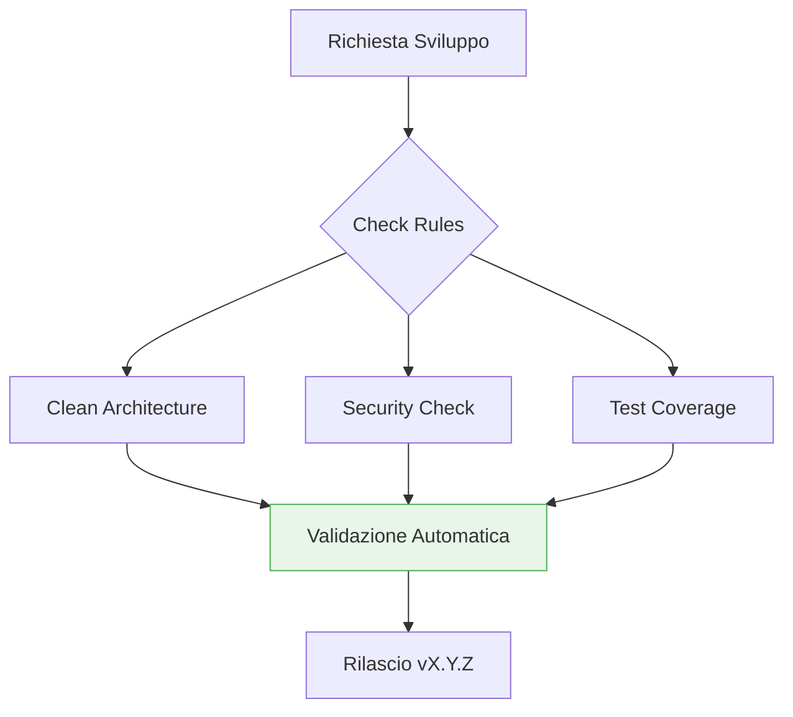

# Common Rules

Queste regole si applicano a **tutto il codice generato**, indipendentemente dal linguaggio o framework. Rappresentano il contratto minimo di qualità per ogni output.

Ogni regola è strutturata secondo il principio del **Contrasto Cognitivo**:
1.  **✅ Corretto**: La best practice da seguire.
2.  **🔴 Anti-pattern**: L'errore comune che viola la regola.
3.  **🔬 Analisi del Fallimento**: Spiegazione teorica del fallimento a livello di Allocazione Memoria, I/O Blocking o Violazione degli Invarianti di Dominio.

---

## 🏗️ Architettura e Core Design

1. **[Clean Architecture](./common/clean-architecture.md)**: Separazione dei layer e regola della dipendenza unidirezionale.
2. **[Principi SOLID](./common/solid.md)**: Fondamenta per un codice manutenibile e scalabile.
3. **[Error Handling](./common/error-handling.md)**: Strategie di resilienza e gestione dei fallimenti.
4. **[Immutability](./common/immutability.md)**: Prevenzione dei side-effect e sicurezza della memoria.

## ✍️ Coding Standards

5. **[Naming Conventions](./common/naming-conventions.md)**: Comunicazione dell'intento tramite nomi significativi.
6. **[Clean Code & Simplicity](./common/simplicity.md)**: KISS e YAGNI per evitare la sovra-ingegnerizzazione.
7. **[OWASP — Secure by Default](./common/security.md)**: Sicurezza nativa in ogni input e output.
8. **[Logging Standards](./common/logging.md)**: Osservabilità tramite log strutturati.

## 🚀 Quality Assurance

9. **[TDD come Design Architetturale](./common/tdd.md)**: Test-first come catalizzatore di design disaccoppiato.
10. **[Traceability & Memory Management](./common/traceability.md)**: Tracciamento granulare delle modifiche e della cronologia.
11. **[Versioning & Semantic Tagging](./common/versioning.md)**: Gestione coerente del ciclo di vita del software.
12. **[Knowledge & Structural Graph](./common/knowledge-graph.md)**: Mappatura obbligatoria delle relazioni tra componenti.

---

## 🛠️ Esempio di Applicazione Regole

```typescript
/**
 * Esempio di applicazione simultanea di SOLID, Clean Arch e Immutability.
 */
class ProcessInvoiceUseCase {
  constructor(private readonly repository: IInvoiceRepository) {} // DI & DIP

  async execute(invoice: Invoice): Promise<Invoice> {
    const updatedInvoice = { ...invoice, status: 'PROCESSED' }; // Immutability
    await this.repository.save(updatedInvoice);
    return updatedInvoice;
  }
}
```

## 📊 Matrice di Qualità Antigravity


> [!IMPORTANT]
> Il mancato rispetto di anche una sola di queste regole durante la generazione del codice attiverà un errore di validazione bloccante nel pre-commit.

## Checklist
- [ ] Il codice segue i layer della Clean Architecture?
- [ ] I principi SOLID sono rispettati?
- [ ] L'error handling è esplicito e non "ingoia" errori?
- [ ] Il naming comunica l'intento e non l'implementazione?
- [ ] Il design è stato guidato dal TDD?
- [ ] La tracciabilità è garantita da un Trace Log strutturato?
- [ ] Il Knowledge Graph è aggiornato e privo di Surprise Edges critici?

## Riferimenti
- [Antigravity Master Agent Protocol](../../AGENT.md)
- [Documentation Standards](../skills/documentation-standards/SKILL.md)
- [OWASP Security Standards](./common/security.md)

---
*v1.3.0 - Antigravity Core Protocol (Graph-Enabled)*