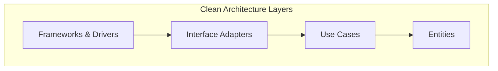

# Common Rules

Queste regole si applicano a **tutto il codice generato**, indipendentemente dal linguaggio o framework. Rappresentano il contratto minimo di qualità per ogni output.

---

## 1. Clean Architecture

Separa sempre le preoccupazioni in livelli distinti e a dipendenza unidirezionale:

| Layer | Responsabilità | Dipende da |
|---|---|---|
| **Entities** | Oggetti di dominio puri, regole di business core | Nessuno |
| **Use Cases** | Orchestrano il flusso di dati, *applicano* le regole | Entities |
| **Interface Adapters** | Convertono dati: Controller, Presenter, Gateway | Use Cases |
| **Frameworks & Drivers** | DB, Web Framework, UI — dettagli implementativi | Interface Adapters |

> [!NOTE]
> Le dipendenze puntano sempre verso i layer interni. Questo significa che le Entities non possono "importare" nulla dagli Use Cases, e gli Use Cases non sanno nulla del Database o del Web Server.




```typescript
// ✅ CORRETTO — Use Case non conosce Express
class CreateUserUseCase {
  constructor(private userRepo: UserRepository) {}
  async execute(data: CreateUserDTO): Promise<User> {
    const user = User.create(data); // logica di dominio pura
    return this.userRepo.save(user);
  }
}

// ❌ SBAGLIATO — Use Case accoppiato a Express
class CreateUserUseCase {
  async execute(req: Request, res: Response) { ... }  // dipendenza da framework
}
```

---

## 2. Principi SOLID

- **S — Single Responsibility**: Una classe/funzione = un motivo per cambiare.
- **O — Open/Closed**: Estendi il comportamento (Strategy, Plugin) senza modificare il codice esistente.
- **L — Liskov Substitution**: Le implementazioni concrete devono essere intercambiabili con le astrazioni (`UserRepository` -> `MongoUserRepository` o `InMemoryUserRepository`).
- **I — Interface Segregation**: Preferisci interfacce piccole e specifiche a monoliti.
- **D — Dependency Inversion**: Dipendi da astrazioni (`interface`), non da implementazioni concrete.

```typescript
// ✅ Dependency Inversion — il Use Case dipende dall'interfaccia, non da Mongoose
interface UserRepository {
  findById(id: string): Promise<User | null>;
  save(user: User): Promise<User>;
}

class CreateUserUseCase {
  constructor(private repo: UserRepository) {} // iniettato dall'esterno
}
```

---

## 3. Error Handling

Non ignorare **mai** gli errori. Uso di `try/catch` e tipi di errore espliciti.

```typescript
// ✅ CORRETTO
async function getUserById(id: string): Promise<User> {
  try {
    const user = await userRepository.findById(id);
    if (!user) throw new NotFoundError(`User ${id} not found`);
    return user;
  } catch (error) {
    logger.error('getUserById failed', { id, error });
    throw error; // re-throw dopo il log, non ingoiare
  }
}

// ❌ SBAGLIATO — errore ingoiato silenziosamente
async function getUserById(id: string) {
  try {
    return await userRepository.findById(id);
  } catch (e) { return null; }
}
```

**Regole**:
- Usa error classes personalizzate (`NotFoundError`, `ValidationError`, `UnauthorizedError`).
- Non esporre **mai** stack trace all'utente finale in produzione.
- Usa codici di errore standard HTTP (400, 401, 403, 404, 500).

---

## 4. Immutability

Preferisci strutture dati immutabili per prevenire side effect inaspettati.

```typescript
// ✅ CORRETTO
const config = Object.freeze({ maxRetries: 3, timeout: 5000 });
const updatedUser = { ...user, name: 'Mario' }; // copia, non mutazione

// ❌ SBAGLIATO
config.maxRetries = 5;  // mutazione silently ignorata su oggetti frozen, o bug su non-frozen
user.name = 'Mario';    // mutazione diretta dell'oggetto
```

---

## 5. Naming Conventions

I nomi devono comunicare **intento**, non implementazione.

| ❌ Generico | ✅ Descrittivo |
|---|---|
| `getData()` | `getUserProfileById()` |
| `val`, `x`, `tmp` | `invoiceTotal`, `retryCount` |
| `handle()` | `handlePaymentWebhook()` |
| `Manager` | `UserSessionCoordinator` |
| `isOk` | `isUserEmailVerified` |

**Convenzioni**:
- **camelCase** per variabili e funzioni.
- **PascalCase** per classi, interfacce e tipi.
- **UPPER_SNAKE_CASE** per costanti globali.
- **kebab-case** per file e directory.

---

## 6. OWASP — Secure by Default

Ogni output di codice deve considerare nativamente la sicurezza. Vedi [`security.md`](./security.md) per le regole complete. Regola minima: **non fidarti mai dell'input esterno** — valida, sanitizza ed esegui escape sempre.

---

## 7. Logging Standards

Il logging è una preoccupazione trasversale — si applica a **tutti i layer**, non solo all'infrastruttura.

```typescript
// ✅ Log strutturato in JSON (usa pino, winston o equivalente)
logger.info({ userId: user.id, action: 'order.created', orderId: order.id }, 'Order created');
logger.error({ err: error, userId }, 'Payment processing failed');

// ❌ SBAGLIATO — log non strutturato e con dati sensibili
console.log(`User ${user.email} logged in with password ${password}`);
```

**Regole**:
- **Mai loggare**: password, token JWT/API key, dati PII (email, CF, numero carta) in chiaro.
- Usa livelli semantici: `debug` (dev only) · `info` (eventi business) · `warn` (anomalie non bloccanti) · `error` (errori operativi) · `fatal` (crash).
- In produzione usa formato **JSON strutturato** (non testo libero) — permette indexing e alerting.
- Includi sempre un `correlationId` / `requestId` per tracciare un'intera request chain.
- Non usare `console.log` in produzione: usa una libreria configurabile (pino, winston).

---

## 8. Test-Driven Development (TDD) & Validation

L'AI **deve** sempre generare test unitari e/o d'integrazione per ogni funzionalità o modifica significativa. Il task non è considerato completato finché tutti i test non sono stati creati ed eseguiti con successo.

**Regole operative**:
- **Test-First Approach**: Definisci il comportamento atteso tramite i test prima di procedere con l'implementazione completa (seguendo lo schema **Red-Green-Refactor**).
- **Copertura Obbligatoria**: Ogni nuova logica di business (Entities/Use Cases) deve essere accompagnata da test che ne validino il comportamento.
- **Validazione Automatica**: L'AI deve eseguire i test localmente e confermare l'esito positivo prima di dichiarare il lavoro finito.
- **Gestione dei Fallimenti**: Se i test falliscono, l'AI deve analizzare il log, correggere il codice e rieseguire i test finché non sono tutti verdi.

### Esempio Ciclo TDD (Red-Green-Refactor)

#### 1. 🔴 Red: Implementazione del Test (Fallisce)
Definisci il comportamento atteso tramite un test prima di scrivere la logica. Il test deve fallire (o non compilare).

```typescript
// tests/unit/math.test.ts
describe('MathUtils', () => {
  it('should sum two numbers correctly', () => {
    const math = new MathUtils();
    expect(math.add(2, 3)).toBe(5); // ❌ Fallisce: MathUtils non esiste ancora
  });
});
```

#### 2. 🟢 Green: Implementazione minima (Passa)
Scrivi il codice minimo indispensabile per far passare il test nel modo più semplice possibile.

```typescript
// src/math.ts
export class MathUtils {
  add(a: number, b: number): number {
    return a + b; // ✅ Il test ora passa
  }
}
```

#### 3. 🔵 Refactor: Miglioramento del codice
Ottimizza, pulisci e rendi professionale il codice, assicurandoti che i test rimangano verdi.

```typescript
// src/math.ts
export class MathUtils {
  /**
   * Somma due numeri interi.
   * @param a - Primo addendo
   * @param b - Secondo addendo
   * @returns La somma aritmetica
   */
  add(a: number, b: number): number {
    return a + b;
  }
}
```


> [!IMPORTANT]
> Non è permesso procedere o consegnare codice che non superi la suite di test associata. La qualità è garantita dalla validazione empirica.

---

## 9. Traceability & Memory Management

L'AI **deve** mantenere una traccia storica e mnemonica di ogni singola interazione che produca una modifica nel repository.

**Regole operative**:
- **Atomic Log**: Ogni richiesta (ad eccezione delle semplici query informative) deve generare un log di tracciamento nella cartella `logTrace/`.
- **Central Indexing**: Ogni nuovo log deve essere registrato in [INDEX.md]({{WORKSPACE}}/logTrace/INDEX.md) per mantenere la cronologia navigabile.
- **Naming del Log**: Il file deve seguire il pattern `trace-<DATA>-<DESCRIZIONE-SINTETICA>.md`.
- **Contenuto Obbligatorio**:
    - **ID della Sessione**: Identificativo univoco (formato YYYYMMDD-NNN).
    - **Obiettivo**: Lo scopo principale della modifica richiesta.
    - **Cambiamenti Effettuati**: Elenco puntato delle modifiche ai file.
    - **Test Superati**: Riferimento alla validazione di successo (obbligatorio se modificato codice, vedi Sezione 8).
    - **Decisioni Architetturali**: Breve spiegazione del "perché" (ADR light).

> [!TIP]
> Per sincronizzare il contesto basandosi sulla cronologia dei log, usa il workflow `/sync-trace`. Questa "memoria" esterna permette all'AI di recuperare rapidamente il contesto senza sovraccaricare il prompt di sistema.

---

## 10. Versioning & Semantic Tagging

Ogni rilascio o modifica significativa deve essere accompagnato da un incremento della versione semantica (SemVer) e dalla creazione di un tag Git corrispondente.

**Regole operative**:
- **Semantic Versioning (SemVer)**: Segui rigorosamente lo standard `MAJOR.MINOR.PATCH`.
    - **MAJOR**: Breaking changes o refactoring strutturali del repository.
    - **MINOR**: Nuove funzionalità, nuove Skill, nuovi Workflow o nuove Regole.
    - **PATCH**: Bugfix, piccoli miglioramenti testuali o maintenance.
- **Automated Update**: L'AI deve aggiornare la versione nel file `package.json` prima di procedere al commit di una nuova funzionalità.
- **Git Tagging**: Ogni completamento di feature deve essere marcato con un tag git (es. `v1.1.0`). Usa il comando `npm run release` per automatizzare il processo di staging, commit e tagging.
- **Trace Log Reference**: Il tag di versione creato deve essere referenziato nell'ultimo Trace Log della sessione.

> [!IMPORTANT]
> Non creare mai tag duplicati o senza aver prima validato la libreria (`npm run validate`).