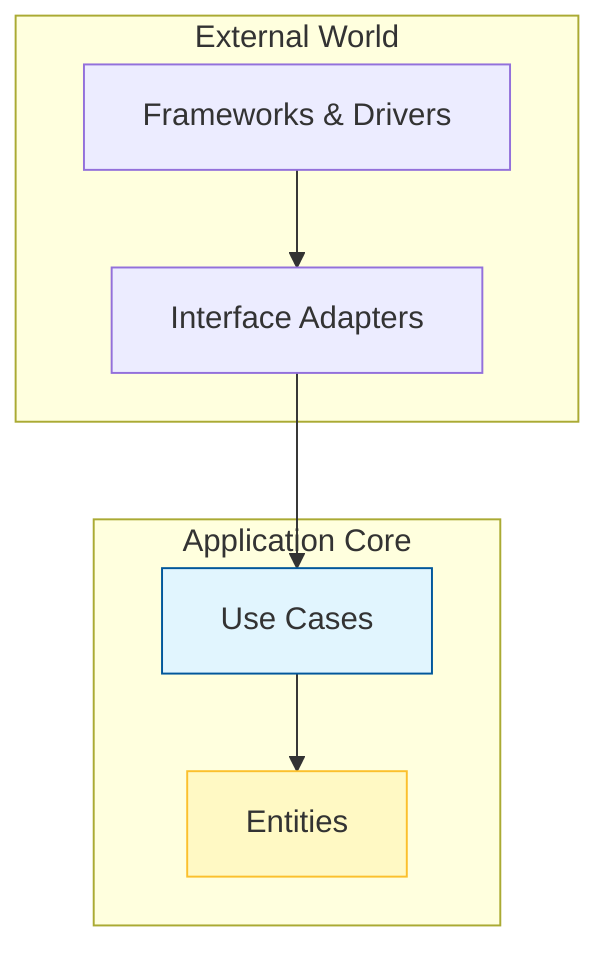

# Clean Architecture

La Clean Architecture in Antigravity garantisce che la logica di business sia isolata dalle tecnologie esterne. Questo permette di cambiare database, framework web o UI senza toccare il "cuore" dell'applicazione.

##  层 Layer e Responsabilità

| Layer | Responsabilità | Dipende da |
|---|---|---|
| **Entities** | Oggetti di dominio puri, regole di business core | Nessuno |
| **Use Cases** | Orchestrano il flusso di dati, applicano le regole | Entities |
| **Interface Adapters** | Convertono dati: Controller, Presenter, Gateway | Use Cases |
| **Frameworks & Drivers** | DB, Web Framework, UI — dettagli implementativi | Interface Adapters |

## 📐 La Regola della Dipendenza
Le dipendenze puntano sempre verso l'interno. I layer esterni possono conoscere i layer interni, ma mai il contrario.



## ✅ Esempio Corretto (Use Case Puro)

```typescript
// Il Use Case non conosce né Express né il Database reale
class CreateUserUseCase {
  constructor(private userRepo: UserRepository) {}
  
  async execute(data: CreateUserDTO): Promise<User> {
    const user = User.create(data); // Logica di dominio pura (Entity)
    return this.userRepo.save(user); // Persistence via abstraction
  }
}
```

## 🔴 Anti-pattern: Data-Centric Architecture (DB-Driven)

```typescript
// ❌ Violazione: Logica di dominio dentro una query SQL o accoppiata all'ORM
class CalculateSalaryUseCase {
  async execute(employeeId: string) {
    // La logica di business è delegata al Database (Stored Procedure / Query complessa)
    const result = await db.query("SELECT salary * 1.2 FROM employees WHERE id = ?", [employeeId]);
    return result;
  }
}
```

## 🔬 Analisi del Fallimento

- **I/O Blocking & Latency:** Spostando la logica di business nel database, si creano colli di bottiglia nell'I/O. Non è possibile scalare la logica orizzontalmente perché è vincolata alla capacità di processing del DB.
- **Domain Invariants:** Se le regole di business cambiano, devi modificare lo schema, rischiando inconsistenze se non tutte le query vengono aggiornate.
- **Accoppiamento Infrastrutturale:** Impedisce la migrazione tecnologica e rende i test 10x più lenti.

> [!IMPORTANT]
> Un'architettura "Clean" è un'architettura che "urla" il suo intento, non le sue tecnologie (Screaming Architecture).

## Checklist
- [ ] Il dominio è privo di importazioni verso framework esterni?
- [ ] Le interfacce dei repository sono definite nel layer dei Use Case o Entities?
- [ ] I controller convertono le richieste esterne in DTO per i Use Case?
- [ ] I test unitari dei Use Case girano senza database?

## Riferimenti
- [SOLID Principles](./solid.md)
- [Antigravity Master Agent Protocol](../../../AGENT.md)
- [DDD Patterns Guide](../../skills/ai-prompting/SKILL.md)
