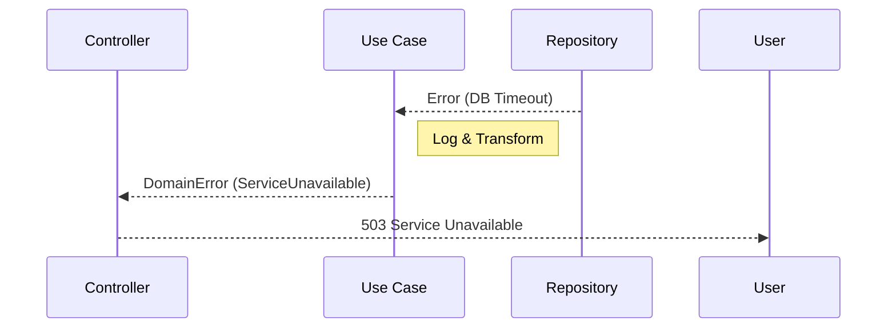

# 3. Error Handling

La gestione degli errori in Antigravity è proattiva e non reattiva. Non ci limitiamo a catturare errori, ma progettiamo il sistema affinché sia resiliente ai fallimenti inevitabili.

## 🛡️ Principi di Base

1. **Non ingoiare mai gli errori**: Ogni errore deve essere loggato, gestito o rilanciato.
2. **Usa Tipi Espliciti**: Preferisci Domain Errors rispetto ai messaggi generici.
3. **Safety First**: Non esporre mai dettagli tecnici (stack traces) all'esterno.

## ✅ Esempio Corretto

```typescript
async function getUserById(id: string): Promise<User> {
  try {
    const user = await userRepository.findById(id);
    if (!user) {
      throw new NotFoundError(`User with ID ${id} not found`);
    }
    return user;
  } catch (error) {
    // Log strutturato con contesto
    logger.error({ id, error }, 'Failed to fetch user');
    throw error; // Propaga l'errore al chiamante
  }
}
```

## 🔴 Anti-pattern: Silent Failure / Error Swallowing

```typescript
// ❌ SBAGLIATO — errore ingoiato silenziosamente
async function getUserById(id: string) {
  try {
    return await userRepository.findById(id);
  } catch (e) { 
    return null; // Il chiamante non saprà mai se il DB era down o l'id mancava
  }
}

try {
  await performCriticalUpdate(data);
} catch (error) {
  console.log("Ops!"); // ❌ Perdita totale di tracciabilità
}
```

## 🔬 Analisi del Fallimento

- **Tracciabilità & Observability:** Inghiottire un errore interrompe la catena di causalità. In un sistema distribuito, questo "buco nero" informativo rende impossibile il debug post-mortem.
- **Invarianti di Dominio:** Se un'operazione parziale fallisce ma non viene propagata, il sistema prosegue in uno stato "inconsistente", violando l'integrità del business.
- **Memory & Resource Leak:** Spesso gli errori silenti lasciano connessioni file-handle o socket aperti perché il blocco di cleanup (`finally`) non viene eseguito correttamente.

## 📉 Ciclo di Propagazione


> [!CAUTION]
> L'uso di `any` nei blocchi catch (default in TS prima della 4.x) è pericoloso. Valida sempre il tipo dell'errore prima di accedervi.

## Checklist
- [ ] Gli errori sono loggati con contesto sufficiente?
- [ ] Stai usando classi di errore personalizzate?
- [ ] Esiste un blocco di cleanup (`finally`) per le risorse aperte?
- [ ] Il sistema restituisce codici HTTP semanticamente corretti?

## Riferimenti
- [Logging Standards](./logging.md)
- [Clean Code Principles](./simplicity.md)
- [Antigravity Workflow: Error Monitoring](../../skills/error-monitoring/SKILL.md)
