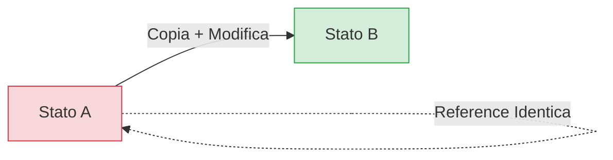

# 4. Immutability

Preferisci strutture dati immutabili per prevenire side effect inaspettati e facilitare il ragionamento sul codice. L'immutabilità non è solo un pattern stilistico, ma una guardia architetturale sulla memoria.

## ✅ Corretto

```typescript
// Uso di Object.freeze per configurazioni statiche
const config = Object.freeze({ maxRetries: 3, timeout: 5000 });

// Pattern Spread per aggiornamenti non distruttivi
const updatedUser = { ...user, name: 'Mario' }; // Crea una nuova reference
```

## 🔴 Anti-pattern: Mutazione In-Place

```typescript
// ❌ SBAGLIATO
config.maxRetries = 5;  // Errore silenzioso o crash
user.name = 'Mario';    // Mutazione diretta dell'oggetto esistente

/**
 * Questo esempio viola l'immutabilità mutando direttamente l'input.
 */
function updateRole(user: any) {
  user.role = 'admin'; // Side effect distruttivo
}
```

## 🔬 Analisi del Fallimento

- **Allocazione Memoria & Cache:** La mutazione in-place mantiene la medesima reference (`Object Identity`). Nei sistemi moderni (React, Event sourcing, Redux), questo impedisce il rilevamento dei cambiamenti tramite 'shallow comparison', causando bug silenti di re-rendering o corruzione dei dati in thread paralleli.
- **Invarianti di Dominio:** La mutazione diretta bypassa potenziali guardie di transizione di stato, rendendo impossibile garantire la consistenza atomica dell'oggetto tra l'inizio e la fine della funzione.

## 📊 Flusso di Stato


> [!IMPORTANT]
> L'uso di strutture dati immutabili riduce drasticamente il tempo di debugging legato a cambiamenti di stato inaspettati causati da reference condivise.

## Checklist
- [ ] Stai usando lo spread operator per aggiornare gli oggetti?
- [ ] Le configurazioni sono protette da `Object.freeze`?
- [ ] Le funzioni pure restituiscono nuovi oggetti invece di modificare i parametri?

## Riferimenti
- [Functional Programming Principles](../../skills/ai-prompting/SKILL.md)
- [Antigravity Core Rules](../common.md)
