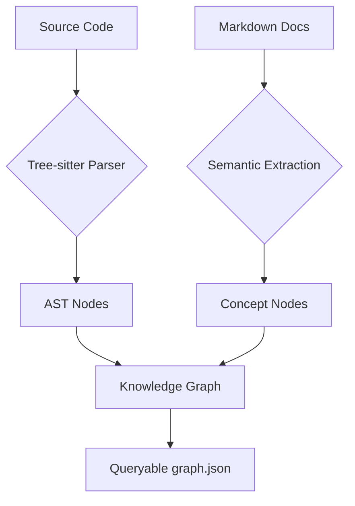

# Knowledge & Structural Graph

Tutti i progetti Antigravity devono mantenere un Knowledge Graph strutturale aggiornato per permettere agli agenti di comprendere le relazioni profonde tra componenti, superando i limiti della ricerca testuale (RAG).

## 1. Mappatura Strutturale

**✅ Corretto**: Utilizzare Graphify o tool equivalenti per generare un grafo di dipendenze (AST-based) che includa chiamate tra funzioni, import di moduli e relazioni tra documentazione e codice.
Il grafo deve essere aggiornato dopo ogni modifica strutturale significativa.



**🔴 Anti-pattern**: Affidarsi esclusivamente alla ricerca semantica (Vector Search). La ricerca semantica può trovare "codice simile", ma non può identificare una catena di dipendenze o una violazione di layer.

**🔬 Analisi del Fallimento**: 
L'assenza di un grafo strutturale porta alla **Frammentazione del Contesto**. L'agente AI opera su frammenti isolati (chunk) e, non avendo una visione dei path di esecuzione, può introdurre involontariamente **Dipendenze Circolari** o violazioni della **Clean Architecture**.

## 2. Rilevamento dei God Nodes e Surprises

**✅ Corretto**: Monitorare il `GRAPH_REPORT.md` per identificare i "God Nodes" (componenti troppo centralizzati) e attivare refactoring preventivi. Investigare ogni "Surprise Edge" per validare che non sia una violazione dei layer.

**🔴 Anti-pattern**: Ignorare la complessità crescente dei moduli centrali finché non diventano colli di bottiglia o punti di fallimento singolo.

> [!IMPORTANT]
> I "God Nodes" sono segnali di debito tecnico. Se un nodo ha un grado di connettività sproporzionato, deve essere considerato per una scomposizione in moduli più piccoli.

**🔬 Analisi del Fallimento**: 
La mancata identificazione dei God Nodes causa un'eccessiva **Accoppiamento (Coupling)**. Questo aumenta esponenzialmente la difficoltà di testing (TDD) e rende il sistema fragile: una modifica in un God Node non mappato ha side-effect imprevedibili.

## ⚙️ Implementazione Mandatoria

Tutti i progetti devono includere:
1. Una cartella `.venv` con `graphifyy` installato.
2. Un file `graphify-out/graph.json` aggiornato.
3. Script NPM dedicati per il build e la query del grafo.

```bash
# Esempio di installazione in un nuovo progetto
python -m venv .venv
.venv\Scripts\pip install graphifyy
.venv\Scripts\graphify gemini install
```

```json
{
  "scripts": {
    "graph:build": ".venv\\Scripts\\python -c \"from graphify.watch import _rebuild_code; from pathlib import Path; _rebuild_code(Path('.'))\"",
    "graph:query": ".venv\\Scripts\\graphify query"
  }
}
```

## 🧠 Teoria del Grafo in Antigravity
Il Knowledge Graph funge da "Cerebellum" per l'agente. Mentre l'LLM gestisce la "Corteccia" (ragionamento e generazione), il grafo gestisce il sistema motorio e di coordinazione (navigazione del repository). Senza questa distinzione, l'agente soffre di allucinazioni contestuali.

## ## Checklist di Qualità del Grafo
- [ ] Il grafo include i file della cartella `.agents`?
- [ ] Il `GRAPH_REPORT.md` è stato generato dopo l'ultima modifica?
- [ ] Sono stati analizzati eventuali "Surprise Edges"?
- [ ] I "God Nodes" identificati sono stati documentati in un ADR se superano una certa soglia di complessità?
- [ ] Gli output landano correttamente in `graphify-out/`?

## ## Riferimenti
- [Antigravity Master Agent Protocol](../../../AGENT.md)
- [Graphify.net Documentation](https://graphify.net/)
- [Clean Architecture Principles](./clean-architecture.md)
- [SOLID Principles in Depth](./solid.md)

---
*v1.0.0 - Graph-Enabled Quality Protocol (Full Context)*
