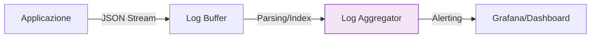

# 8. Logging Standards

Il logging è una preoccupazione trasversale cruciale per l'osservabilità in produzione. In Antigravity passiamo da un logging testuale caotico a un logging strutturato basato su eventi.

## 📡 Principi del Logging Moderno

1. **Struttura JSON**: Ogni log deve essere parsabile dalle macchine (ELK, Datadog).
2. **Semantica dei Livelli**: Usa correttamente `INFO`, `WARN`, `ERROR`, `FATAL`.
3. **Correlazione**: Includi ID univoci per tracciare le richieste cross-servizi.

## ✅ Esempio Corretto (JSON Strutturato)

```typescript
// Log di successo
logger.info({ 
  userId: user.id, 
  action: 'order.created', 
  orderId: order.id,
  processingTimeMs: 45
}, 'Order successfully processed');

// Log di errore con contesto completo
logger.error({ 
  err: error, 
  userId, 
  transactionId: 'TX-99' 
 }, 'Payment processing failed due to timeout');
```

## 🔴 Anti-pattern: Verbose & Unstructured Logging

```typescript
// ❌ SBAGLIATO — log non strutturato e con dati sensibili
console.log(`User ${user.email} logged in with password ${password}`); // ❌ Leak di PII

// ❌ Violazione: Log caotico dentro un loop
for (let item of heavyList) {
  console.log("Processing item: " + item.name); // ❌ I/O overhead massivo
}
```

## 🔬 Analisi del Fallimento

- **I/O Overhead (Blocking):** L'uso massivo di `console.log` synchronous può degradare le performance del 50-80% in scenari ad alta frequenza.
- **Memory Footprint:** L'accumulo di stringhe concatenate genera un'elevata pressione sul Garbage Collector, portando a picchi di latenza.
- **Sicurezza (Domain Leak):** Loggare PII (email, password) viola le normative GDPR e aumenta drasticamente la superficie d'attacco.

## 📊 Pipeline dei Log


> [!IMPORTANT]
> Non loggare mai segreti, token JWT o informazioni personali (PII) in chiaro. Usa hashing o mask se necessario.

## Checklist
- [ ] I log sono in formato JSON?
- [ ] Il livello del log è corretto per l'importanza dell'evento?
- [ ] Hai rimosso i `console.log` di debug dal codice di produzione?
- [ ] Ogni richiesta include un `requestId` per la tracciabilità?

## Riferimenti
- [Error Handling Standards](./error-handling.md)
- [Antigravity Observability Skill](../../skills/debugging-pro/SKILL.md)
- [Security Guidelines](./security.md)
