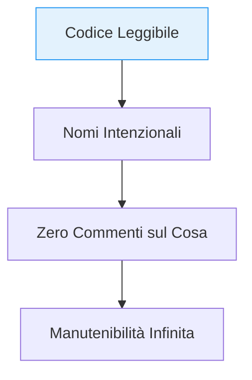

# 5. Naming Conventions

In Antigravity, dare un nome corretto è la forma più alta di documentazione. Un nome deve esprimere l'intento di business, non i dettagli dell'implementazione tecnica.

## 🧭 Regole di Naming

| ❌ Generico | ✅ Descrittivo | Motivo |
|---|---|---|
| `getData()` | `getUserProfileById()` | Specifica l'entità e l'azione |
| `val`, `x`, `tmp` | `invoiceTotal`, `retryCount` | Elimina ambiguità semantica |
| `Manager` | `UserSessionCoordinator` | Evita nomi "scatola nera" |
| `handle()` | `handlePaymentWebhook()` | Indica l'evento scatenante |

## ✅ Esempio Corretto (Intenzionalità)

```typescript
// camelCase per variabili e funzioni
const isUserEligibleForDiscount = true;

// PascalCase per classi e interfacce
interface PaymentProcessor {
  process(amount: number): Promise<void>;
}

// UPPER_SNAKE_CASE per costanti globali
const MAX_CONNECTION_RETRIES = 5;
```

## 🔴 Anti-pattern: Implementation Detail in Name

```typescript
/**
 * ❌ Violazione: Il nome rivela come viene fatto, non cosa viene fatto.
 */
function fetchUserDataFromMysqlTable(userId: string) { ... } // ❌ Leak del DB
const userArray = []; // ❌ Includere il tipo (Hungarian Notation)
const d = new Date(); // ❌ Nome di una sola lettera
```

## 🔬 Analisi del Fallimento

- **Cognitive Load:** Nomi tecnici costringono a mappare mentalmente l'implementazione fisica. Questo aumenta lo sforzo cognitivo durante la lettura.
- **Fragilità (Refactoring Cost):** Se si decide di passare da MySQL a MongoDB, bisogna rinominare ogni occorrenza, distruggendo l'astrazione.
- **Violation of Domain Invariants:** I nomi generici rendono invisibili le violazioni delle regole di business. `verifiedUserAccount` comunica uno stato fondamentale che `data` non comunica.

## 🔡 Gerarchia della Chiarezza


> [!TIP]
> Segui la regola del "Teatro": se uno sviluppatore leggesse il nome della tua funzione su un palco, il pubblico dovrebbe capire immediatamente cosa accade senza vedere il codice.

## Checklist
- [ ] Il nome comunica il "Cosa" e non il "Come"?
- [ ] Stai usando nomi di dominio (Domain Ubiquitous Language)?
- [ ] Hai evitato abbreviazioni criptiche (es. `authInfo` invece di `ai`)?
- [ ] Le variabili booleane iniziano con `is`, `has`, `can`?

## Riferimenti
- [Simplicity & Clean Code](./simplicity.md)
- [Clean Architecture Guide](./clean-architecture.md)
- [Antigravity Master Agent Protocol](../../../AGENT.md)
