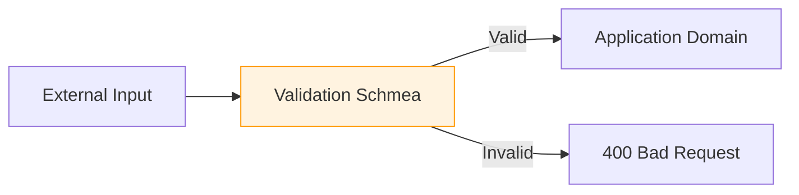

# 7. OWASP — Secure by Default

La sicurezza non è un'attività post-sviluppo, ma parte integrante del ciclo di vita del software. In Antigravity applichiamo i principi OWASP ad ogni riga di codice.

## 🛡️ Pilastri della Sicurezza

1. **Zero Trust**: Non fidarti mai dell'input esterno (validazione rigorosa).
2. **Least Privilege**: Esegui i processi con il minimo dei permessi necessari.
3. **Defense in Depth**: Applica barriere di sicurezza a più livelli (API, DB, Network).

## ✅ Esempio Corretto (Input Sanitization)

```typescript
// Uso di librerie di validazione (es. Zod) per definire schemi sicuri
const UserSchema = z.object({
  id: z.string().uuid(),
  email: z.string().email(),
  bio: z.string().max(500).transform(val => escape(val))
});

// Query parametrizzate contro SQL Injection
const query = {
  text: 'SELECT * FROM users WHERE id = $1',
  values: [userId],
};
```

## 🔴 Anti-pattern: Implicit Trust & Raw Input

```typescript
// ❌ Violazione: fiducia cieca nell'input dell'utente
app.get('/user', (req, res) => {
  const query = `SELECT * FROM users WHERE id = ${req.query.id}`; // ❌ SQL Injection
  db.execute(query);
});

// ❌ Rendering di input non sanitizzato
res.send(`<h1>Hello ${req.query.name}</h1>`); // ❌ XSS (Cross-Site Scripting)
```

## 🔬 Analisi del Fallimento

- **Sicurezza & Integrity:** L'assenza di sanitizzazione permette l'esecuzione di codice malevolo, portando alla compromissione totale della riservatezza (data leak) e dell'integrità dei dati.
- **Domain Invariants:** L'inserimento di caratteri speciali inaspettati viola gli invarianti di business logic, causando crash o stati inconsistenti.
- **Resource Exhaustion:** L'input non validato può essere usato per attacchi DoS locali (es. richiedere un limit di query enorme), saturando la memoria o l'I/O.

## 🔐 Ciclo di Validazione


> [!IMPORTANT]
> Considera sempre che l'utente possa essere un attaccante. La validazione lato client è solo per UX; la validazione lato server è l'unica difesa reale.

## Checklist
- [ ] Stai usando query parametrizzate per ogni accesso al DB?
- [ ] Ogni input esterno è validato tramite uno schema (es. ZOD)?
- [ ] Hai rimosso segreti e chiavi API dal codice sorgente?
- [ ] Le header di sicurezza (Helmet, CSP) sono configurate correttamente?

## Riferimenti
- [Antigravity Security Workflow](../../skills/auth-patterns/SKILL.md)
- [OWASP Top 10 Official List](https://owasp.org/www-project-top-ten/)
- [Logging PII Standards](./logging.md)
