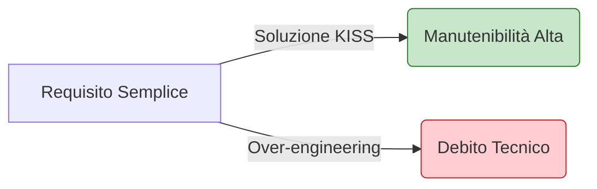

# 6. Clean Code & Simplicity

Il codice deve essere un mezzo di comunicazione tra esseri umani. In Antigravity, la semplicità batte l'eleganza complessa ogni volta. Il codice migliore è quello che viene rimosso perché non necessario.

## 💡 Principi Guida

- **KISS (Keep It Simple, Stupid)**: La soluzione più semplice è quasi sempre quella corretta.
- **YAGNI (You Ain't Gonna Need It)**: Non implementare astrazioni per problemi che non hai ancora.
- **Dry vs Moist**: Evita duplicazioni inutili, ma non sacrificare la leggibilità sull'altare del DRY (Don't Repeat Yourself).

## ✅ Esempio Corretto (Let It Crash & Simple logic)

```typescript
// Semplice, diretto, leggibile
function findUser(id: string) {
  if (!id) return null;
  return users.find(u => u.id === id);
}

// Funzioni piccole con massimo 3 parametri
function sendNotification(user: User, message: string, channel: NotificationChannel) {
  // Logica focalizzata
}
```

## 🔴 Anti-pattern: Premature Abstraction (Over-Engineering)

```typescript
// ❌ Violazione: Creare una fabbrica di astrattori per un caso d'uso banale
class BaseAbstractGenericServiceFactoryProvider<T extends BaseInterface> {
  getInstance(context: ContextualObject): GenericHandler<T> {
    // ❌ Complessità non necessaria che nasconde l'intento
  }
}
```

## 🔬 Analisi del Fallimento

- **Cognitive Load & Memory:** L'eccessiva astrazione aumenta il "Call Stack" mentale. Ogni layer aggiuntivo consuma memoria (heap allocation) e cicli di CPU per il dispatch dinamico.
- **Flessibilità Inversa:** La sovra-ingegnerizzazione rende il sistema rigido. Piccoli cambiamenti richiedono refactoring di intere gerarchie, violando la manutenibilità agile.
- **I/O Overhead:** L'abuso di astrazioni porta spesso a caricare moduli eccessivi al bootstrap, rallentando i tempi di cold-start.

## 🎢 Curva della Complessità


> [!TIP]
> Chiediti sempre: "Posso scrivere questo con meno righe di codice senza sacrificare la chiarezza?".

## Checklist
- [ ] La funzione è più lunga di 30 righe? (Se sì, estrai)
- [ ] Hai più di 3 parametri? (Se sì, usa un DTO/Oggetto)
- [ ] Il nome del file riflette esattamente il suo contenuto?
- [ ] Hai rimosso codice commentato o "morto"?

## Riferimenti
- [Naming Conventions](./naming-conventions.md)
- [Antigravity Refactoring Skill](../../skills/refactoring-guide/SKILL.md)
- [SOLID Principles](./solid.md)
