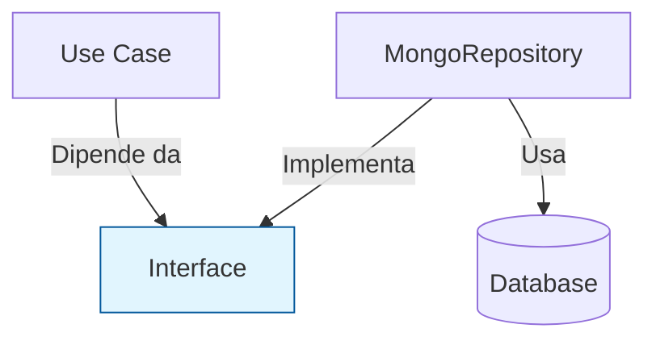

# 2. Principi SOLID

I principi SOLID sono la base del design object-oriented e della Clean Architecture in Antigravity. Ogni violazione di questi principi porta a un debito tecnico che scala esponenzialmente.

## 📐 I Cinque Principi

- **S — Single Responsibility**: Una classe o funzione deve avere un solo motivo per cambiare. Se gestisce sia la persistenza che la logica di business, deve essere divisa.
- **O — Open/Closed**: Il codice deve essere aperto all'estensione ma chiuso alla modifica. Usa pattern come Strategy o Decorator per aggiungere funzionalità.
- **L — Liskov Substitution**: Gli oggetti di una sottoclasse devono poter sostituire quelli della superclasse senza alterare la correttezza del programma.
- **I — Interface Segregation**: Meglio molte interfacce specifiche che una sola interfaccia enorme e generica.
- **D — Dependency Inversion**: Dipendi dalle astrazioni (interfacce), non dalle implementazioni concrete.

## ✅ Esempio Corretto (Dependency Inversion)

```typescript
// L'interfaccia definisce il contratto
interface UserRepository {
  findById(id: string): Promise<User | null>;
  save(user: User): Promise<User>;
}

// Il caso d'uso dipende dall'astrazione
class CreateUserUseCase {
  constructor(private repo: UserRepository) {} // Injected via DI
  
  async execute(user: User) {
    return this.repo.save(user);
  }
}
```

## 🔴 Anti-pattern: The God Object & Concrete Coupling

```typescript
class UserService {
  // ❌ Violazione SRP: gestisce DB, Email, e Logica di business
  async createUser(data: any) {
    const db = new MongoConnection(); // ❌ Violazione DIP: accoppiamento forte
    await db.save(data);
    const mailer = new SmtpService(); // ❌ Violazione SRP/DIP
    await mailer.sendWelcome(data.email);
  }
}
```

## 🔬 Analisi del Fallimento

- **Accoppiamento Binario:** La creazione di istanze concrete all'interno del codice (`new MongoConnection()`) impedisce il testing isolato. Il fallimento dell'I/O del database blocca l'intero test suite, rendendo il design fragile ai cambiamenti infrastrutturali.
- **I/O Blocking:** Senza astrazione, non è possibile implementare facilmente pattern di resilienza come Circuit Breaker o Retry trasversali, portando a colli di bottiglia non gestiti nel pool di connessioni I/O.
- **Invarianti di Dominio:** La logica di business è intrecciata con i dettagli di persistenza, violando l'invariante di "Purezza del Dominio".

## 🧩 Visualizzazione del Disaccoppiamento


> [!TIP]
> Applica il principio di Dependency Inversion per rendere il tuo codice testabile al 100% senza la necessità di un database reale.

## Checklist
- [ ] Ogni classe ha una sola responsabilità ben definita?
- [ ] Stai usando interfacce per separare il dominio dall'infrastruttura?
- [ ] È possibile estendere il sistema senza modificare il codice esistente?
- [ ] Le sottoclassi rispettano il contratto delle interfacce genitrici?

## Riferimenti
- [Clean Architecture Guide](./clean-architecture.md)
- [Antigravity Master Agent Protocol](../../../AGENT.md)
- [Dependency Injection Pattern](../../skills/api-design/SKILL.md)
