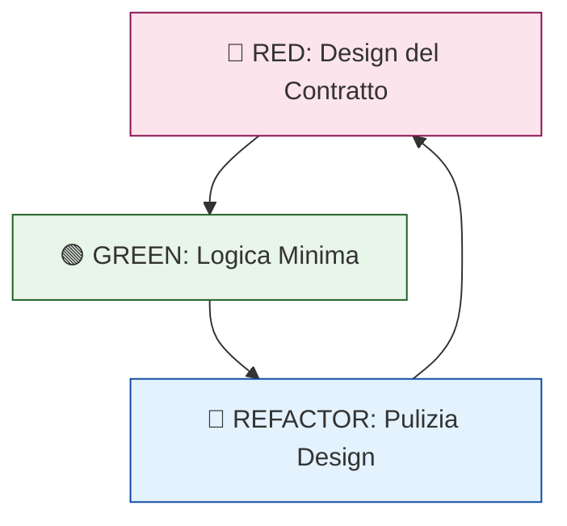

# 9. TDD come Design Architetturale

In Antigravity, il TDD non è un mero strumento di validazione funzionale, ma un potente **strumento di design**. La stesura del test precede la logica perché è in quella fase che vengono prese le decisioni architetturali più critiche.

## 🏛️ Il Ruolo del Test nel Design

1. **Definizione dell'Interfaccia (Consumer-First)**: Scrivere il test obbliga a porsi nei panni del fruitore dell'API, definendo i confini basati sull'usabilità.
2. **Disaccoppiamento Forzato**: Un componente è testabile in isolamento solo se è disaccoppiato dalle dipendenze. Il TDD forza la **Dependency Inversion**.
3. **Feedback Immediato**: Setup complessi nel test indicano componenti troppo accoppiati o con troppe responsabilità.

## ✅ Esempio Corretto (Fase Red/Design)

```typescript
describe('ProcessPayment Use Case', () => {
  it('should execute payment and notify repository', async () => {
    // Definizione dei Mock basata su Interfacce (DIP)
    const paymentGatewayMock: IPaymentGateway = { 
        process: jest.fn().mockResolvedValue({ success: true }) 
    };
    const orderRepoMock: IOrderRepository = { updateStatus: jest.fn() };

    const useCase = new ProcessPaymentUseCase(paymentGatewayMock, orderRepoMock);
    await useCase.execute('order-123');

    expect(orderRepoMock.updateStatus).toHaveBeenCalledWith('order-123', 'PAID');
  });
});
```

## 🔴 Anti-pattern: Code-First without Design (Post-hoc Testing)

```typescript
// ❌ Il codice viene scritto prima, includendo dipendenze concrete
class OrderService {
  async completeOrder(id: string) {
    const db = new PostgresDB(); // ❌ Impossibile da mockare correttamente
    const stripe = new StripeSDK('secret-key'); // ❌ Accoppiamento infrastrutturale
  }
}

// ❌ Il test viene scritto DOPO, costringendo a usare library di "monkey patching" 
// o testando contro un DB reale, rendendo il ciclo lento e fragile.
```

## 🔬 Analisi del Fallimento

- **Accoppiamento Infrastrutturale (I/O Bound):** Scrivere il codice prima del test porta all'istanziazione di dipendenze pesanti nel dominio. Questo rende il test I/O bound, rallentando il ciclo di feedback.
- **Binary Coupling (Memory):** L'uso di `new` crea un legame binario immutabile. In memoria, le istanze sono fuse, impedendo la sostituzione del comportamento (Violazione LSP).
- **Violation of Domain Invariants:** Senza test-first, i dettagli implementativi (gestione null del DB) inquinano la logica pura, rendendo gli invarianti fragili.

## 🔄 Ciclo Red-Green-Refactor


> [!IMPORTANT]
> Se il design non è guidato dai test, è probabile che si stia costruendo un'architettura rigida. Il TDD è l'assicurazione per la Clean Architecture.

## Checklist
- [ ] Il test descrive l'intento di business?
- [ ] Il componente riceve le dipendenze tramite interfacce?
- [ ] Il setup del test richiede meno di 10 righe?
- [ ] Stai testando un solo comportamento per test?

## Riferimenti
- [SOLID Principles](./solid.md)
- [Clean Architecture Standards](./clean-architecture.md)
- [Antigravity TDD Workflow](../../skills/tdd-workflow/SKILL.md)
