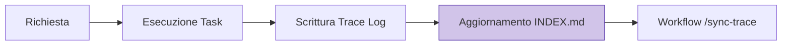

# 10. Traceability & Memory Management

In Antigravity, ogni modifica al codice deve essere tracciabile e giustificata. L'AI mantiene una memoria esterna (Trace Log) per evitare allucinazioni e garantire che ogni scelta architetturale sia documentata.

## 🗒️ Il Protocollo di Tracciamento

Ogni sessione di lavoro che produce modifiche deve generare un file di log strutturato. Questo permette il ripristino del contesto (Context Recovery) in caso di interruzione.

| Requisito | Descrizione | Obbligo |
|---|---|---|
| **Atomic Log** | Un file per ogni task atomico | SI |
| **Central Index** | Registrazione in `INDEX.md` | SI |
| **Naming Pattern** | `trace-YYYYMMDD-descrizione.md` | SI |
| **ADR Light** | Spiegazione del "perché" tecnico | SI |

## ✅ Esempio Corretto (Log Strutturato)

```markdown
# Session: 20240410-001
- **Goal**: Implementazione Circuit Breaker su PaymentService.
- **Changes**: 
  - Created `src/infra/resilience/CircuitBreaker.ts`
  - Updated `src/core/services/PaymentService.ts`
- **Architectural Decision**: Usato il pattern Circuit Breaker per gestire timeout I/O su Gateway Stripe.
```

## 🔴 Anti-pattern: Disconnected Events (Black Box Development)

```markdown
# Errore di tracciabilità: Modifiche senza contesto
- Modificato `UserService.ts`
- Aggiunto test `auth.test.ts`
# ❌ Nessun ID sessione, nessuna decisione architetturale, nessun test log.
```

## 🔬 Analisi del Fallimento

- **Causality Loss (Memory):** In assenza di un log strutturato, si perde la "catena di derivazione". Questo porta a problemi di allucinazione per l'AI e difficoltà di archeologia del codice per l'umano.
- **I/O & Sync Inefficiency:** Senza un indice centralizzato, l'agente deve scansionare l'intero filesystem per recuperare lo stato, causando overhead di I/O e lentezza.
- **Violation of Domain Invariants:** La mancanza di ADR impedisce di verificare se le modifiche violano decisioni strategiche prese in precedenza (Entropy Death).

## 🧠 Flusso della Memoria AI


> [!TIP]
> Usa il comando `/sync-trace` all'inizio di ogni sessione per sincronizzare l'agente con gli ultimi cambiamenti registrati.

## Checklist
- [ ] Hai creato il file di log in `logTrace/`?
- [ ] Il log è stato registrato nell' `INDEX.md`?
- [ ] Hai incluso l'ID sessione corretto?
- [ ] Le decisioni architetturali sono spiegate chiaramente?

## Riferimenti
- [Trace Index](../../../logTrace/INDEX.md)
- [Antigravity Master Agent Protocol](../../../AGENT.md)
- [Versioning Standards](./versioning.md)