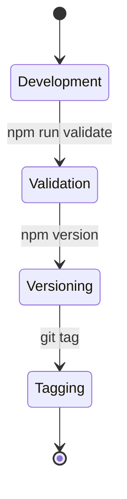

# 11. Versioning & Semantic Tagging

Il versionamento in Antigravity non è opzionale. Ogni rilascio deve seguire lo standard SemVer per garantire la stabilità dell'ecosistema e la prevedibilità degli aggiornamenti.

## 🔨 Regole SemVer (MAJOR.MINOR.PATCH)

- **MAJOR (X.0.0)**: Breaking changes. Modifiche che rompono la retro-compatibilità delle API o della struttura del repository.
- **MINOR (0.X.0)**: Nuove funzionalità, Rule o Skill aggiunte in modo retro-compatibile.
- **PATCH (0.0.X)**: Bugfix, modifiche minori alla documentazione o ottimizzazioni senza nuove feature.

## ✅ Esempio Corretto (Release Flow)

```bash
# 1. Validazione della libreria
npm run validate

# 2. Aggiornamento versione
npm version patch -m "v1.2.1: Fixed race condition in database adapter"

# 3. Tagging e Push
git push origin master --tags
```

## 🔴 Anti-pattern: Implicit SemVer Breakage (Blind Versioning)

```bash
# Sbagliato: Rilasciare una PATCH per una breaking change
# ❌ git tag v1.0.1 -m "Refactored Core interfaces" 
# (ma rompe tutti i moduli dipendenti che si aspettano la vecchia firma)
```

## 🔬 Analisi del Fallimento

- **Accoppiamento & Stability:** Spacciare una breaking change per una patch rompe l'invariante di "Stabilità del Contratto". Le dipendenze a valle falliranno silenziosamente in runtime.
- **I/O Distribution Failure:** Se i tag non corrispondono alle versioni reali nel `package.json`, i sistemi di CI/CD distribuiranno artefatti inconsistenti, saturando l'I/O per download errati.
- **Trust & Cognitive Load:** La violazione del SemVer distrugge la fiducia. Lo sviluppatore dovrà ispezionare manualmente ogni diff invece di fidarsi della versione (Increased cognitive friction).

## 🚀 Ciclo di Release


> [!IMPORTANT]
> Non creare mai tag manuali senza aver prima validato la libreria (`npm run validate`).

## Checklist
- [ ] La versione nel `package.json` è stata incrementata?
- [ ] Il tipo di incremento (Major/Minor/Patch) riflette l'entità delle modifiche?
- [ ] Il tag git è stato creato correttamente?
- [ ] La release è documentata nel changelog o nel trace log?

## Riferimenti
- [Traceability Rules](./traceability.md)
- [Antigravity DevOps Skill](../../skills/devops-pipeline/SKILL.md)
- [Project Configuration (GEMINI.md)](../../../GEMINI.md)
