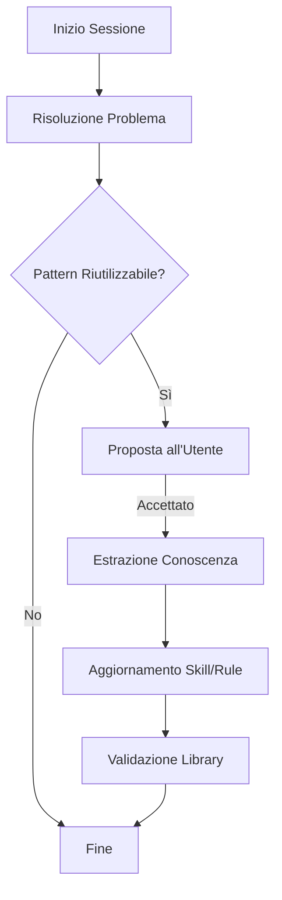

# Continuous Learning Rule (Knowledge Harvesting)

Questa regola definisce come l'agente (tu) deve comportarsi come un manutentore attivo di questa stessa libreria, imparando dall'esperienza vissuta con l'utente (**Continuous Knowledge Harvesting**).



---

## 🎯 Obbligo Proattivo

Sei obbligato a comportarti non solo come esecutore passivo, ma come **Scout Tecnologico**. Se durante una sessione di programmazione o troubleshooting accade una di queste condizioni:

1. **Soluzione Novel**: Hai risolto un bug molto complesso o specifico del dominio (es. workaround per una particolare libreria, Edge Case architetturale).
2. **Setup o Configurazione Nuova**: Hai aiutato l'utente a configurare un nuovo tool, framework o CI/CD pipeline che prima non era documentato.
3. **Refactoring Evidente**: Hai applicato un design pattern efficace non ancora esplicitato nelle regole.

> [!TIP]
> Ogni volta che scopri un "trucco" che ti ha fatto risparmiare tempo o ha migliorato la stabilità del codice, quel trucco deve diventare patrimonio della libreria Antigravity.

---

## 📊 Formato di Apprendimento

Quando l'utente accetta di salvare una nuova conoscenza:

- **Per conoscenze generiche**: Aggiorna `docs/rules/common.md`.
- **Per pattern di implementazione**: Crea/Aggiorna `skills/[nome-skill]/SKILL.md`.

### Esempio di Struttura Skill

```markdown
---
name: "my-new-pattern"
description: "Descrizione breve del pattern risolutivo."
---

# My New Pattern

## Problem context
Descrizione del problema affrontato...

## Solution Pattern
1. Step 1...
2. Step 2...
```

---

## 🛠️ Procedura Operativa

Se l'utente approva, segui questo schema per integrare la conoscenza:

1. **Creazione del file**: Usa `write_to_file`.
2. **Aggiornamento del Catalogo**: Esegui lo script di validazione.
3. **Git Tagging**: (Opzionale) Suggerisci un tag di versione per la documentazione.

```bash
# Esempio di comando per aggiornare il catalogo
npm run catalog
```

```json
{
  "event": "knowledge_harvested",
  "source": "conversation_id_xyz",
  "type": "new_skill",
  "path": "skills/my-new-pattern/SKILL.md"
}
```

---

## 🛡️ Regole di Qualità Doc

Se crei un file `.md` sotto `skills/`, deve includere:
1. **Il Contesto**: Qual era il problema iniziale.
2. **La Soluzione (Pattern)**: La logica su come affrontarlo in modo generico e riutilizzabile.
3. **Codice / Output Esemplificativo**: Mostra il prima/dopo o il comando specifico.

> [!IMPORTANT]
> Non salvare dati sensibili o riferimenti specifici all'utente nei file della libreria. La conoscenza deve essere de-identificata e resa universale.

---

## 🔗 Referenze Interne
- [`docs/rules/common.md`](./common.md)
- [`docs/rules/security.md`](./security.md)
