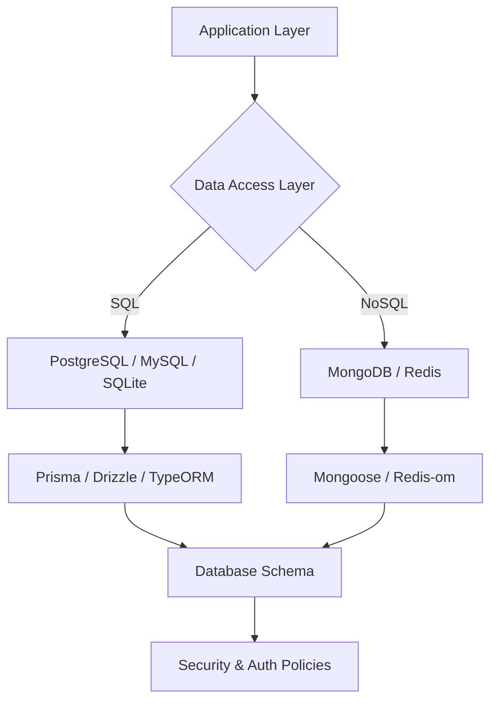

# Database Rules

Queste regole si applicano a **ogni interazione con un database**, SQL o NoSQL. L'obiettivo è garantire integrità, performance e manutenibilità del data layer.



> [!NOTE]
> La scelta tra SQL e NoSQL deve essere basata sulla natura dei dati e sulla complessità delle relazioni, non sulla preferenza personale.


---

## 1. Schema Design

### Principi Generali
- **Ogni entità ha un ID immutabile** (UUID o CUID preferiti a integer auto-increment per sistemi distribuiti).
- **Soft delete** quando i record devono essere recuperabili: aggiungi `deletedAt: DateTime | null` invece di DELETE fisico.
- **Audit fields** su ogni tabella: `createdAt`, `updatedAt`, `createdBy` (dove applicabile).

```sql
-- ✅ Schema con audit fields e soft delete
CREATE TABLE users (
  id          UUID PRIMARY KEY DEFAULT gen_random_uuid(),
  email       VARCHAR(255) UNIQUE NOT NULL,
  name        VARCHAR(100) NOT NULL,
  role        VARCHAR(20)  NOT NULL DEFAULT 'USER',
  deleted_at  TIMESTAMP,
  created_at  TIMESTAMP NOT NULL DEFAULT NOW(),
  updated_at  TIMESTAMP NOT NULL DEFAULT NOW()
);
```

### Naming Conventions
| Elemento | Convenzione | Esempio |
|---|---|---|
| Tabelle | `snake_case` plurale | `user_profiles` |
| Colonne | `snake_case` | `first_name`, `created_at` |
| Indici | `idx_<table>_<col>` | `idx_users_email` |
| Foreign Key | `fk_<table>_<ref>` | `fk_orders_user_id` |
| Enum | `UPPER_SNAKE_CASE` | `'ACTIVE'`, `'INACTIVE'` |

---

## 2. ORM / Query Builder Rules

### Prisma (TypeScript — Preferito)
```typescript
// ✅ Proiezione esplicita — non usare findMany() senza select
const users = await prisma.user.findMany({
  select: { id: true, email: true, name: true },
  where: { deletedAt: null },
  orderBy: { createdAt: 'desc' },
  take: 20,
  skip: (page - 1) * 20,
});

// ✅ Upsert per operazioni idempotenti
await prisma.user.upsert({
  where: { email: data.email },
  update: { name: data.name },
  create: { email: data.email, name: data.name },
});
```

### Mongoose (MongoDB)
```typescript
// ✅ Lean queries per letture (performance +50%)
const users = await User.find({ deletedAt: null })
  .select('email name role')
  .lean()  // ritorna POJO invece di Mongoose Document
  .limit(20);

// ✅ Definisci sempre gli indici nello schema
const UserSchema = new Schema({
  email: { type: String, required: true, unique: true, index: true },
  role:  { type: String, enum: ['USER', 'ADMIN'], default: 'USER' },
}, { timestamps: true });
```

---

## 3. Query Optimization — N+1 Problem

L'N+1 è il killer di performance più comune. **Usa always eager loading / batching**.

```typescript
// ❌ N+1 — 1 query per gli ordini + N query per ogni utente
const orders = await Order.findAll();
for (const order of orders) {
  order.user = await User.findById(order.userId); // N query!
}

// ✅ Join / include in un'unica query
const orders = await prisma.order.findMany({
  include: { user: { select: { name: true, email: true } } },
});

// ✅ MongoDB — DataLoader per batching
const userLoader = new DataLoader(async (ids: string[]) => {
  const users = await User.find({ _id: { $in: ids } }).lean();
  return ids.map(id => users.find(u => u._id.toString() === id));
});
```

---

## 4. Transazioni

Usa le transazioni per operazioni che **devono essere atomiche** (tutto o niente).

```typescript
// ✅ Prisma transaction
await prisma.$transaction(async (tx) => {
  const order = await tx.order.create({ data: orderData });
  await tx.stock.update({
    where: { productId: orderData.productId },
    data: { quantity: { decrement: orderData.quantity } },
  });
  await tx.payment.create({ data: { orderId: order.id, ...paymentData } });
});

// ✅ Mongoose session
const session = await mongoose.startSession();
session.startTransaction();
try {
  await Order.create([orderData], { session });
  await Stock.updateOne({ ... }, { ... }, { session });
  await session.commitTransaction();
} catch (error) {
  await session.abortTransaction();
  throw error;
} finally {
  session.endSession();
}
```

---

## 5. Migrazioni

- **Non modificare mai** una migrazione già eseguita in produzione. Crea sempre una nuova.
- Le migrazioni devono essere **idempotenti** (eseguibili più volte senza errori).
- Includi sempre uno script di **rollback** (`down`) per ogni migrazione.

```bash
# Prisma
npx prisma migrate dev --name add_user_role_index
npx prisma migrate deploy  # in produzione

# Drizzle
npx drizzle-kit generate:pg
npx drizzle-kit push:pg
```

---

## 6. Indicizzazione

Aggiungi indici su:
- **Foreign key** (sempre)
- Campi usati frequentemente in `WHERE`, `ORDER BY`, `JOIN`
- Campi di ricerca testuale → considera indici Full-Text

```sql
-- ✅ Indici strategici
CREATE INDEX idx_orders_user_id ON orders(user_id);
CREATE INDEX idx_orders_status ON orders(status) WHERE deleted_at IS NULL; -- partial index
CREATE INDEX idx_products_search ON products USING GIN(to_tsvector('english', name || ' ' || description));
```

**Non over-indicizzare**: ogni indice rallenta INSERT/UPDATE. Aggiungi solo dove hai query lente documentate.

> [!CAUTION]
> L'assenza di indici sulle Foreign Key può portare a deadlock e table scan massivi durante le operazioni di JOIN in produzione. Ricordati sempre di indicizzarle.


---

## 7. Sicurezza del Data Layer

- **Row-Level Security (RLS)** per database multi-tenant (Postgres/Supabase).
- **Least Privilege**: l'utente del DB applicativo non deve avere `DROP`, `TRUNCATE` o accesso a tabelle di sistema.
- **Encrypt at rest** per dati sensibili (PII): considera la column-level encryption.
- Backup automatici + test periodici di restore.

```sql
-- ✅ Postgres RLS per multi-tenancy
ALTER TABLE documents ENABLE ROW LEVEL SECURITY;
CREATE POLICY tenant_isolation ON documents
  USING (tenant_id = current_setting('app.current_tenant_id')::uuid);
```


## Checklist di Verifica v3.2.0
- [ ] Il file segue gli standard di Clean Architecture?
- [ ] Sono presenti esempi di codice reali e validi?
- [ ] Il diagramma Mermaid è coerente con la logica descritta?
- [ ] Le sezioni Checklist e Riferimenti sono incluse?


## Riferimenti
- [.agents/rules/common.md](../../.agents/rules/common.md)
- [Antigravity Documentation Standards](../../.agents/skills/documentation-standards/SKILL.md)


---
*v3.2.0 - Antigravity Quality Enforcement*
