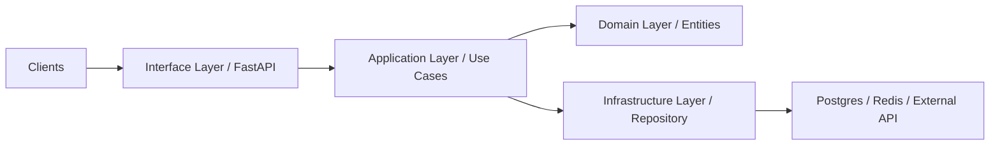

# Python Rules

Queste regole si applicano a **ogni file Python generato o modificato**. L'obiettivo è codice leggibile, type-safe e moderno (Python 3.10+).



> [!TIP]
> In Python, la leggibilità conta quanto il funzionamento. Usa `ruff` e `black` per garantire uno stile coerente e concentrati sulla logica di business invece che sulla formattazione.


---

## 1. Stile & Formattazione

Segui **PEP 8** e automatizza il formatting con i tool standard:

```bash
# Tool consigliati (configura nel progetto)
pip install black isort ruff

# black — formattatore opinionato
black .

# isort — ordinamento import
isort .

# ruff — linter velocissimo (sostituisce flake8+pylint)
ruff check .
```

**Configurazione `pyproject.toml`**:
```toml
[tool.black]
line-length = 88
target-version = ["py311"]

[tool.isort]
profile = "black"

[tool.ruff.lint]
select = ["E", "F", "I", "N", "UP", "S"]
```

---

## 2. Type Hints — Obbligatori

Ogni funzione, metodo e variabile di modulo deve avere type hints. Usa `mypy` o `pyright` per la verifica statica.

> [!IMPORTANT]
> I Type Hint non sono opzionali. Una funzione senza tipi è considerata "legacy" e deve essere refactorata immediatamente. Questo è fondamentale per prevenire bug a runtime in applicazioni complesse.


```python
# ✅ CORRETTO — type hints completi
from typing import Optional
from datetime import datetime

def get_user_by_email(email: str) -> Optional["User"]:
    """Recupera un utente per email. Ritorna None se non trovato."""
    ...

# ✅ Python 3.10+ — X | None invece di Optional[X]
def find_order(order_id: str) -> "Order | None":
    ...

# ✅ Dataclass per DTO/Value Objects
from dataclasses import dataclass, field

@dataclass(frozen=True)  # frozen = immutabile
class CreateUserDTO:
    email: str
    name: str
    role: str = "USER"
```

**Configura mypy in `pyproject.toml`**:
```toml
[tool.mypy]
python_version = "3.11"
strict = true
warn_return_any = true
```

---

## 3. Dependency & Packaging

| Tool | Uso |
|---|---|
| **Poetry** (preferito) | Gestione dipendenze, virtual env, publish |
| **uv** | Alternativa ultra-veloce a pip + venv |
| **pip + venv** | Fallback minimale |

```bash
# ✅ Avvia un nuovo progetto con Poetry
poetry new my-project
poetry add fastapi uvicorn[standard]
poetry add --group dev pytest mypy black ruff

# ✅ Esporta requirements.txt per compatibilità
poetry export -f requirements.txt --output requirements.txt
```

**Non usare** `pip install` globale. Sempre in un virtual environment isolato.

---

## 4. Async Programming

Per API ad alta concorrenza (FastAPI, aiohttp) usa `async/await`.

```python
# ✅ FastAPI async handler
from fastapi import FastAPI, HTTPException
import asyncio

app = FastAPI()

@app.get("/users/{user_id}")
async def get_user(user_id: str) -> UserResponse:
    user = await user_service.find_by_id(user_id)
    if not user:
        raise HTTPException(status_code=404, detail="User not found")
    return UserResponse.from_domain(user)

# ✅ Operazioni parallele
async def get_dashboard_data(user_id: str):
    user, orders, stats = await asyncio.gather(
        user_service.find_by_id(user_id),
        order_service.find_by_user(user_id),
        stats_service.get_user_stats(user_id),
    )
    return { "user": user, "orders": orders, "stats": stats }
```

---

## 5. Error Handling

```python
# ✅ Custom exception hierarchy
class AppError(Exception):
    def __init__(self, message: str, status_code: int = 500):
        super().__init__(message)
        self.status_code = status_code

class NotFoundError(AppError):
    def __init__(self, resource: str):
        super().__init__(f"{resource} not found", status_code=404)

class ValidationError(AppError):
    def __init__(self, message: str):
        super().__init__(message, status_code=400)

# ✅ Gestione errori in FastAPI
from fastapi import Request
from fastapi.responses import JSONResponse

@app.exception_handler(AppError)
async def app_error_handler(request: Request, exc: AppError):
    return JSONResponse(
        status_code=exc.status_code,
        content={"error": str(exc)},
    )
```

---

## 6. FastAPI — Standard di Pattern

```python
# ✅ Struttura Clean Architecture in FastAPI
# src/
#   domain/          → entities, value objects, repository interfaces
#   application/     → use cases / services
#   infrastructure/  → repository implementations (SQLAlchemy, MongoDB)
#   interface/       → FastAPI routers, request/response schemas (Pydantic)

# ✅ Pydantic v2 per validazione input/output
from pydantic import BaseModel, EmailStr, Field

class CreateUserRequest(BaseModel):
    email: EmailStr
    name: str = Field(min_length=2, max_length=100)
    role: Literal["USER", "ADMIN"] = "USER"

class UserResponse(BaseModel):
    id: str
    email: str
    name: str
    created_at: datetime

    model_config = {"from_attributes": True}  # Pydantic v2
```

---

## 7. Testing

```python
# ✅ pytest + pytest-asyncio
import pytest
from httpx import AsyncClient

@pytest.mark.asyncio
async def test_create_user_returns_201(async_client: AsyncClient):
    # Arrange
    payload = {"email": "mario@test.it", "name": "Mario"}

    # Act
    response = await async_client.post("/users", json=payload)

    # Assert
    assert response.status_code == 201
    assert response.json()["email"] == payload["email"]

# ✅ Fixture per dependency injection nei test
@pytest.fixture
def fake_user_repo() -> UserRepository:
    return InMemoryUserRepository()
```