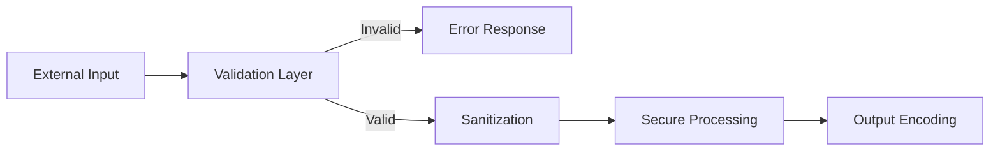

# Security Standards (OWASP)

Queste regole si applicano a **tutto il codice generato** per garantire sicurezza by design. Non sono opzionali.

---

## 1. Input Validation

Valida **tutti** gli input sul lato server. Non fidarti mai del client.

```typescript
// ✅ Con Zod (TypeScript)
import { z } from 'zod';

const CreateUserSchema = z.object({
  email: z.string().email(),
  password: z.string().min(8).max(128),
  role: z.enum(['USER', 'ADMIN']),
});

// In controller/use case:
const parsed = CreateUserSchema.safeParse(req.body);
if (!parsed.success) {
  return res.status(400).json({ errors: parsed.error.flatten() });
}
```

**Regole**:
- Usa **whitelist** di valori accettati, non blacklist.
- Imposta limiti di lunghezza minimo e massimo su tutti i campi stringa.
- Non usare mai `eval()` o costrutti dinamici con input utente.

> [!IMPORTANT]
> La validazione dell'input è la prima linea di difesa contro injection, XSS e buffer overflow. Non saltarla MAI, nemmeno per comunicazioni inter-servizio "fidate".



---

## 2. Authentication & Authorization

### JWT — Gestione Token
```typescript
// ✅ Access token breve + Refresh token in HttpOnly cookie
const accessToken = jwt.sign(payload, SECRET, { expiresIn: '15m' });
const refreshToken = crypto.randomBytes(64).toString('hex'); // opaque token

// Cookie sicuro per il refresh token
res.cookie('refreshToken', refreshToken, {
  httpOnly: true,   // non accessibile da JS
  secure: true,     // solo HTTPS
  sameSite: 'strict',
  maxAge: 7 * 24 * 60 * 60 * 1000, // 7 giorni
});
```

### RBAC — Role-Based Access Control
```typescript
// ✅ Middleware di autorizzazione
function authorize(...roles: Role[]) {
  return (req: Request, res: Response, next: NextFunction) => {
    if (!req.user || !roles.includes(req.user.role)) {
      return res.status(403).json({ error: 'Forbidden' });
    }
    next();
  };
}

// Uso: router.delete('/users/:id', authenticate, authorize('ADMIN'), deleteUser);
```

**Regole**:
- Applica il principio del **minimo privilegio** (Least Privilege).
- Separa sempre **autenticazione** (chi sei?) da **autorizzazione** (cosa puoi fare?).
- Non implementare crypto home-made. Usa librerie battle-tested (jsonwebtoken, bcrypt, Argon2).
- Per esempi di implementazione dettagliati, consulta la skill [auth-patterns](../skills/auth-patterns/SKILL.md).

---

## 3. Sensitive Data Exposure

```bash
# ✅ Usa sempre variabili d'ambiente per i segreti
DATABASE_URL="mongodb://..."
JWT_SECRET="..."
API_KEY="..."

# .gitignore obbligatorio
.env
.env.local
.env.production
```

**Regole**:
- **NEVER** committare segreti nel codice. Usa `.env` + `.gitignore`.
- Usa **hashing forte** per le password: Argon2id (preferito) o bcrypt con cost ≥ 12.
- Non loggare mai password, token, chiavi API o dati sensibili dell'utente.
- In risposta API, non esporre campi come `password`, `passwordHash`, `internalId`.

---

## 4. Injection Prevention

```typescript
// ✅ SQL — usa ORM o query parametrizzate
const user = await db.query('SELECT * FROM users WHERE id = $1', [userId]);

// ✅ MongoDB — usa driver/ORM, non costruire query da stringhe
const user = await User.findOne({ _id: new ObjectId(userId) });

// ❌ MAI string concatenation per query
const query = `SELECT * FROM users WHERE id = '${userId}'`; // SQL Injection!
```

---

## 5. Cross-Site Scripting (XSS) & CSRF

### XSS Prevention
```typescript
// ✅ Escape dei dati in output (se non usi framework che lo fa automaticamente)
import DOMPurify from 'dompurify';
const safeHtml = DOMPurify.sanitize(userInput);

// React e Vue eseguono l'escape automaticamente nelle espressioni template.
// ❌ NON usare dangerouslySetInnerHTML / v-html con dati non sanitizzati.
```

### CSRF Prevention
- ⚠️ `csurf` è **deprecato** (2023) e non mantenuto. Usa invece **`csrf-csrf`** o **`@edge-csrf/core`**.
- Se usi **JWT in `Authorization: Bearer` header** (non cookie), sei naturalmente protetto da CSRF: non hai bisogno di token aggiuntivi.
- Se usi **cookie di sessione**, implementa il Double Submit Cookie pattern con `csrf-csrf`:
  ```bash
  npm install csrf-csrf
  ```
- Imposta sempre `SameSite=Strict` o `SameSite=Lax` sui cookie di autenticazione.

---

## 6. Rate Limiting & Brute Force Prevention

```typescript
// ✅ Express — usa express-rate-limit
import rateLimit from 'express-rate-limit';

const loginLimiter = rateLimit({
  windowMs: 15 * 60 * 1000, // 15 minuti
  max: 10, // max 10 tentativi per IP
  standardHeaders: true,
  legacyHeaders: false,
  message: { error: 'Too many login attempts. Try again later.' },
});

app.post('/auth/login', loginLimiter, loginHandler);
```

---

## 7. Security Headers

Aggiungi sempre gli header di sicurezza HTTP (usa `helmet` per Express):

```typescript
import helmet from 'helmet';
app.use(helmet()); // Include: X-Content-Type-Options, X-Frame-Options, HSTS, CSP, ecc.
```

---

## Checklist Pre-Commit Sicurezza

Prima di ogni commit, verifica:
- [ ] Nessun segreto hardcoded nel codice
- [ ] Tutti gli input sono validati con uno schema (Zod/Joi)
- [ ] Le query DB usano parametri, non string concatenation
- [ ] I token JWT hanno scadenze brevi (access: 15m, refresh: 7d)
- [ ] I cookie sensibili hanno `httpOnly`, `secure`, `sameSite`
- [ ] Il rate limiting è attivo sugli endpoint pubblici sensibili
