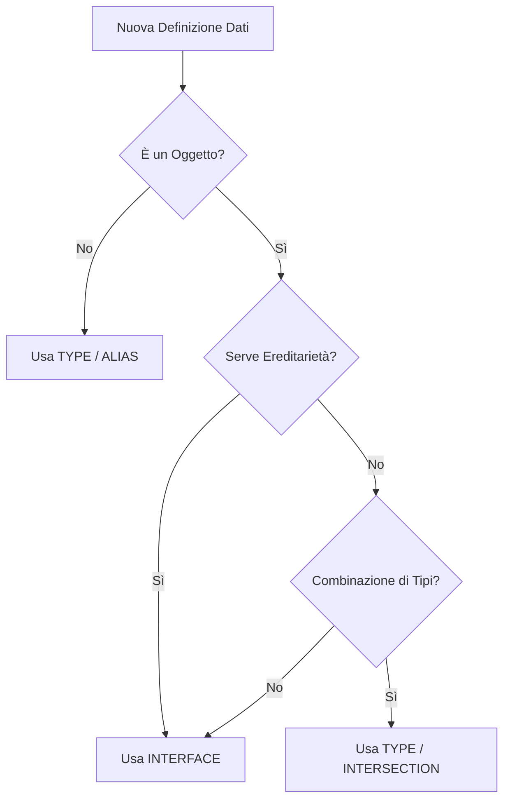

# TypeScript Rules

Queste regole si applicano a **ogni file TypeScript prodotto o modificato**. L'obiettivo è type-safety massima e codice prevedibile.



> [!NOTE]
> Le `interface` sono preferite per API pubbliche ed estendibili (grazie alla declaration merging), mentre i `type` eccellono nella manipolazione di tipi complessi (Union, Intersection, Mapped Types).


---

## 1. Strict Mode — Obbligatorio

Abilita sempre `strict: true` in `tsconfig.json`. Questo attiva:

```json
{
  "compilerOptions": {
    "strict": true,
    "noImplicitAny": true,
    "strictNullChecks": true,
    "strictFunctionTypes": true,
    "noUnusedLocals": true,
    "noUnusedParameters": true,
    "exactOptionalPropertyTypes": true
  }
}
```

**Non usare mai `any`**. Usa alternative sicure:

> [!CAUTION]
> L'uso di `any` disabilita completamente il controllo dei tipi di TypeScript, rendendo il compilatore inutile. È una violazione grave dei princìpi di Clean Architecture e sicurezza del codice. Se il tipo è ignoto all'origine, usa `unknown`.


```typescript
// ❌ Evita
function process(data: any) { ... }

// ✅ Usa unknown per input non tipizzato, poi restringi con type guard
function process(data: unknown) {
  if (typeof data === 'string') { /* safe */ }
}

// ✅ Usa generics per funzioni polimorfe
function identity<T>(value: T): T { return value; }
```

---

## 2. Interfaces vs Types

| Usa `interface` per... | Usa `type` per... |
|---|---|
| Oggetti pubblici e DTO | Union e intersection types |
| Contratti (Repository, Service) | Aliases di tipi primitivi |
| Ereditarietà e `extends` | Mapped types e conditional types |

```typescript
// ✅ Interface per contratto di repository
interface UserRepository {
  findById(id: string): Promise<User | null>;
  save(user: User): Promise<User>;
}

// ✅ Type per union e alias
type UserId = string;
type Role = 'ADMIN' | 'USER' | 'GUEST';
type ApiResponse<T> = { status: 'success'; data: T } | { status: 'error'; message: string };
```

---

## 3. Async/Await & Promise

```typescript
// ✅ Usa async/await — più leggibile e debuggabile
async function fetchUser(id: string): Promise<User> {
  const user = await userRepo.findById(id);
  if (!user) throw new NotFoundError(`User ${id} not found`);
  return user;
}

// ✅ Operazioni parallele indipendenti → Promise.all
const [user, permissions] = await Promise.all([
  userRepo.findById(id),
  permissionRepo.findByUserId(id),
]);

// ✅ Gestisci i failure selettivi → Promise.allSettled
const results = await Promise.allSettled([fetchA(), fetchB()]);

// ❌ Evita .then().catch() anidati (callback hell)
fetchUser(id).then(user => getOrders(user.id).then(orders => ...));
```

---

## 4. Enums — Prefer Alternatives

Gli `enum` TypeScript introducono codice JavaScript aggiuntivo e comportamenti inaspettati.

```typescript
// ❌ Enum classico (compila in un oggetto IIFE)
enum Status { Active, Inactive }

// ✅ String literal union type (zero overhead, fully type-safe)
type Status = 'ACTIVE' | 'INACTIVE' | 'PENDING';

// ✅ Const object (accesso come enum, ma prevedibile)
const STATUS = {
  ACTIVE: 'ACTIVE',
  INACTIVE: 'INACTIVE',
} as const;
type Status = typeof STATUS[keyof typeof STATUS];
```

---

## 5. Readonly & Immutability

```typescript
// ✅ Proprietà readonly di default nelle interfacce
interface User {
  readonly id: string;
  readonly email: string;
  name: string; // solo name è mutabile
}

// ✅ Readonly array
function processItems(items: ReadonlyArray<string>): void { ... }

// ✅ DeepReadonly per oggetti complessi
type DeepReadonly<T> = { readonly [P in keyof T]: DeepReadonly<T[P]> };
```

---

## 6. Generics

```typescript
// ✅ Repository generico riusabile
interface Repository<T, ID> {
  findById(id: ID): Promise<T | null>;
  save(entity: T): Promise<T>;
  delete(id: ID): Promise<void>;
}

// ✅ Result type per Error Handling esplicito (pattern Railway)
type Result<T, E = Error> = { success: true; data: T } | { success: false; error: E };

async function createUser(dto: CreateUserDTO): Promise<Result<User>> {
  try {
    const user = await userRepo.save(User.create(dto));
    return { success: true, data: user };
  } catch (error) {
    return { success: false, error: error as Error };
  }
}
```

---

## 7. Error Handling in TypeScript

```typescript
// ✅ Custom error classes con type discrimination
class AppError extends Error {
  constructor(
    message: string,
    public readonly statusCode: number,
    public readonly code: string
  ) {
    super(message);
    this.name = this.constructor.name;
  }
}

class NotFoundError extends AppError {
  constructor(resource: string) {
    super(`${resource} not found`, 404, 'NOT_FOUND');
  }
}

class ValidationError extends AppError {
  constructor(message: string) {
    super(message, 400, 'VALIDATION_ERROR');
  }
}

// ✅ Type guard per error handling
function isAppError(error: unknown): error is AppError {
  return error instanceof AppError;
}
```

---

## 8. Utility Types Utili

```typescript
// Partial<T> — tutte le proprietà opzionali (utile per update DTO)
type UpdateUserDTO = Partial<Pick<User, 'name' | 'email'>>;

// Required<T> — tutte le proprietà obbligatorie
type CompleteUser = Required<User>;

// Record<K, V> — dizionario tipizzato
const rolePermissions: Record<Role, string[]> = { ADMIN: ['*'], USER: ['read'] };

// Omit<T, K> — esclude campi (utile per response DTO senza password)
type UserResponse = Omit<User, 'passwordHash'>;

// Extract / Exclude — filtraggio di union types
type AdminOrUser = Extract<Role, 'ADMIN' | 'USER'>;
```