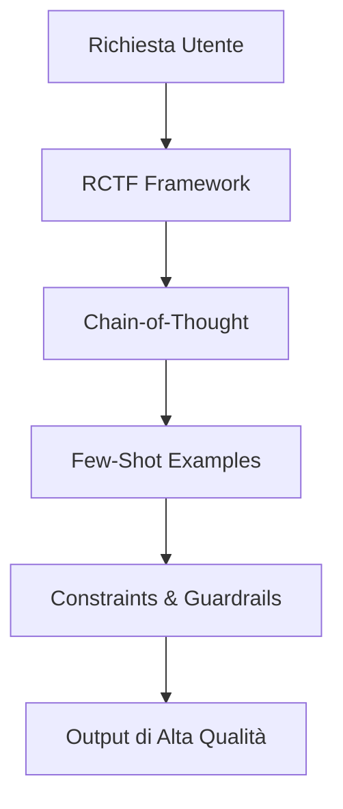

# AI Prompting Skill

> [!TIP]
> Un buon prompt non è solo un set di istruzioni, ma un framework di pensiero condiviso tra umano e AI.



## Il Contesto
Un prompt mal scritto produce output generici, incoerenti o errati. Un prompt ben strutturato trasforma l'AI in un collaboratore preciso. Questa skill distilla le tecniche più efficaci testate in produzione.

---

## Pattern 1: Role + Context + Task + Format (RCTF)

La struttura RCTF è il framework di base per qualsiasi prompt efficace:

```
[ROLE]    — Chi è l'AI in questo contesto?
[CONTEXT] — Quale situazione o stato di partenza?
[TASK]    — Cosa deve fare esattamente?
[FORMAT]  — Come deve essere strutturato l'output?
```

**Esempio — Code Review Prompt**:
```
ROLE: Sei un Senior TypeScript Developer specializzato in Clean Architecture.

CONTEXT: Sto aggiungendo un endpoint POST /api/orders a un'API Express esistente 
che usa Prisma e segue la Clean Architecture. Il codice attuale è questo:
[CODICE]

TASK: Esegui una code review. Identifica:
1. Violazioni della Clean Architecture (dipendenze nei layer sbagliati)
2. Problemi di sicurezza (mancanza di validazione input, OWASP)
3. Problemi di performance (N+1, query inefficienti)

FORMAT: Usa questo schema per ogni finding:
- [SEVERITY: BLOCKING/IMPORTANT/SUGGESTION] Titolo
  - Problema: ...
  - Suggerimento: [codice concreto]
```

---

## Pattern 2: Chain-of-Thought (CoT)

Istruisci l'AI a *ragionare prima di rispondere*. Cruciale per task complessi di analisi o design.

```
Prima di rispondere, ragiona step-by-step:
1. Analizza il requisito e identifica i casi edge.
2. Considera 2-3 approcci alternativi con i loro trade-off.
3. Scegli l'approccio migliore e spiega perché.
4. Solo poi scrivi il codice finale.
```

**Quando usarlo**: architetture, debugging complesso, security audit, decisioni tecniche.

---

## Pattern 3: Few-Shot Examples

Fornisci esempi concreti di input → output atteso per guidare lo stile della risposta.

```
Quando scrivi un Use Case, segui questo pattern:

ESEMPIO INPUT: "Crea un Use Case per aggiornare il profilo utente"

ESEMPIO OUTPUT:
\`\`\`typescript
class UpdateUserProfileUseCase {
  constructor(private readonly userRepo: UserRepository) {}

  async execute(userId: string, dto: UpdateUserDTO): Promise<Result<User>> {
    const user = await this.userRepo.findById(userId);
    if (!user) return { success: false, error: new NotFoundError('User') };
    const updated = user.updateProfile(dto);
    await this.userRepo.save(updated);
    return { success: true, data: updated };
  }
}
\`\`\`

Ora crea un Use Case per: [NUOVO TASK]
```

---

## Pattern 4: Constraints & Guardrails

Definisci esplicitamente cosa l'AI **NON** deve fare. Previene output fuori scope.

```
VINCOLI OBBLIGATORI:
- Non usare `any` in TypeScript
- Non suggerire soluzioni che richiedono librerie non presenti in package.json
- Non scrivere codice non testabile (niente dipendenze hardcoded)
- Non aggiungere feature non richieste esplicitamente nel task
- Se non sei certo di qualcosa, dillo esplicitamente prima di procedere
```

---

## Pattern 5: Iterative Refinement

Per task complessi, usa un approccio in 2 fasi invece di chiedere tutto in una volta:

```
FASE 1 — Piano:
"Prima di scrivere codice, proponi un piano architetturale in max 5 punti.
Non scrivere codice ancora."

[Rivedi e approva il piano]

FASE 2 — Implementazione:
"Implementa ora il piano approvato, seguendo le regole in docs/rules/common.md"
```

---

## Anti-Pattern da Evitare

| Anti-Pattern | Problema | Fix |
|---|---|---|
| Prompt vago: "Scrivi del codice per gli utenti" | Output generico | Specifica: layer, tecnologie, vincoli |
| Prompt troppo lungo (>2000 token di contesto) | L'AI "dimentica" l'inizio | Spezzalo in più prompt sequenziali |
| Nessun formato richiesto | Output inconsistente tra run | Sempre specificare il formato atteso |
| Chiedere tutto in una volta | Qualità scade su task complessi | Usa Chain-of-Thought + fasi sequenziali |
| Nessun esempio | L'AI interpreta liberamente | Usa Few-Shot con almeno 1 esempio |

---

## Template per Nuove Rule/Skill

Quando vuoi aggiungere contenuto a questa libreria, usa questo prompt:

```
Sei un Technical Writer esperto di Antigravity (leggi GEMINI.md per il contesto).

TASK: Crea una nuova [regola in docs/rules/ | skill in skills/] su "[ARGOMENTO]".

Deve includere:
- Titolo H1 descrittivo
- Sezione "Il Contesto" (perché questa regola esiste)
- 3-5 sezioni con esempi di codice ✅/❌
- Checklist finale azionabile

VINCOLI:
- Lunghezza: 150-250 righe
- Lingua: italiano
- Codice: TypeScript preferito, con commenti esplicativi
- No placeholder: ogni esempio deve essere funzionante
```

---

## Checklist Prompt Quality

- [ ] Il ROLE è specifico (non "sei un esperto", ma "sei un Senior TypeScript Developer con foco su Clean Architecture")
- [ ] Il CONTEXT include lo stato attuale del codice/sistema
- [ ] Il TASK usa verbi d'azione chiari (analizza, identifica, crea, refactora)
- [ ] Il FORMAT specifica struttura, lunghezza e lingua dell'output
- [ ] I VINCOLI elencano esplicitamente cosa non fare
- [ ] Per task complessi: usato CoT o approccio a fasi

