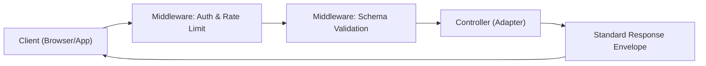

# RESTful API Design Standards

In Antigravity, la progettazione delle API segue rigorosi standard di coerenza e sicurezza. Un'API ben disegnata è auto-esplicativa, prevedibile e facile da integrare.

> [!IMPORTANT]
> Tutte le API devono essere accompagnate da una specifica OpenAPI (Swagger) aggiornata che funga da "contratto" tra frontend e backend.

## Flusso di una Richiesta API



## Struttura degli Endpoint (Nomi, non Verbi)

Gli URL devono rappresentare risorse (nomi plurali), non azioni. L'azione è definita dal metodo HTTP.

- `GET /orders`: Recupera la lista degli ordini (Supporta paginazione/filtri).
- `POST /orders`: Crea un nuovo ordine.
- `GET /orders/{id}`: Recupera il dettaglio di un ordine specifico.
- `PATCH /orders/{id}`: Aggiornamento parziale (es: cambia solo lo stato).
- `DELETE /orders/{id}`: Cancellazione logica o fisica dell'ordine.

## Standard di Risposta (Envelope)

Tutte le risposte devono seguire una struttura standard per facilitare il parsing lato client.

```json
{
  "status": "success",
  "data": {
    "user": {
      "id": "uuid-123",
      "email": "mario@example.com"
    }
  },
  "metadata": {
    "requestId": "req-987",
    "timestamp": "2026-04-09T10:00:00Z"
  }
}
```

### Status Codes Fondamentali

- **200 OK**: Richiesta completata con successo.
- **201 Created**: Nuova risorsa creata (ritorna l'oggetto creato).
- **400 Bad Request**: Errore di validazione (ritorna i dettagli dei campi errati).
- **401 Unauthorized**: Manca l'autenticazione.
- **403 Forbidden**: Utente autenticato ma non ha i permessi (RBAC).
- **404 Not Found**: La risorsa non esiste.
- **500 Internal Server Error**: Bug lato server (non esporre mai lo stack trace).

## Paginazione e Filtraggio

Le collezioni devono essere paginate per default per proteggere le performance del database.

```javascript
// Esempio di query string per paginazione e ricerca
// GET /api/v1/users?page=2&limit=50&role=admin&sort=createdAt:desc
```

La risposta paginata deve includere i metadata:

```json
{
  "status": "success",
  "data": [...],
  "pagination": {
    "total": 1250,
    "limit": 50,
    "page": 2,
    "pages": 25
  }
}
```

## Validazione dello Schema

Utilizza sempre librerie come **Joi**, **Zod** o **Yup** per validare il body delle richieste prima di processarle.

```typescript
const UserSchema = z.object({
  email: z.string().email(),
  password: z.string().min(8),
  role: z.enum(['USER', 'ADMIN']).default('USER')
});
```

> [!TIP]
> Usa `PATCH` invece di `PUT` quando vuoi aggiornare solo alcuni campi di una risorsa, risparmiando banda e riducendo il rischio di sovrascrittura accidentale di dati non inviati.

> [!CAUTION]
> Non includere mai segreti (API keys, password hash) nelle risposte API, nemmeno per gli amministratori.
