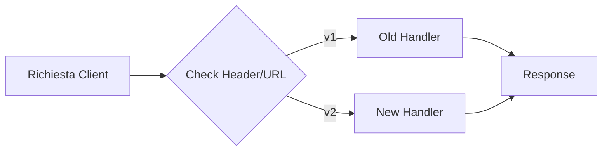

# API Versioning Skill

> [!IMPORTANT]
> Una strategia di versioning chiara è la spina dorsale della stabilità degli ecosistemi distribuiti.



Questa skill definisce i pattern per gestire il **versionamento delle API** in modo da evolvere il contratto senza rompere i client esistenti. Applicala prima di rilasciare un breaking change o quando pianifichi l'evoluzione di un'API pubblica.

## Il Contesto
Un'API senza versionamento è un debito tecnico critico. Ogni modifica che rompe il contratto esistente (rimozione campo, cambio tipo, endpoint rinominato) diventa un'emergenza per i client. Il versionamento ti dà la libertà di evolvere l'API mantenendo la compatibilità.

---

## Pattern 1: URI Versioning (Raccomandato)

La strategia più comune e comprensibile: la versione è nella URL.

```typescript
// ✅ Router Express con versioning
import { Router } from 'express';
import { usersRouterV1 } from './v1/users.router';
import { usersRouterV2 } from './v2/users.router';

const apiRouter = Router();

apiRouter.use('/v1/users', usersRouterV1);
apiRouter.use('/v2/users', usersRouterV2);

// Alias: /api/users → /api/v2/users (versione corrente)
apiRouter.use('/users', usersRouterV2);

export { apiRouter };
```

**Struttura cartelle**:
```
src/
  interface/
    api/
      v1/
        users.router.ts      # vecchia implementazione — non modificare!
        users.controller.ts
      v2/
        users.router.ts      # nuova implementazione
        users.controller.ts
```

---

## Pattern 2: Deprecation Headers

Segnala ai client che una versione è deprecata **prima** di rimuoverla, con largo anticipo.

```typescript
// ✅ Middleware di deprecation — da applicare sulle route v1
function deprecationWarning(sunsetDate: string, link?: string) {
  return (req: Request, res: Response, next: NextFunction) => {
    // Sunset header (RFC 8594) — data di rimozione pianificata
    res.setHeader('Sunset', new Date(sunsetDate).toUTCString());
    // Deprecation header (RFC 9745)
    res.setHeader('Deprecation', 'true');
    if (link) {
      res.setHeader('Link', `<${link}>; rel="successor-version"`);
    }
    next();
  };
}

// Uso su router v1
router.use(deprecationWarning('2026-12-31', '/api/v2/users'));
```

**HTTP Response con headers di deprecation**:
```
HTTP/1.1 200 OK
Deprecation: true
Sunset: Wed, 31 Dec 2026 23:59:59 GMT
Link: </api/v2/users>; rel="successor-version"
```

---

## Pattern 3: Gestione Breaking Changes

Distingui cambiamenti **compatibili** (non richiedono nuova versione) da **breaking** (richiedono nuova versione).

### ✅ Cambiamenti NON-breaking (compatibili con versione esistente)
| Tipo | Esempio |
|---|---|
| Aggiunta campo opzionale | `{ name, email, **bio?** }` |
| Nuovo endpoint | `POST /v1/users/export` |
| Nuovo valore enum | `status: 'active' \| 'inactive' \| **'suspended'**` |
| Nuovi header di risposta | `X-Request-Id` |

### ❌ Cambiamenti BREAKING (richiedono nuova versione)
| Tipo | Esempio |
|---|---|
| Rimozione campo | `{ name, ~~email~~ }` |
| Cambio tipo | `id: number` → `id: string` |
| Cambio semantica | `GET /orders` ritornava solo propri ordini, ora tutti |
| Rename campo | `firstName` → `first_name` |
| Rimozione endpoint | `DELETE /v1/users/bulk` rimosso |

---

## Pattern 4: Changelog & Migration Guide

Per ogni nuova versione, documenta le differenze e fornisci una guida di migrazione.

```markdown
# API Migration Guide: v1 → v2

## Breaking Changes

### Users endpoint
- `GET /v2/users` ora ritorna i campi in camelCase (era snake_case in v1)
  - `first_name` → `firstName`
  - `created_at` → `createdAt`
- Il campo `role` ora è un oggetto `{ id, name }` invece di una stringa

### Orders endpoint  
- `POST /v2/orders` richiede ora `lineItems[]` invece di `productId` + `quantity`

## Migration Steps

1. Aggiorna il client per usare il path `/v2/`
2. Rinomina i campi nel parsing della risposta Users
3. Aggiorna il payload Orders alla nuova struttura lineItems
4. Verifica: `/v1` sarà rimosso il **2026-12-31**

## Esempi

### Prima (v1)
```json
GET /api/v1/users/123
{ "first_name": "Mario", "role": "ADMIN" }
```

### Dopo (v2)
```json
GET /api/v2/users/123
{ "firstName": "Mario", "role": { "id": "1", "name": "ADMIN" } }
```
```

---

## Pattern 5: Versionamento Contratto OpenAPI

```yaml
# openapi.yaml — specifica versionata
openapi: 3.1.0
info:
  title: My API
  version: "2.0.0"   # ← versione del contratto, non del software

# Deprecato
paths:
  /v1/users:
    get:
      deprecated: true   # ← flag OpenAPI standard
      summary: "[DEPRECATED - use /v2/users] List users"
      
  /v2/users:
    get:
      summary: "List users"
```

---

## Timeline di Deprecation Consigliata

```
Oggi → [Rilascio v2] → [3 mesi] → [Warning attivi v1] → [6 mesi] → [Sunset v1]
```

- **Minimo**: 3 mesi tra annuncio e sunset per API pubbliche.
- **Interno**: 1 mese può essere sufficiente se i client sono noti.
- **Comunica via**: email/changelog/header Deprecation + data su Sunset header.

---

## Checklist Versionamento API

- [ ] Breaking change identificato prima del rilascio
- [ ] Nuova versione creata (es. `/v2/`) con routing separato
- [ ] Versione precedente marcata con `Sunset` header e data
- [ ] Migration guide scritta e pubblicata
- [ ] Test di regressione sulla versione precedente (non deve rompersi)
- [ ] Specifica OpenAPI aggiornata con flag `deprecated: true` sulle route v1
- [ ] Timeline di sunset comunicata ai client (notifica + header)


