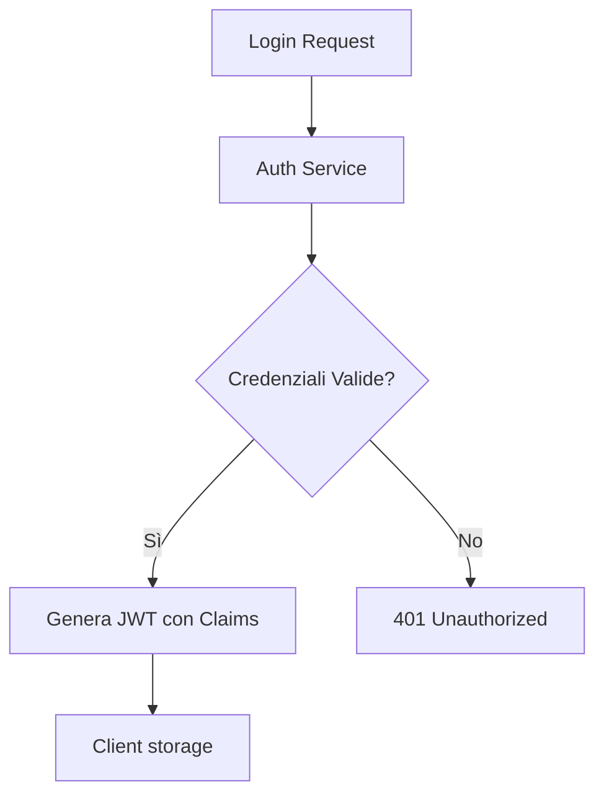

# Auth Patterns Skill

> [!IMPORTANT]
> L'autenticazione è l'identità, l'autorizzazione è il permesso. Non confonderle mai.



Questa skill definisce i pattern canonici per implementare **Autenticazione e Autorizzazione** sicure. Applicala ogni volta che devi proteggere endpoint o gestire identità utente.

## Il Contesto
L'autenticazione è l'area più soggetta a vulnerabilità critiche (vedi OWASP Top 10: A07 - Identification and Authentication Failures). Non reinventare la ruota: segui questi pattern consolidati.

---

## Pattern 1: JWT con Access + Refresh Token

### Architettura
```
Client → POST /auth/login → Server
         ← { accessToken: "eyJ..." } (15 min, in body/memory)
         ← Set-Cookie: refreshToken=... (7 days, HttpOnly)

Client → GET /api/resource → Bearer eyJ...
         Token scaduto → 401 Unauthorized
         → POST /auth/refresh (con cookie automatico)
         ← { accessToken: "eyJ..." } (nuovo)
```

### Implementazione (Node.js / TypeScript)
```typescript
import jwt from 'jsonwebtoken';
import crypto from 'crypto';

const JWT_SECRET = process.env.JWT_SECRET!;
const JWT_EXPIRES_IN = '15m';

// Generazione token
function generateTokens(userId: string, role: string) {
  const accessToken = jwt.sign(
    { sub: userId, role, iat: Date.now() },
    JWT_SECRET,
    { expiresIn: JWT_EXPIRES_IN }
  );

  const refreshToken = crypto.randomBytes(64).toString('hex'); // opaque
  return { accessToken, refreshToken };
}

// Middleware di autenticazione
function authenticate(req: Request, res: Response, next: NextFunction) {
  const authHeader = req.headers.authorization;
  if (!authHeader?.startsWith('Bearer ')) {
    return res.status(401).json({ error: 'Missing or invalid token' });
  }

  try {
    const payload = jwt.verify(authHeader.slice(7), JWT_SECRET) as JwtPayload;
    req.user = { id: payload.sub!, role: payload.role };
    next();
  } catch {
    return res.status(401).json({ error: 'Token expired or invalid' });
  }
}

// Refresh endpoint
async function refreshTokenHandler(req: Request, res: Response) {
  const incomingRefresh = req.cookies?.refreshToken;
  if (!incomingRefresh) return res.status(401).json({ error: 'No refresh token' });

  // Cerca il token nel DB, verifica che non sia revocato
  const session = await sessionRepo.findByToken(incomingRefresh);
  if (!session || session.expiresAt < new Date()) {
    return res.status(401).json({ error: 'Refresh token expired or invalid' });
  }

  // Ruota il refresh token (invalidate old, issue new)
  const tokens = generateTokens(session.userId, session.role);
  await sessionRepo.rotate(incomingRefresh, tokens.refreshToken);

  res.cookie('refreshToken', tokens.refreshToken, {
    httpOnly: true, secure: true, sameSite: 'strict',
    maxAge: 7 * 24 * 60 * 60 * 1000,
  });

  return res.json({ accessToken: tokens.accessToken });
}

// Logout endpoint (Invalidazione sessione)
async function logoutHandler(req: Request, res: Response) {
  const incomingRefresh = req.cookies?.refreshToken;
  if (incomingRefresh) {
    // Invalida il token nel DB così non può più essere usato per il refresh
    await sessionRepo.deleteByToken(incomingRefresh);
  }
  
  // Rimuovi il cookie dal client
  res.clearCookie('refreshToken');
  return res.status(204).send();
}
```

---

## Pattern 2: RBAC — Role-Based Access Control

```typescript
// Definizione ruoli e permessi
const PERMISSIONS = {
  'posts:read':   ['GUEST', 'USER', 'ADMIN'],
  'posts:write':  ['USER', 'ADMIN'],
  'posts:delete': ['ADMIN'],
  'users:manage': ['ADMIN'],
} as const;

type Permission = keyof typeof PERMISSIONS;
type Role = 'GUEST' | 'USER' | 'ADMIN';

function hasPermission(role: Role, permission: Permission): boolean {
  return (PERMISSIONS[permission] as readonly string[]).includes(role);
}

// Middleware di autorizzazione
function authorize(permission: Permission) {
  return (req: Request, res: Response, next: NextFunction) => {
    const role = req.user?.role ?? 'GUEST';
    if (!hasPermission(role as Role, permission)) {
      return res.status(403).json({ error: 'Insufficient permissions' });
    }
    next();
  };
}

// Uso su router
router.delete('/posts/:id',
  authenticate,
  authorize('posts:delete'),
  deletePostHandler
);
```

---

## Pattern 3: OAuth2 / OIDC (Social Login)

Usa **passportjs** (Node.js) o la libreria nativa del framework. Non implementare OAuth2 from scratch.

```typescript
// ✅ Con passport-google-oauth20
passport.use(new GoogleStrategy({
  clientID: process.env.GOOGLE_CLIENT_ID!,
  clientSecret: process.env.GOOGLE_CLIENT_SECRET!,
  callbackURL: '/auth/google/callback',
}, async (accessToken, refreshToken, profile, done) => {
  try {
    let user = await userRepo.findByGoogleId(profile.id);
    if (!user) {
      user = await userRepo.create({
        googleId: profile.id,
        email: profile.emails![0].value,
        name: profile.displayName,
      });
    }
    return done(null, user);
  } catch (err) {
    return done(err);
  }
}));
```

---

## Pattern 4: Password Hashing (Se necessario salt casuale salvato su db)

```typescript
import argon2 from 'argon2';

// Hash al momento della registrazione
async function hashPassword(plaintext: string): Promise<string> {
  return argon2.hash(plaintext, {
    type: argon2.argon2id,
    memoryCost: 65536,  // 64 MB
    timeCost: 3,
    parallelism: 4,
  });
}

// Verifica al momento del login
async function verifyPassword(hash: string, plaintext: string): Promise<boolean> {
  return argon2.verify(hash, plaintext);
}

// ❌ Non usare MD5, SHA1, SHA256 per le password — sono hash veloci, non adatti
// ❌ Non usare bcrypt con cost < 12
```

---

## Pattern 5: MFA — Multi-Factor Authentication

Implementazione obbligatoria per account privilegiati (Admin/Staff).

### Architettura (TOTP: Time-based One-Time Password)
1. **Enrollment**: Generazione di un segreto univoco -> Visualizzazione QR Code (per Google Authenticator/Authy).
2. **Verification**: Invio del codice a 6 cifre durante il login.

### Setup (Node.js con `otplib`)
```typescript
import { authenticator } from 'otplib';
import qrcode from 'qrcode';

// 1. Generazione Segreto MFA
async function generateMfaSecret(user: User) {
  const secret = authenticator.generateSecret();
  const otpauth = authenticator.keyuri(user.email, 'AntigravityAppName', secret);
  const qrCodeUrl = await qrcode.toDataURL(otpauth);
  
  return { secret, qrCodeUrl }; // Salva il segreto (criptato!) nel DB
}

// 2. Validazione Codice
function verifyMfaToken(token: string, secret: string): boolean {
  return authenticator.check(token, secret);
}
```

---

## Checklist Pre-Deploy Auth

- [ ] Access token scade in ≤ 15 minuti
- [ ] Refresh token è opaque (non JWT!) e salvato in DB per poter essere revocato
- [ ] Refresh token è in `HttpOnly` cookie, non in `localStorage`
- [ ] Il rotation del refresh token è implementato (ogni refresh genera un nuovo token)
- [ ] Il logout invalida il refresh token nel DB
- [ ] Rate limiting attivo su `/auth/login` e `/auth/refresh`
- [ ] Password hashata con Argon2id (cost ≥ 64MB)
- [ ] CORS configurato con `origin` whitelist esplicita, non `*`


