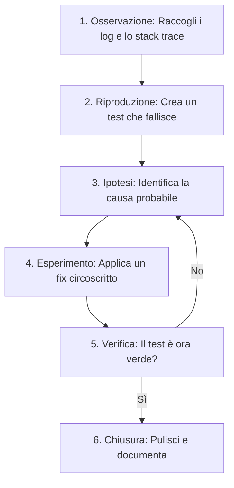

# Systematic Debugging & Root Cause Analysis

Il debugging non è un atto di fortuna o intuizione pura; in Antigravity lo consideriamo un **processo scientifico** rigoroso. Risolvere un bug significa comprenderne l'origine profonda per evitare che si ripresenti.

> [!IMPORTANT]
> Non provare mai a risolvere un bug che non sei riuscito a riprodurre in modo deterministico. Una soluzione basata sull'ipotesi senza conferma è spesso un "cerotto" che nasconde il vero problema.

## Il Metodo Scientifico di Debugging

Segui questo flusso per ridurre drasticamente il tempo di risoluzione delle issue complesse.



## Tecniche Avanzate

### 1. Root Cause Analysis (I Cinque Perché)
La tecnica dei "5 Whys" aiuta a scavare oltre i sintomi superficiali.

```markdown
**Esempio di Analisi:**
1. Perché il sistema è andato in crash? -> C'è stata una NullReferenceException.
2. Perché l'oggetto era null? -> Perché la chiamata all'API esterna ha fallito.
3. Perché la chiamata ha fallito? -> Perché il token di autenticazione era scaduto.
4. Perché non è stato rinnovato? -> Perché il cronjob di refresh non è partito.
5. Perché il cronjob non è partito? -> Perché la configurazione del path era errata.
**FIX REALE:** Correggere il path del cronjob (non aggiungere un controllo if(null)).
```

### 2. Binary Search Debugging (Divide et Impera)
Se hai una funzione lunga o una pipeline complessa e non sai dove fallisce, usa la ricerca binaria commentando/isolando metà del codice.

```javascript
async function complexProcess(data) {
  // Step A: Validazione
  await stepA(data); 
  
  // LOGICA DI CONTROLLO: Se torno qui, il bug è negli Step B o C
  // return { message: "Step A OK" }; 

  // Step B: Trasformazione
  await stepB(data); 
  
  // Step C: Salvataggio
  await stepC(data);
}
```

### 3. Riproduzione tramite Test (Test-Double)
Scrivi sempre un test di regressione prima di correggere. Questo serve come documentazione vivente del bug.

```typescript
describe('Bug #123 Regression Test', () => {
  it('should handle special characters in username without crashing', async () => {
    // Arrange: input che causava il crash
    const maliciousInput = "mario;-- DROP TABLE users";
    const service = new UserService();

    // Act & Assert
    // Questo test DEVE fallire prima del fix e passare dopo il fix
    await expect(service.updateProfile(maliciousInput)).resolves.not.toThrow();
  });
});
```

## Observability vs Debugging

In produzione, il debugging classico è impossibile. Devi fare affidamento sull'**Osservabilità**.

> [!TIP]
> Logga sempre il contesto! Un messaggio di errore come `"Error: failed"` è inutile. Usa:
> `logger.error({ userId, action, errorCode: 'AUTH_001', originalError: err.message }, "Authentication failed")`.

### Checklist Anti-Bug
- [ ] Hai controllato i log del server e del browser (se applicabile)?
- [ ] Hai verificato la versione delle dipendenze (package-lock.json)?
- [ ] Esistono variabili d'ambiente mancanti o errate?
- [ ] Il bug dipende dallo stato globale (cache, db persistente)?

> [!CAUTION]
> Evita di usare `console.log` in produzione o di lasciarli nel codice dopo la sessione di debugging. Possono rallentare le prestazioni e inquinare i log di sistema.
