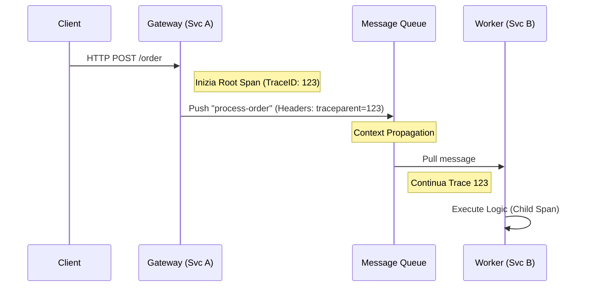

# High-Fidelity Observability & Deep Debugging

In sistemi distribuiti e asincroni, il logging tradizionale non è sufficiente. L'**Osservabilità** è la capacità di comprendere lo stato interno di un sistema basandosi esclusivamente sui suoi output esterni (Segnali: Traces, Metrics, Logs).

## 1. Architettura del Distributed Tracing

Il Distributed Tracing permette di ricostruire il percorso di una richiesta attraverso molteplici microservizi, code e database.

### Core Concepts:
- **Trace**: L'intero "viaggio" di un'operazione (es. una richiesta HTTP `POST /order`).
- **Span**: Un'unità di lavoro atomica (es. una query DB, una chiamata gRPC).
- **Context Propagation**: L'atto di passare i metadati del tracing (`traceId`, `spanId`) tra i confini del sistema.



## 2. Regole di Context Propagation

Per garantire la tracciabilità end-to-end, il contesto di tracciamento deve fluire attraverso ogni strato.

### A. HTTP & Web Frameworks
Usa lo standard **W3C Trace Context** (`traceparent`).
- Header: `traceparent: 00-4bf912...-01` (version-traceid-parentid-flags).

### B. Strati Asincroni (Queues & Pub/Sub)
Le code (BullMQ, RabbitMQ, Kafka) non supportano nativamente la propagazione automatica tra producer e consumer. Devi iniettare manualmente il contesto nei metadati.

```typescript
// ✅ Iniezione Contesto (Interface Adapter / Gateway)
async function sendMessage(data: any) {
  const carrier = {};
  // Inietta il contesto corrente nell'oggetto carrier
  propagation.inject(context.active(), carrier);
  
  await queue.publish({
    payload: data,
    metadata: { tracing: carrier } // Propagazione esplicita
  });
}

// ✅ Estrazione Contesto (Worker / Consumer)
async function onMessage(msg: Message) {
  const parentContext = propagation.extract(ROOT_CONTEXT, msg.metadata.tracing);
  
  return context.with(parentContext, () => {
    // Ora tutti gli span creati qui saranno figli della trace originale
    return tracer.startActiveSpan('process_message', (span) => { ... });
  });
}
```

### C. WebSockets
Il contesto va propagato durante l'handshake iniziale (HTTP header) o iniettato nel frame di controllo del protocollo applicativo.

## 3. Deep Profiling & Performance Analysis

Quando il sistema è lento ma i log sono "verdi", il debugging classico fallisce. Serve l'analisi dei colli di bottiglia fisici.

### A. Analisi dei Flame Graphs (CPU)
Un Flame Graph visualizza dove la CPU spende tempo.
- **Larghezza (X)**: Indica la frequenza/tempo totale. Più è larga la barra, più tempo la CPU ha speso in quella funzione.
- **Gerarchia (Y)**: Mostra lo stack delle chiamate (chi ha chiamato chi).
- **Pattern "Heavy Top"**: Se una funzione è larga in cima alla "fiamma", significa che lei stessa è il bottleneck (non i suoi figli). Spesso causato da reg-exp complesse, loop pesanti o serializzazione.

### B. Memory Profiling (Heap Snapshots)
Per identificare memory leak in produzione:
1. **Snapshots Comparativi**: Prendi tre snapshot ad intervalli di 5 minuti sotto carico.
2. **Shallow Size vs Retained Size**:
   - *Shallow*: Memoria occupata dall'oggetto stesso.
   - *Retained*: Memoria che verrebbe liberata eliminando l'oggetto (inclusi i figli).
3. **Analisi del Delta**: Cerca oggetti con "Retained Size" che cresce costantemente.

```bash
# Esempio: Generazione Heap Snapshot in Node.js via segnale
node --inspect index.js
# O via codice
const heapdump = require('heapdump');
heapdump.writeSnapshot('./snap-' + Date.now() + '.heapsnapshot');
```

## 4. Analisi dei Colli di Bottiglia (Clean Architecture)

Non debuggare solo il codice; debugga l'architettura attraverso le tracce.

| Sintomo | Livello Clean Architecture | Strumento |
|---|---|---|
| Latenza DB alta | Frameworks & Drivers | Tracing Spans (DB Query) |
| Logica core lenta | Entities / Use Cases | CPU Flame Graph |
| Tempo di attesa tra servizi | Interface Adapters | Distributed Tracing (Gap analysis) |

## Checklist Observability Pro
- [ ] Ogni richiesta esterna ha un `traceId` unico iniettato negli header di risposta.
- [ ] Le code asincrone estraggono e propagano il `traceparent`.
- [ ] Esiste un campionamento (sampling) configurato per non saturare la rete.
- [ ] Le metriche di business (es. numero ordini) sono arricchite con metadati di tracing.

## Riferimenti
- [Standard W3C Trace Context](https://www.w3.org/TR/trace-context/)
- [OpenTelemetry Specification](https://opentelemetry.io/docs/concepts/signals/traces/)
- [Profiling Node.js with Flame Graphs](https://nodejs.org/en/docs/guides/simple-profiling/)
- [V8 Memory Management & Profiling](https://v8.dev/docs/memory-management)


