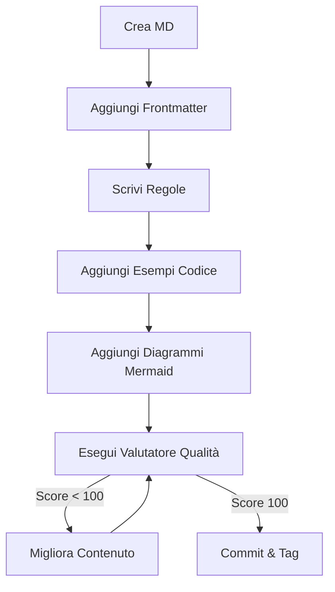

# Documentation Standards

> [!NOTE]
> La documentazione non è polvere sul codice, è la mappa per navigarlo.

### Esempio di Struttura README.md
```markdown
# Nome Componente
Descrizione chiara del funzionamento.

## Architettura
Spiegazione dei layer coinvolti.

## Comandi
- `npm run dev`
- `npm test`
```

Aderisci sempre agli standard di documentazione per assicurare che altri agenti, bot LLM o ingegneri umani possano mantenere il sistema.

## File "README.md" Locali
- Ogni modulo o package fondamentale (es. `src/auth`, o cartelle root) dovrebbe disporre di un piccolo `README.md` che spiega:
  1. Cosa fa il componente.
  2. Modelli di dati / Architettura principale.
  3. Comandi utili o prerequisiti associati a quel particolare modulo.

## JSDoc / TSDoc / Docstrings
- Aggiungi un blocco documentale in cima a funzioni ed entità esposte (pubbliche), file config centrali o utils/adapter esterni.
- Scopo: non dire *"Questo aggiunge x e y"*. Cerca di spiegare lo scopo del blocco o parametri ambigui.
- Esempio corretto in JS/TS:
```typescript
/**
 * Calcola l'hash univoco partendo da input string basato sull'algoritmo configurabile.
 * Utile per generare un ETag o un cache key veloce senza collissioni.
 *
 * @param {string} payload Il valore su cui effettuare l'hashing
 * @param {string?} algorithm L'algoritmo; di default usa SHA-256 se non specificato.
 * @returns {string} L'hash esadecimale restituito
 */
```

## "Clean" Comments In-Code
- Il codice dovrebbe essere auto-documentante (attraverso le regole Naming `common.md`). Se devi scrivere un lungo commento dentro la fuzione per spiegare *cosa sta facendo* o il *come*, molto probabilmente hai bisogno di applicare una tecnica di **Extract Method** (`refactoring.md`).
- I commenti si dovrebbero utilizzare principalmente per spiegare il *Perché* hai preso una decisione architetturale particolare, spesso quando utilizzi hack specifici (e.g., ignorare lint, regex estese di workaround, eccellente debito da riparare).## Standard di Qualità (Indice 100/100)
Per essere considerato "Definitive", ogni file `.md` nella libreria deve soddisfare i seguenti criteri:

- **YAML Frontmatter**: Deve includere `title`, `description` e `tags`.
- **Esempi di Codice**: Almeno 3 blocchi di codice (JS/TS, Bash, etc.) che illustrano i pattern.
- **Visualizzazione**: Deve includere almeno un diagramma **Mermaid** (graph, sequence, etc.) per spiegare flussi complessi.
- **Micro-documentazione**: Utilizzo degli alert tag (`> [!NOTE]`, `> [!IMPORTANT]`, etc.) per evidenziare punti critici.
- **Profondità**: Almeno 60 righe di contenuto strutturato.

> [!TIP]
> Usa lo script `node scripts/evaluate-md-quality.js <file>` per verificare il punteggio di qualità di un file prima del commit.




## Checklist di Verifica v3.2.0
- [ ] Il file segue gli standard di Clean Architecture?
- [ ] Sono presenti esempi di codice reali e validi?
- [ ] Il diagramma Mermaid è coerente con la logica descritta?
- [ ] Le sezioni Checklist e Riferimenti sono incluse?


## Riferimenti
- [.agents/rules/common.md](../../../.agents/rules/common.md)
- [Antigravity Documentation Standards](../../../.agents/skills/documentation-standards/SKILL.md)


---
*v3.2.0 - Antigravity Quality Enforcement*
