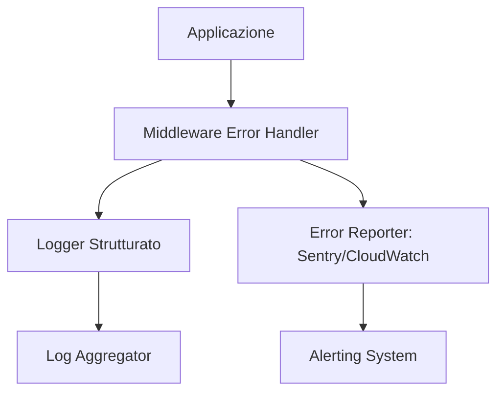

# Error Monitoring Skill

> [!IMPORTANT]
> Un errore non loggato non esiste... finché non rompe la produzione.



Questa skill definisce i pattern per implementare **observability** completa: error tracking, tracing distribuito e alerting. Applicala quando un'applicazione va in produzione o quando "non sai cosa sta succedendo in prod".

## Il Contesto
Il logging con `console.log` non basta in produzione. Senza un sistema di error monitoring strutturato, i bug vengono scoperti dagli utenti prima che dal team. L'obiettivo è: **zero surprise failures** — ogni errore viene rilevato, classificato e assegnato prima che impatti l'utente.

---

## Pattern 1: Sentry — Error Tracking

### Setup (Node.js / TypeScript)
```typescript
// src/infrastructure/monitoring/sentry.ts
import * as Sentry from '@sentry/node';
import { nodeProfilingIntegration } from '@sentry/profiling-node';

export function initSentry() {
  Sentry.init({
    dsn: process.env.SENTRY_DSN,
    environment: process.env.NODE_ENV,
    release: process.env.APP_VERSION, // es. git SHA
    integrations: [nodeProfilingIntegration()],
    tracesSampleRate: process.env.NODE_ENV === 'production' ? 0.1 : 1.0,
    profilesSampleRate: 0.1,
    // Non loggare PII
    beforeSend(event) {
      if (event.request?.cookies) delete event.request.cookies;
      if (event.user?.email) event.user.email = '[REDACTED]';
      return event;
    },
  });
}

// Cattura errori non gestiti in Express
export function setupSentryErrorHandler(app: Express) {
  Sentry.setupExpressErrorHandler(app);
}
```

### Cattura manuale con contesto
```typescript
// ✅ Aggiungi sempre user e context all'errore
try {
  await paymentService.charge(order);
} catch (error) {
  Sentry.withScope((scope) => {
    scope.setUser({ id: userId });
    scope.setTag('operation', 'payment.charge');
    scope.setExtra('orderId', order.id);
    scope.setExtra('amount', order.total);
    Sentry.captureException(error);
  });
  throw error; // re-throw dopo la cattura
}
```

---

## Pattern 2: OpenTelemetry — Distributed Tracing

Per sistemi con microservizi o architetture distribuite, usa OpenTelemetry per tracciare request cross-service.

```typescript
// src/infrastructure/monitoring/tracing.ts
import { NodeSDK } from '@opentelemetry/sdk-node';
import { OTLPTraceExporter } from '@opentelemetry/exporter-trace-otlp-http';
import { Resource } from '@opentelemetry/resources';
import { SEMRESATTRS_SERVICE_NAME } from '@opentelemetry/semantic-conventions';

const sdk = new NodeSDK({
  resource: new Resource({
    [SEMRESATTRS_SERVICE_NAME]: process.env.SERVICE_NAME ?? 'api',
  }),
  traceExporter: new OTLPTraceExporter({
    url: process.env.OTEL_EXPORTER_OTLP_ENDPOINT,
  }),
});

sdk.start();

// Graceful shutdown
process.on('SIGTERM', () => sdk.shutdown());
```

### Span personalizzati per operazioni critiche
```typescript
import { trace, context, SpanStatusCode } from '@opentelemetry/api';

const tracer = trace.getTracer('payment-service');

async function processPayment(orderId: string) {
  return tracer.startActiveSpan('payment.process', async (span) => {
    span.setAttribute('order.id', orderId);
    try {
      const result = await chargeGateway(orderId);
      span.setStatus({ code: SpanStatusCode.OK });
      return result;
    } catch (error) {
      span.setStatus({ code: SpanStatusCode.ERROR, message: String(error) });
      span.recordException(error as Error);
      throw error;
    } finally {
      span.end();
    }
  });
}
```

---

## Pattern 3: Error Budget & SLO

```typescript
// ✅ Defini i tuoi SLO nel codice documentazione, non solo in Grafana
/**
 * SLO Definitions — rivedi mensilmente
 *
 * API Availability:    99.9%  → max 43 min downtime/mese
 * API Latency p95:     < 500ms
 * Error Rate:          < 0.1% delle request
 * Payment Success:     > 99.5%
 */

// Health endpoint che espone metriche SLO
app.get('/health', async (req, res) => {
  const [dbOk, redisOk] = await Promise.allSettled([
    prisma.$queryRaw`SELECT 1`,
    redis.ping(),
  ]);

  const status = {
    status: 'ok',
    timestamp: new Date().toISOString(),
    version: process.env.APP_VERSION,
    dependencies: {
      database: dbOk.status === 'fulfilled' ? 'healthy' : 'unhealthy',
      cache: redisOk.status === 'fulfilled' ? 'healthy' : 'unhealthy',
    },
  };

  const isHealthy = Object.values(status.dependencies).every(s => s === 'healthy');
  res.status(isHealthy ? 200 : 503).json(status);
});
```

---

## Pattern 4: Alerting con PagerDuty / Slack

Configura alert **solo per eventi actionable** — troppi alert → alert fatigue → alert ignorati.

```typescript
// ✅ Alert utility — usa per errori critici che richiedono azione immediata
async function sendCriticalAlert(message: string, context: Record<string, unknown>) {
  if (process.env.NODE_ENV !== 'production') return;

  await fetch(process.env.SLACK_WEBHOOK_URL!, {
    method: 'POST',
    body: JSON.stringify({
      text: `🔴 *CRITICAL ALERT*: ${message}`,
      attachments: [{
        color: 'danger',
        fields: Object.entries(context).map(([k, v]) => ({
          title: k,
          value: String(v),
          short: true,
        })),
      }],
    }),
  });
}

// Uso: solo per errori che richiedono intervento umano immediato
// ❌ NON usare per ogni eccezione — usa Sentry per quello
await sendCriticalAlert('Payment gateway down', { errorCode: err.code, since: new Date() });
```

---

## Checklist Pre-Deploy Monitoring

- [ ] Sentry (o equivalente) configurato con DSN di produzione
- [ ] `beforeSend` hook rimuove PII (email, token, cookie) prima dell'invio a Sentry
- [ ] OpenTelemetry attivo per servizi distribuiti (o log correlation ID per monolith)
- [ ] Health endpoint `/health` risponde con status dipendenze
- [ ] Alert configurati su: error rate > soglia, latency p95 > soglia, dependency down
- [ ] `APP_VERSION` / release tag propagato in Sentry per tracciare regressioni
- [ ] Error budget monitorato mensilmente (SLO review)
- [ ] Runbook documentato per ogni alert critico (cosa fare quando scatta)


