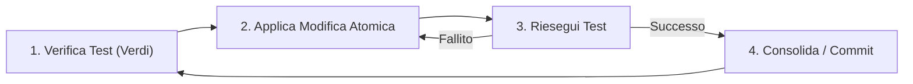

# Refactoring: Miglioramento Continuo del Codice

Il Refactoring è il cuore della manutenzione software in Antigravity. Non è un'attività "opzionale" o da posticipare a un futuro indefinito; è una pratica quotidiana per mantenere il sistema sano, flessibile e pronto al cambiamento.

> [!IMPORTANT]
> La regola d'oro del refactoring: **Nessun refactoring senza una suite di test solida.** Se non puoi verificare istantaneamente di non aver rotto nulla, non stai facendo refactoring, stai solo camminando su un campo minato.

## Il Loop del Refactoring Sicuro

Per evitare regressioni, segui un processo incrementale e controllato.



## Tecniche di Rifattorizzazione Fondamentali

### 1. Extract Method (Estrazione di Metodo)
Se un blocco di codice necessita di un commento per essere spiegato, probabilmente dovrebbe essere una funzione separata con un nome auto-esplicativo.

**PRIMA:**
```javascript
function processOrder(order) {
  // Calcolo delle tasse
  let tax = order.amount * 0.22;
  if (order.country === 'US') tax = order.amount * 0.07;
  
  order.total = order.amount + tax;
  save(order);
}
```

**DOPO:**
```javascript
function processOrder(order) {
  order.total = order.amount + calculateTax(order);
  save(order);
}

function calculateTax(order) {
  const TAX_RATE_EU = 0.22;
  const TAX_RATE_US = 0.07;
  return order.country === 'US' ? order.amount * TAX_RATE_US : order.amount * TAX_RATE_EU;
}
```

### 2. Sostituzione di Numeri Magici con Costanti
Evita valori "magici" che rendono il codice oscuro e difficile da aggiornare.

```javascript
// ✅ CORRETTO
const MAX_LOGIN_ATTEMPTS = 5;
const STATUS_SUSPENDED = 'suspended';

if (user.attempts >= MAX_LOGIN_ATTEMPTS) {
  user.status = STATUS_SUSPENDED;
}
```

## Gestione del Debito Tecnico

Applica la **Regola del Boy Scout**: *"Lascia il codice in uno stato migliore di come l'hai trovato."*

> [!TIP]
> All'interno della Clean Architecture, il refactoring spesso significa spostare la logica dai Controller (Adattatori) verso i Use Cases o le Entities (Domain Layer) per aumentare la testabilità e il riuso.

### Checklist per un Refactoring di Successo
- [ ] Ho un test che copre questa logica?
- [ ] La modifica ha semplificato o chiarito il codice?
- [ ] Ho evitato di aggiungere nuove funzionalità durante il refactoring?
- [ ] Il nome del metodo comunica l'intento (cosa) anziché l'implementazione (come)?

> [!CAUTION]
> Non fare mai "Big Bang Refactoring" che durano giorni senza commit intermedie. Modifiche piccole e frequenti riducono drasticamente il rischio di conflitti e bug invisibili.
