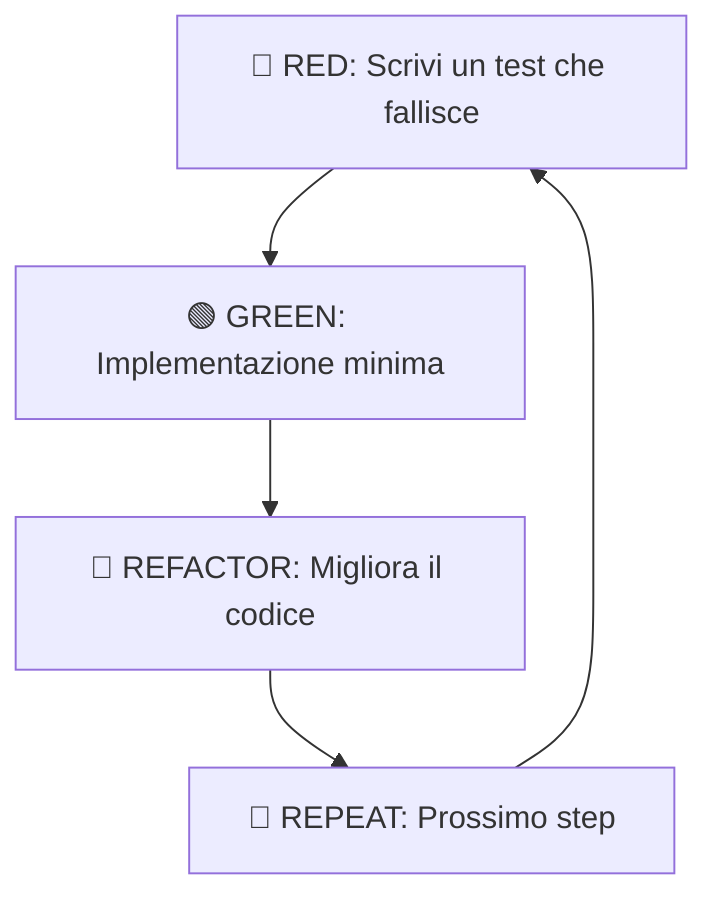

# TDD Workflow & Testing Strategy

Il Test-Driven Development (TDD) è una disciplina fondamentale in Antigravity. Non si tratta solo di scrivere test, ma di utilizzare i test come **strumento di design** per definire il comportamento del software prima ancora di implementarlo.

> [!IMPORTANT]
> In Antigravity, nessuna funzionalità è considerata "completata" senza una suite di test che ne validi il comportamento in modo deterministico.

## Il Ciclo Red-Green-Refactor

Il cuore del TDD è un ciclo iterativo rapido che garantisce feedback costante.



1.  **Red**: Definisci il contratto. Il test deve fallire perché la logica non esiste ancora.
2.  **Green**: Scrivi il codice "sporco" ma funzionale. L'obiettivo è solo far passare il test.
3.  **Refactor**: Elimina la duplicazione, migliora i nomi, applica i principi SOLID. I test rimangono verdi.

## Pattern AAA (Arrange-Act-Assert)

Ogni test deve essere leggibile e strutturato seguendo il pattern AAA per garantire chiarezza sull'obiettivo della verifica.

```typescript
describe('UserService', () => {
  it('should create a new user when data is valid', async () => {
    // 1. Arrange: Prepara il contesto
    const userData = { email: 'test@example.com', name: 'Mario Rossi' };
    const userRepository = new MockUserRepository();
    const service = new UserService(userRepository);

    // 2. Act: Esegui l'azione da testare
    const result = await service.register(userData);

    // 3. Assert: Verifica il risultato
    expect(result.id).toBeDefined();
    expect(userRepository.saveCalled).toBe(true);
  });
});
```

## Mocking e Isolamento

Per testare i componenti della **Clean Architecture** (come gli Use Cases), è essenziale isolare la logica di business dalle dipendenze esterne (Database, API esterne) utilizzando i Mock.

```typescript
// Esempio di Mock per un repository
class MockUserRepository implements UserRepository {
  public saveCalled = false;
  async save(user: User): Promise<User> {
    this.saveCalled = true;
    return { ...user, id: 'uuid-123' };
  }
  async findByEmail(email: string): Promise<User | null> {
    return null;
  }
}
```

> [!TIP]
> Usa il mocking per simulare scenari di errore (es. DB timeout, API offline) che sono difficili da riprodurre con test d'integrazione reali.

## Piramide dei Test

Focalizza i tuoi sforzi seguendo la gerarchia della qualità:

- **Unit Tests (70%)**: Logica pura, nessun I/O. Estremamente veloci.
- **Integration Tests (20%)**: Interazione tra componenti (es. Use Case + DB In-Memory).
- **E2E Tests (10%)**: Flussi completi dell'utente. Più lenti ma garantiscono il valore di business.

```javascript
// Esempio di test unitario su entità pura
describe('User Entity', () => {
  it('should throw error if email is invalid', () => {
    expect(() => User.create({ email: 'invalid-email' })).toThrow();
  });
});
```

## Checklist per un Buon Test
- [ ] Il test è isolato e indipendente? (Nessun dato condiviso tra test).
- [ ] Il test è deterministico? (Stesso input = stesso output, sempre).
- [ ] Il nome del test descrive il *comportamento*, non l'implementazione?
- [ ] Il test fallisce se rimuovo la logica corrispondente? (Validazione del test stesso).

> [!CAUTION]
> Evita i "Test Fragili" che dipendono da dettagli implementativi interni che cambiano spesso. Testa il *cosa*, non il *come*.
