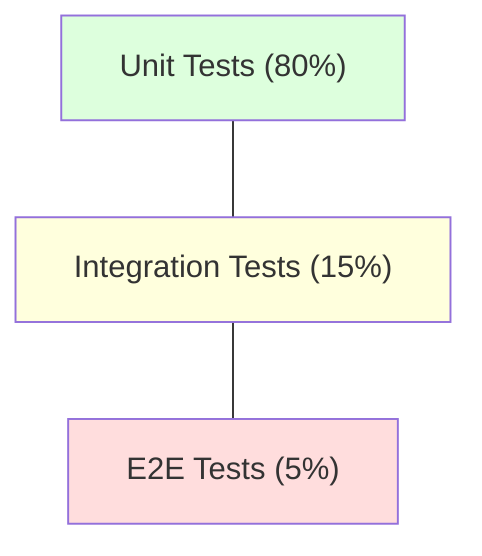

# Testing Strategy Skill

> [!IMPORTANT]
> I test non servono a dimostrare che il codice funziona ora, ma che funzionerà ancora domani.



Questa skill definisce una strategia di test completa e pratica per applicazioni moderne. Applicala quando avvii un nuovo progetto o quando devi aumentare la copertura di uno esistente.

## Il Contesto
Il test è un investimento, non un costo. Una strategia sbagliata (es. solo unit test su codice banale, o solo e2e che crollano ad ogni deploy) genera più conf che valore. Questa skill ti aiuta a scegliere il tipo di test giusto per ogni scenario.

---

## La Testing Pyramid

```
        /\
       /E2E\          ← pochi, lenti, costosi — testano flussi utente reali
      /──────\
     /Integr. \       ← medi, testano interazioni tra moduli (API, DB)
    /──────────\
   / Unit Tests \     ← molti, veloci, economici — testano logica isolata
  /______________\
```

**Regola pratica**: 70% Unit · 20% Integration · 10% E2E.

---

## Pattern 1: Unit Testing

Testa **logica di business pura** in isolamento. Non tocca DB, network o filesystem.

```typescript
// ✅ Use Case testato con repository in-memory (nessun DB reale)
import { CreateOrderUseCase } from '@/application/use-cases/CreateOrderUseCase';
import { InMemoryOrderRepository } from '@/test/fakes/InMemoryOrderRepository';
import { InMemoryStockRepository } from '@/test/fakes/InMemoryStockRepository';

describe('CreateOrderUseCase', () => {
  let sut: CreateOrderUseCase;
  let orderRepo: InMemoryOrderRepository;
  let stockRepo: InMemoryStockRepository;

  beforeEach(() => {
    orderRepo = new InMemoryOrderRepository();
    stockRepo = new InMemoryStockRepository();
    stockRepo.addItem({ productId: 'p1', quantity: 10 });
    sut = new CreateOrderUseCase(orderRepo, stockRepo);
  });

  it('should create an order and decrement stock', async () => {
    const result = await sut.execute({ productId: 'p1', quantity: 3, userId: 'u1' });

    expect(result.success).toBe(true);
    expect(orderRepo.items).toHaveLength(1);
    expect(stockRepo.getQuantity('p1')).toBe(7);
  });

  it('should fail when stock is insufficient', async () => {
    const result = await sut.execute({ productId: 'p1', quantity: 99, userId: 'u1' });

    expect(result.success).toBe(false);
    expect(result.error?.message).toContain('Insufficient stock');
  });
});
```

**Quando usare i mock vs fake**:
- **Fake** (InMemoryRepository): preferito — implementa l'interfaccia realmente.
- **Mock** (`jest.fn()`): per verificare che una funzione sia *chiamata* (es. invio email).
- **Stub**: ritorna un valore predefinito, non verifica le chiamate.

---

## Pattern 2: Integration Testing (API Layer)

Testa l'intera stack HTTP → Controller → Use Case → Repository → DB reale (o in-memory SQLite/Mongo).

```typescript
// ✅ Supertest (Node.js) — testa l'endpoint HTTP completo
import request from 'supertest';
import { app } from '@/app';
import { prisma } from '@/infrastructure/database/prisma';

afterAll(async () => await prisma.$disconnect());
afterEach(async () => await prisma.order.deleteMany()); // cleanup

describe('POST /api/orders', () => {
  it('should return 201 with created order', async () => {
    const response = await request(app)
      .post('/api/orders')
      .set('Authorization', `Bearer ${getTestToken('USER')}`)
      .send({ productId: 'p1', quantity: 2 });

    expect(response.status).toBe(201);
    expect(response.body).toMatchObject({ productId: 'p1', quantity: 2 });
  });

  it('should return 401 without auth token', async () => {
    const response = await request(app).post('/api/orders').send({ productId: 'p1' });
    expect(response.status).toBe(401);
  });
});
```

---

## Pattern 3: E2E Testing (Playwright)

Testa flussi utente reali nel browser. Riservato agli **happy path critici** (login, checkout, onboarding).

```typescript
// ✅ Playwright — E2E test
import { test, expect } from '@playwright/test';

test('user can login and place an order', async ({ page }) => {
  // Login
  await page.goto('/login');
  await page.fill('[data-testid="email"]', 'test@example.com');
  await page.fill('[data-testid="password"]', 'Password123!');
  await page.click('[data-testid="submit"]');
  await expect(page).toHaveURL('/dashboard');

  // Piazza ordine
  await page.click('[data-testid="product-p1"]');
  await page.click('[data-testid="add-to-cart"]');
  await page.click('[data-testid="checkout"]');
  await expect(page.locator('[data-testid="order-confirmation"]')).toBeVisible();
});
```

**Best practice E2E**:
- Usa `data-testid` come selettori — non dipendono da CSS o testo visibile.
- Isola i test con seed/cleanup del DB tra le run.
- Esegui gli E2E solo in CI, non ad ogni save in sviluppo.

---

## Coverage Goals

| Layer | Soglia minima | Target ideale |
|---|---|---|
| Domain / Use Cases | 90% | 100% |
| Interface Adapters | 70% | 85% |
| Infrastructure | 50% | 70% |
| **Totale progetto** | **70%** | **80%+** |

```bash
# Configurazione soglie in Jest
# jest.config.ts
coverageThreshold: {
  global: {
    branches: 70,
    functions: 80,
    lines: 80,
    statements: 80,
  },
},
```

---

## Checklist Testing

- [ ] Ogni Use Case ha almeno: happy path + failure path + edge case
- [ ] Nessun test accede a servizi esterni (DB reale, API terze parti) nelle unit
- [ ] I test sono deterministici: stesso output a ogni esecuzione
- [ ] I test sono indipendenti: l'ordine di esecuzione non influisce sul risultato
- [ ] La CI blocca il merge se la coverage scende sotto la soglia
- [ ] Gli E2E hanno retry logic abilitata (flaky test tolleranza)


