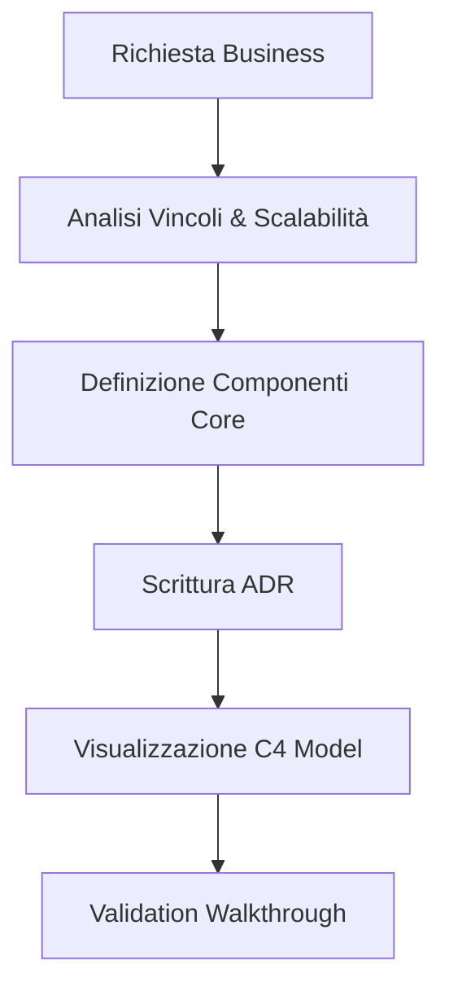
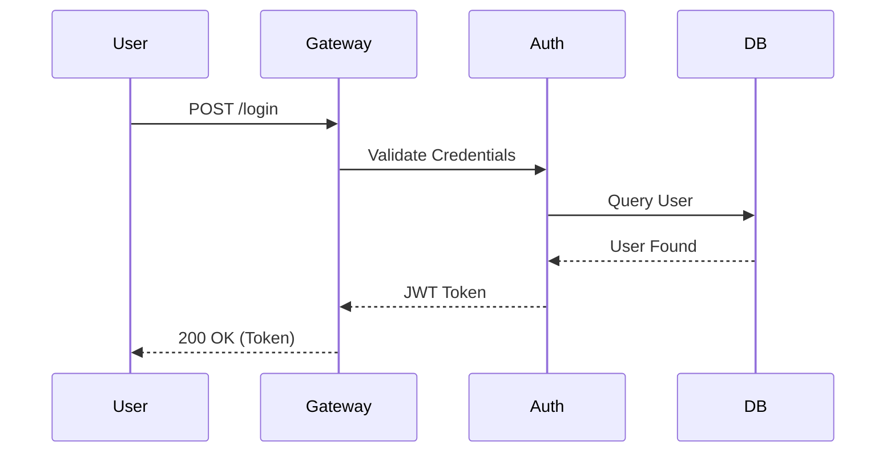

# Software Architect Workflow

L'**Architect** è il guardiano della visione a lungo termine. In Antigravity, l'architettura non è scolpita nella pietra, ma evolve secondo principi di flessibilità, robustezza e disaccoppiamento. Questo workflow guida la progettazione di sistemi complessi e la risoluzione di problemi strutturali.

## Responsabilità Core
- Definizione degli strati del sistema.
- Selezione degli stack tecnologici e dei database.
- Gestione dei trade-off (Performance vs Manutenibilità).

## Framework di Progettazione



### 1. Analisi dei Trade-off
Ogni scelta architettonica ha un costo. L'Architect deve documentarlo.
```markdown
# Trade-off Analysis: Microservices vs Monolith
- **Microservices**: Scalabilità granulare, ma complessità di rete.
- **Monolith**: Semplicità di deployment, ma accoppiamento forte.
- **Scelta Antigravity**: Monolite Modulare (Modulith). Vedi sezione [Isolamento Modulare](#isolamento-modulare) per i dettagli.
```

## Isolamento Modulare (Modular Monolith)

In Antigravity, il Monolite Modulare non è un "big ball of mud", ma un insieme di moduli rigorosamente isolati.

### 1. Definizione dei Bounded Context
Ogni modulo deve rappresentare un **Bounded Context** (DDD) autonomo.
- **Proprietà dei Dati**: Ogni contesto possiede i propri schemi e tabelle. Il partizionamento dello stato è fisico o logico, ma mai condiviso a livello di query.
- **Autonomia Logica**: Un modulo deve poter essere estratto in un microservizio con il minimo sforzo.

### 2. Vincoli di Comunicazione
Per evitare l'accoppiamento "spaghetti", si applicano le seguenti regole:
- **Event-Driven UI/Logic**: La comunicazione inter-modulo deve essere **asincrona ed event-driven**. Un modulo emette eventi di dominio, gli altri moduli si mettono in ascolto.
- **Strict API Boundaries**: L'accesso sincrono è permesso solo tramite interfacce pubbliche (`Module API`). È vietato importare classi interne o utility di altri moduli.
- **Data Isolation**: È **vietato l'accesso diretto ai data store** di domini esterni. Se il Modulo A ha bisogno di dati del Modulo B, deve richiederli tramite API o sincronizzarli tramite eventi.


### 2. Architecture Decision Records (ADR)
Usa il formato ADR per ogni decisione significativa.

```markdown
# ADR 005: Choice of NoSQL for Audit Logs
## Context
We need to store 1M events per day with flexible schema.
## Decision
Use MongoDB instead of PostgreSQL.
## Consequences
Higher write throughput, but eventually consistent reads.
```

### 3. Diagrammi di System Design
Visualizza le interazioni tra i servizi.


### 4. Strumenti di Validazione Architetturale
Assicurati che l'implementazione non violi il design originale.
```bash
# Controllo delle dipendenze fra package
npx dependency-cruiser --config .dependency-cruiser.js src/
```

## Checklist dei 5 Pilastri
- [ ] **Affidabilità**: Il sistema resiste ai fallimenti?
- [ ] **Sicurezza**: I dati sono protetti in transito e a riposo?
- [ ] **Efficienza**: Le risorse sono ottimizzate?
- [ ] **Operatività**: Il sistema è monitorabile (Observability)?
- [ ] **Costo**: L'infrastruttura è sostenibile?

> [!IMPORTANT]
> L'architettura deve servire il business, non l'ego dello sviluppatore. Evita la "Over-engineering" se un task semplice può essere risolto con una soluzione lineare.

> [!TIP]
> Segui il principio "Write code that is easy to delete", non solo facile da scrivere. Il disaccoppiamento è la chiave per la manutenibilità.

## Changelog
- **v1.3**: Definizione dei Bounded Context e vincoli di isolamento modulare (Event-driven, Data isolation).
- **v1.2**: Integrato diagramma di sequenza e checklist dei 5 pilastri.
- **v1.1**: Prima versione degli standard per ADR.

---
*v1.3 - Antigravity System Architecture*
