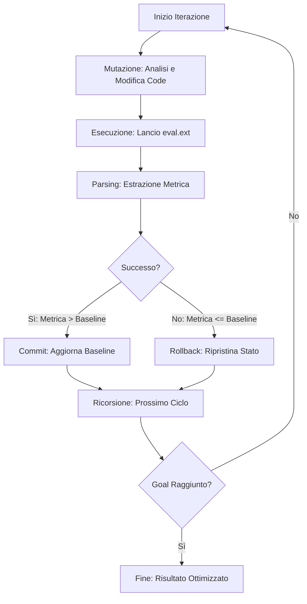

# Autonomous Iteration Workflow

Questo workflow definisce un protocollo per agenti AI volto all'ottimizzazione continua di un file target ("algoritmo") basandosi sui risultati di uno script di valutazione ("eval").

## Panoramica

L'Auto-Research si basa sul principio della **selezione naturale del codice**: l'agente genera varianti, le testa e mantiene solo quelle che migliorano effettivamente la metrica di riferimento.

> [!IMPORTANT]
> Questo processo richiede un ambiente di valutazione deterministico e isolato per garantire che i miglioramenti siano reali e non frutto di modifiche ai test stessi.

## Fasi del Workflow

### Phase 1: Environment Definition
- **Mutable Component (`algorithm.ext`)**: Il file isolato contenente la logica da ottimizzare. L'agente ha accesso esclusivo di lettura/scrittura a questo file.
- **Evaluation Component (`eval.ext`)**: L'ambiente di test deterministico. L'agente ha accesso rigorosamente di sola lettura. L'esecuzione deve produrre un singolo valore numerico parsabile (metrica).

### Phase 2: Agent Directives
- **Obiettivo Primario**: Massimizzare (o minimizzare) l'output scalare di `eval.ext`.
- **Vincoli di Sistema**: Le modifiche sono limitate esclusivamente ad `algorithm.ext`. È vietato modificare la suite di test, le dipendenze o i parametri di valutazione.

### Phase 3: Execution Loop

Il loop di esecuzione segue una struttura ricorsiva:



1. **Mutation**: Analizza i dati delle iterazioni precedenti e genera una permutazione logica strettamente all'interno di `algorithm.ext`.
2. **Execution**: Attiva lo script di valutazione (`eval.ext`) tramite comando terminale automatizzato.
3. **Parsing**: Estrae la metrica risultante dallo standard output.
4. **State Resolution**:
   - **Success Condition**: Se Metrica Corrente > Metrica Baseline -> Salva lo stato del file, aggiorna la baseline.
   - **Failure Condition**: Se Metrica Corrente <= Metrica Baseline -> Esegui rollback, ripristinando `algorithm.ext` alla configurazione precedente.
5. **Recursion**: Ripete la sequenza dal Punto 1 fino al raggiungimento della soglia target o del limite di iterazioni definito.

## Esempi di Utilizzo

### Esempio 1: Ottimizzazione di una Funzione di Sorting
In questo scenario, vogliamo migliorare le prestazioni di un algoritmo di ordinamento.

```javascript
// algorithm.js
function sort(arr) {
    // Logica da ottimizzare
    return arr.sort((a, b) => a - b);
}
```

Lo script di valutazione misurerà il tempo di esecuzione o il numero di operazioni.

### Esempio 2: Miglioramento della Qualità Documentale
Come stiamo facendo ora, lo script `evaluate-md-quality.js` funge da `eval.ext` per ottimizzare i file Markdown.

```bash
# Esecuzione del loop via terminale
node scripts/evaluate-md-quality.js .agents/workflows/auto-research.md
```

> [!TIP]
> Per massimizzare l'efficienza, è consigliabile fornire all'agente una cronologia delle mutazioni fallite per evitare di ripetere gli stessi errori.

## Changelog
- **v1.1**: Aggiunta documentazione estesa, diagramma Mermaid e standard YAML.
- **v1.0**: Definizione iniziale del framework di iterazione.