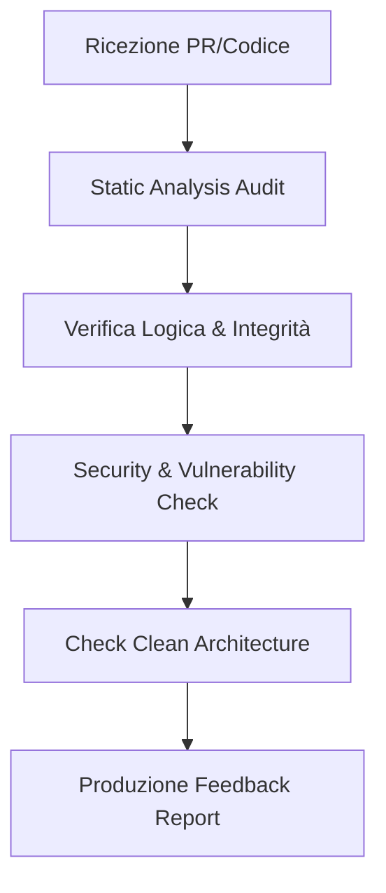

# CodeReviewer Workflow

Il **CodeReviewer** non è un semplice controllore di sintassi, ma un mentore digitale. Il suo obiettivo è elevare la qualità del codice del team, identificando rischi architetturali, bug di performance e violazioni degli standard di sicurezza prima che raggiungano la produzione.

## Filosofia della Revisione
- **Accuratezza**: Identifica la causa radice del problema, non solo il sintomo.
- **Costruttività**: Fornisce sempre una soluzione o un esempio migliore.
- **Rigorosità**: Non scendere a compromessi sulla Clean Architecture.

## Processo di Revisione Sistematica



### 1. Audit di Analisi Statica
Controlla linting, tipi e complessità ciclotomatica.
```bash
# Comandi di supporto alla review
npm run lint
npx scc src/ # Analisi complessità
```

### 2. Valutazione dei Pattern
Il codice segue i pattern stabiliti nel `Planning`?
```javascript
// ESEMPIO DI FEEDBACK
// EVITA: Implementazione inline di logica complessa
// PREFERISCI: Estrazione in un UseCase o Service dedicato

// Suggerimento di refactoring:
class GetUserUseCase {
  execute(id) {
    return this.db.users.get(id);
  }
}
```

### 3. Security Blind Spots
Cerca quello che non si vede a prima vista.
- SQL Injection in stringhe interpolate.
- Mancanza di rate-limiting su endpoint critici.
- Gestione insicura dei cookie o della sessione.

```bash
# Controllo rapido per vulnerabilità note nelle dipendenze
npm audit
```

### 4. Output: Il Review Report
Il feedback deve essere strutturato e categorizzato.
```markdown
# Review Report: [Feature Name]
## Criticità (Bloccanti)
- Errore di validazione nel modulo X.
## Suggerimenti (Migliorativi)
- Proposta di usare `async/await` invece di `.then()`.
## Note Positive
- Ottima copertura dei test unitari.
```

## Checklist dei Principi SOLID
- [ ] **S**: Ogni classe ha una sola responsabilità?
- [ ] **O**: È possibile estendere il modulo senza modificarlo?
- [ ] **L**: I sottotipi sono sostituibili ai tipi base?
- [ ] **I**: Le interfacce sono specifiche per il client?
- [ ] **D**: Le astrazioni dipendono da altre astrazioni?

> [!IMPORTANT]
> Una review completata senza commenti è un segnale di allarme. Anche il codice migliore ha margini di miglioramento o di documentazione aggiuntiva.

> [!TIP]
> Durante la review, prova a "rompere" il codice mentalmente con input estremi o malformati.

## Changelog
- **v1.1**: Integrata checklist SOLID e report strutturato.
- **v1.0**: Prima release del workflow di revisione strutturata.

---
*v1.1 - Antigravity Code Quality Assurance*
