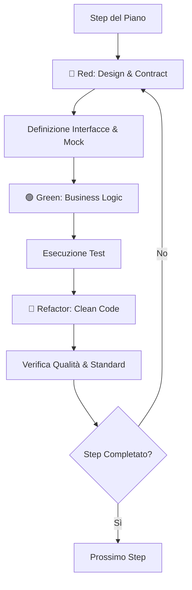

# Execution Workflow

L'**Execution** è la fase in cui il progetto prende vita. In Antigravity, l'esecuzione non è solo "scrivere codice", ma un processo di **Design Guidato dai Test**. Ogni componente viene forgiato attraverso il disaccoppiamento forzato dalla testabilità.

## Principi Guida
- **TDD come Architettura**: Il test non valida solo la funzione, definisce l'interfaccia e i confini (DIP).
- **Clean Architecture**: Ogni riga di codice deve rispettare il layer di appartenenza.
- **Resilienza per Design**: Gestione degli errori e stati di fallback definiti già in fase di test "Red".

## Ciclo di Implementazione: Design Loop



### 1. Il Momento del Design (Red Phase)
In Antigravity, la fase **Red** è dove si decide come il componente interagirà con il resto del sistema. 
- **User Story**: "Il sistema deve salvare un utente solo se l'email è valida."
- **Design Decision**: Creiamo un'interfaccia `IUserRepository` invece di usare direttamente un DB.

### 2. Esempi di Codificazione Architetturale

#### Snippet 1: Design dell'Interfaccia tramite Test (Red)
```typescript
// tests/unit/create-user.test.ts
describe('CreateUserUseCase', () => {
    it('should decouple from database using repository pattern', async () => {
        // 💡 Il test ci forza a definire l'astrazione prim'ancora di scegliere il DB.
        const repoMock: IUserRepository = { save: jest.fn() };
        const useCase = new CreateUserUseCase(repoMock);
        
        await useCase.execute({ email: 'test@example.com' });
        
        expect(repoMock.save).toHaveBeenCalled();
    });
});
```

#### Snippet 2: Implementazione Disaccoppiata (Green)
```typescript
// src/use-cases/create-user.ts
class CreateUserUseCase {
    constructor(private userRepository: IUserRepository) {} // Dependency Inversion

    async execute(data: UserData) {
        if (!this.isValid(data.email)) throw new ValidationError();
        return await this.userRepository.save(data);
    }
}
```

#### Snippet 3: Refactoring e Robustezza
```typescript
// Refactoring per aggiungere logging e gestione errori centralizzata senza inquinare la logica
class CreateUserUseCase {
    constructor(
        private userRepository: IUserRepository,
        private logger: ILogger // Nuova dipendenza astratta emersa dal refactoring
    ) {}

    async execute(data: UserData) {
        try {
            this.logger.info('Creating user', { email: data.email });
            return await this.userRepository.save(data);
        } catch (error) {
            this.logger.error('Failed to create user', { error });
            throw new DomainError('User creation failed');
        }
    }
}
```

### 3. Strumenti di Verifica
Ogni iterazione deve essere validata per assicurare che il disaccoppiamento non abbia introdotto complessità non necessaria.

```bash
# Comandi di verifica in-loop
npm run test -- <file-path>
npm run lint
```

## Gestione del Design Emergente
Se durante il TDD emerge che un'interfaccia è troppo complessa:
1. **Fermati**: Non forzare l'implementazione.
2. **Semplifica**: Spezza il componente in unità più piccole (Single Responsibility).
3. **Aggiorna il Piano**: Se il cambiamento è strutturale, rifletti le modifiche nel Planning.

> [!CAUTION]
> Non saltare la fase di Refactoring. Senza refactoring, il TDD produce solo "codice che funziona", non "codice pulito".

---

## Checklist di Esecuzione Architetturale
- [ ] Il test ha definito l'interfaccia prima dell'implementazione?
- [ ] Le dipendenze esterne sono astratte tramite Interfacce (DIP)?
- [ ] Il componente è testabile senza avviare database o servizi esterni?
- [ ] Il "Refactor" ha migliorato la modularità senza cambiare il comportamento?
- [ ] Il codice segue i principi SOLID emersi durante la stesura del test?

## Riferimenti
- [.agents/rules/common/tdd.md](../rules/common/tdd.md)
- [Planning Workflow](./planning.md)
- [Review Workflow](./review.md)

---
*v2.0 - Antigravity Execution Protocol*