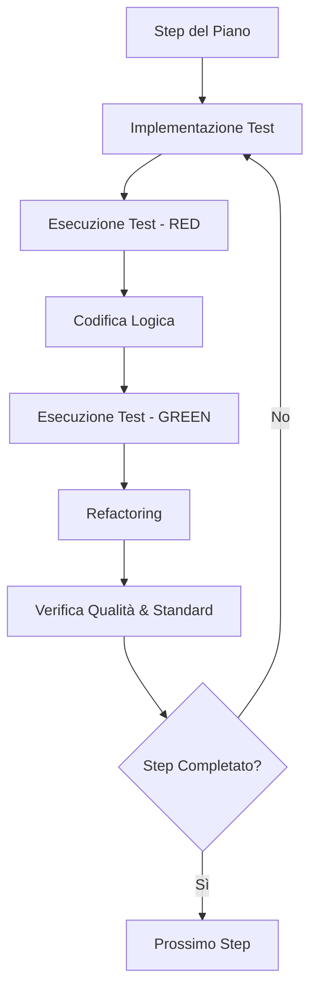

# Execution Workflow

L'**Execution** è la fase in cui il progetto prende vita. In Antigravity, l'esecuzione è governata dalla precisione. Non "buttiamo giù codice", ma costruiamo componenti solidi seguendo il piano stabilito.

## Principi Guida
- **TDD (Test Driven Development)**: Il test guida il design.
- **Clean Architecture**: Ogni riga di codice deve stare nel posto giusto.
- **Resilio**: Codice capace di gestire i fallimenti con grazia.

## Ciclo di Implementazione



### 1. Implementazione Incrementale
Lavora sempre su una piccola unità alla volta. Non creare file da 1000 righe in un solo passaggio.

### 2. Esempi di Codificazione

#### Snippet 1: Implementazione Test (Red)
```javascript
// tests/unit/parser.test.js
describe('DataParser', () => {
    it('should extract date from messy strings', () => {
        const parser = new DataParser();
        expect(parser.extractDate("Done on 2026-04-07")).toBe("2026-04-07");
    });
});
```

#### Snippet 2: Implementazione Logica (Green)
```javascript
class DataParser {
    extractDate(input) {
        const match = input.match(/\d{4}-\d{2}-\d{2}/);
        return match ? match[0] : null;
    }
}
```

#### Snippet 3: Refactoring e Manutenibilità
```javascript
// Refactoring per estrarre il pattern in una costante
const DATE_PATTERN = /\d{4}-\d{2}-\d{2}/;

class DataParser {
    extractDate(input) {
        return input.match(DATE_PATTERN)?.[0] || null;
    }
}
```

### 3. Strumenti di Verifica durante l'Esecuzione
Assicurati di validare ogni file modificato prima di passare al successivo.

```bash
# Comandi di verifica in-loop
node scripts/validate-syntax.js src/parser.js
npm run test -- src/parser.test.js
```

## Gestione del Debito Tecnico
Se durante l'esecuzione noti un'opportunità di refactoring che non era nel piano:
1. Segnala il debito tecnico.
2. Implementa solo se non altera il piano core.
3. Altrimenti, crea un task di backlog per la fase successiva.

> [!CAUTION]
> Evita la "Feature Creep" durate l'esecuzione. Rimani fedele agli obiettivi definiti nella fase di `Planning`. Se il piano non funziona più, torna indietro e rifallo invece di improvvisare.

> [!TIP]
> Commenta il codice "perché", non il "cosa". Il "cosa" dovrebbe essere ovvio dal nome delle funzioni.

## Changelog
- **v1.2**: Integrati esempi di TDD espliciti.
- **v1.1**: Prima versione del protocollo di esecuzione iterativa.

---
*v1.2 - Antigravity Execution Protocol*