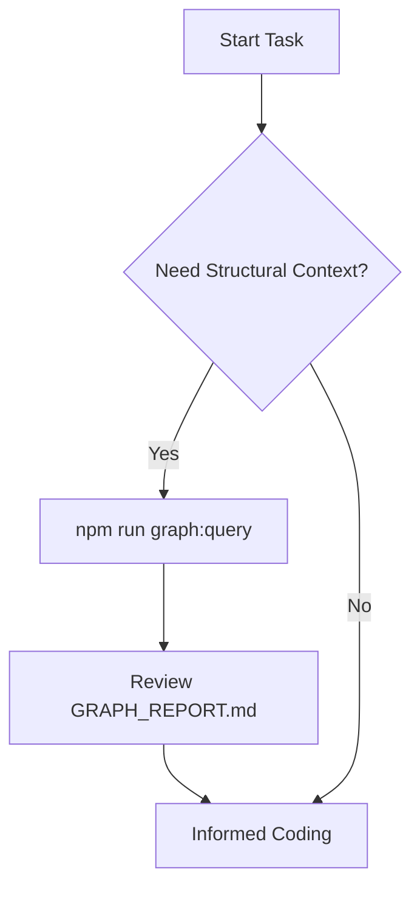

# Graphify Intelligence Workflow

Questo workflow guida l'agente nell'utilizzo di Graphify per ottenere una comprensione profonda del codebase prima di ogni azione significativa.

## 🚀 Trigger Operativo
Attiva questo workflow quando:
- Devi eseguire un refactoring che coinvolge più di 3 file.
- Devi mappare le dipendenze di un nuovo modulo.
- Identifichi violazioni della Clean Architecture sospette tramite "Surprise Edges".



## 🛠️ Step Operativi

### Phase 1: Analisi Strutturale
Esegui una query mirata per capire l'interconnessione del modulo target.
```bash
npm run graph:query "Mostrami tutte le dipendenze in entrata e uscita per [Modulo]"
```

### Phase 2: Audit d'Impatto
Verifica se il modulo è un "God Node" (alto accoppiamento). Se lo è, pianifica il disaccoppiamento prima di procedere, seguendo i principi SOLID.

### Phase 3: Sincronizzazione Post-Modifica
Assicurati che il grafo rifletta il nuovo stato dell'architettura:
```bash
npm run graph:build
```

## 🏗️ Casi d'Uso Approfonditi

### 1. Analisi d'Impatto (Impact Analysis)
Prima di modificare un'interfaccia o un file core, usa il grafo per vedere l'altezza dell'iceberg.
- **Domanda**: "Chi utilizza questo modulo?"
- **Scopo**: Prevenire breaking changes a cascata nei moduli di Infrastructure o Framework.

### 2. Community Discovery & Modularity
L'algoritmo di community raggruppa i file in base alla densità di interazione.
- **Verifica**: Se i file di moduli diversi finiscono nella stessa community, potrebbe esserci un accoppiamento nascosto che viola la Clean Architecture.

### 3. Surprise Identification
Graphify segnala link inaspettati tra strati (es. Domain che importa Infrastructure).
- **Azione**: Questi link vanno eliminati immediatamente per mantenere il core "puro".

## 🔎 Navigazione Avanzata
Se il progetto è di grandi dimensioni, utilizza il file `graphify-out/wiki/index.md` come punto di ingresso per una navigazione gerarchica guidata, simile a una Wikipedia interna del codice.

> [!TIP]
> Esegui il build del grafo con il flag `--wiki` (tramite configurazione graphify) per abilitare la generazione della Wiki interna navigabile dall'agente.

## ## Checklist di Validazione Operativa
- [ ] La query di Graphify è stata eseguita prima di definire il piano d'azione?
- [ ] Il file `GRAPH_REPORT.md` è stato consultato per individuare potenziali rischi?
- [ ] Il grafo è stato ricostruito dopo il completamento del task?
- [ ] Sono stati documentati eventuali "Surprise Edges" rilevati nel log di traccia?
- [ ] La validazione `npm run validate` è stata superata dopo il rebuild?
- [ ] Il Virtual Environment `.venv` è attivo e aggiornato?

## ## Riferimenti
- [Antigravity Master Agent Protocol](../../AGENT.md)
- [Knowledge Graph Rule](../rules/common/knowledge-graph.md)
- [Graphify Official Documentation](https://graphify.net/)
- [Clean Architecture Skill](../skills/refactoring-guide/SKILL.md)

---
*v1.1.0 - Antigravity Operational Intelligence (Master Edition)*
