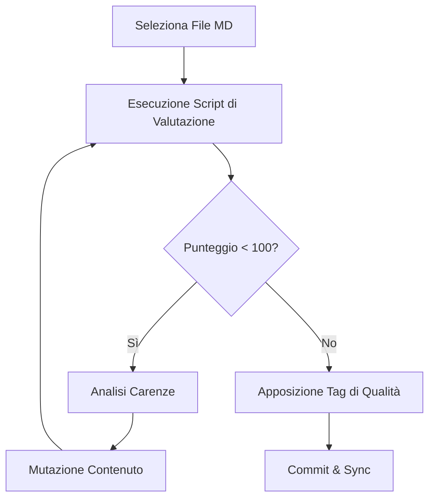

# ImproveMd Workflow

Il **ImproveMd** è il protocollo dedicato alla manutenzione e al miglioramento continuo della base di conoscenza di Antigravity. Un'AI senza documentazione di qualità è come un pilota senza mappe: inefficiente e soggetta a errori.

## Obiettivi della Documentazione
- **AI-Readability**: Formattazione ottimizzata per il parsing dei Large Language Models.
- **Precisione**: Informazioni tecniche aggiornate e verificate.
- **Ricchezza**: Uso di diagrammi, esempi di codice e avvisi.

## Pipeline di Miglioramento



### 1. Valutazione Metrica
Usa lo script di sistema per identificare i punti deboli del file.
```bash
# Valuta la qualità di un file specifico
node scripts/evaluate-md-quality.js ./docs/my-file.md
```

### 2. Standard di Formattazione (Markdown Premium)
Ogni file deve contenere:
- **YAML Frontmatter**: Per il routing e la categorizzazione.
- **Mermaid Diagrams**: Per visualizzare algoritmi o architetture.
- **Blocchi di Codice**: Almeno 3 esempi pratici.

#### Esempio: Anatomia di un Markdown di Successo
```markdown
# Titolo Chiaro
> [!NOTE]
> Contesto importante.

## Esempio Logico
```javascript
// Codice verificato
const cleanWay = (data) => data.filter(Boolean);
```
```

### 3. Git Tagging per la Documentazione
Antigravity utilizza una strategia di tagging per marcare la versione della conoscenza.

```bash
# Tagga il file dopo un aggiornamento significativo
git tag -a doc-v1.2-auth -m "Update authentication guidelines"
```

## Checklist di Qualità MD
- [ ] Il titolo è in formato H1?
- [ ] Ci sono link a documenti correlati?
- [ ] Il linguaggio è professionale e privo di ambiguità?

> [!IMPORTANT]
> Non aggiungere mai contenuto "placeholder". Se una sezione non è pronta, usa un alert `[!WARNING]` per segnalare che la documentazione è in corso d'opera.

> [!TIP]
> Usa `markdownlint` per pulire automaticamente spazi bianchi e problemi di formattazione minori.

## Changelog
- **v1.1**: Integrato nel workflow Auto-Research.
- **v1.0**: Prima release degli standard documentali.

---
*v1.1 - Antigravity Knowledge Engineering*
