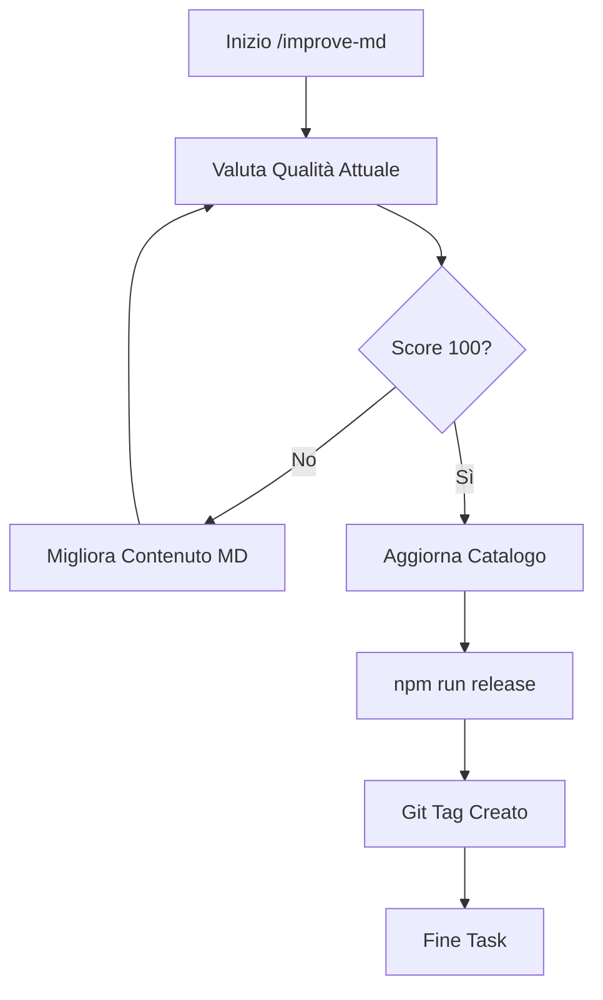

# /improve-md Workflow

Questo workflow applica il pattern **Auto-Research** per portare i file Markdown della libreria ad uno score di qualità di 100/100, eseguendo poi il release con Git Tag.

## 1. Preparazione (Evaluation Component)
L'agente deve caricare lo script di valutazione:
- **Script**: `scripts/evaluate-md-quality.js`
- **Obiettivo**: Massimizzare il punteggio (Target: 100).

## 2. Ciclo di Iterazione (Execution Loop)
Per ogni file `.md` target:
1. **Baseline**: Esegui `node scripts/evaluate-md-quality.js <file>` per ottenere il punteggio attuale.
2. **Mutation**: L'agente analizza le lacune (es. manca Mermaid, mancano alert, poco profondo) e riscrive il file.
3. **Execution**: Riesegui lo script di valutazione.
4. **Validation**: Se il punteggio è migliorato, mantieni le modifiche. Altrimenti, riprova o rollback.

## 3. Gestione Release (Git Tagging)
Al raggiungimento della qualità desiderata in tutti i file critici:
// turbo
1. Eseguire `npm run release`.
   - Questo comando:
     a. Valida la libreria (`npm run validate`).
     b. Aggiorna il catalogo (`npm run catalog`).
     c. Staging e Commit delle modifiche.
     d. Crea un Git Tag basato sulla versione in `package.json`.

> [!TIP]
> Per file critici si intendono tutti i file in `docs/rules/`, `skills/` e `.agent/workflows/`.

