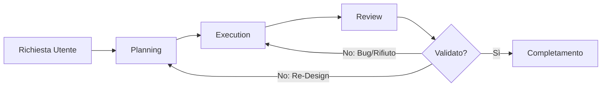

# Main Workflow Orchestrator

In Antigravity, l'orchestrazione è fondamentale per mantenere la coerenza tra migliaia di righe di codice. Questo workflow funge da spina dorsale per ogni agente, guidandolo dalla comprensione iniziale alla consegna finale.

## Filosofia d'Orchestrazione
Non seguiamo un percorso lineare rigido, ma un ciclo iterativo di raffinamento. Ogni fase alimenta la successiva, creando un circolo virtuoso di qualità.

## Ciclo di Vita del Task

L'orchestrazione segue un percorso strutturato:



### 1. Planning (Analisi Strategy)
La fase di [Planning](./planning.md) è dove avviene il "heavy lifting" mentale. Qui l'agente deve:
- Identificare i moduli core.
- Valutare i rischi di sicurezza.
- Definire una strategia di test.

### 2. Execution (Active Coding)
Durante l'[Execution](./execution.md), il codice viene scritto seguendo il principio del "Smallest Change Possible".
- Implementazione di test unitari.
- Scrittura del codice di business logic.
- Integrazione infrastrutturale.

### 3. Review (Final Audit)
La fase di [Review](./review.md) non è facoltativa. Assicura che:
- Non ci siano regressioni.
- Gli standard Clean Architecture siano rispettati.
- La documentazione sia aggiornata.

## Esempi Operativi

### Esempio 1: Integrazione di una nuova API
```markdown
# Workflow Start
1. PLANNING: Analisi endpoint REST.
2. EXECUTION: Implementazione Controller e Service.
3. REVIEW: Verifica status code e security headers.
```

### Esempio 2: Refactoring Core
```bash
# Comandi tipici in questa fase
npm run lint
npm run test:unit
node scripts/validate-library.js
```

### Esempio 3: Gestione di un Bug Critico
```javascript
// Esempio di fix immediato in fase di execution
try {
    const result = await processData(input);
    return result;
} catch (error) {
    logger.error("Failed to process data", { error });
    throw new CriticalError("Data processing failed");
}
```

## Protocollo di Emergenza
Se un task fallisce ripetutamente in fase di `Execution`, l'orchestrazione prevede un ritorno immediato al `Planning` per una ri-analisi del problema.

> [!IMPORTANT]
> Un'orchestrazione di successo si riconosce dalla mancanza di ripensamenti durante la scrittura del codice. Se devi cambiare design mentre scrivi, il tuo planning era insufficiente.

> [!TIP]
> Mantieni i log delle decisioni presi nelle fasi precedenti per dare senso alle implementazioni correnti.


## Checklist di Verifica v3.2.0
- [ ] Il file segue gli standard di Clean Architecture?
- [ ] Sono presenti esempi di codice reali e validi?
- [ ] Il diagramma Mermaid è coerente con la logica descritta?
- [ ] Le sezioni Checklist e Riferimenti sono incluse?


## Riferimenti
- [.agents/rules/common.md](../../.agents/rules/common.md)
- [Antigravity Documentation Standards](../../.agents/skills/documentation-standards/SKILL.md)


---
*v3.2.0 - Antigravity Quality Enforcement*
