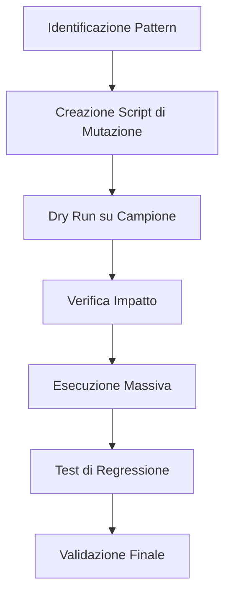

# MassRefactor Workflow

Il **MassRefactor** è il workflow di Antigravity per operazioni su larga scala. Viene utilizzato quando un cambiamento architetturale o un aggiornamento di standard deve essere propagato su decine o centinaia di file, garantendo coerenza e riducendo l'errore umano.

## Scenari d'Uso
- Cambiamento sistematico di una convenzione di naming.
- Migrazione di una libreria (es. da Moikit a Jest).
- Aggiunta di standard di sicurezza (es. sanitizzazione input) in tutti i controller.

## Pipeline di Refactoring



### 1. Analisi del Pattern
Trova tutti i file coinvolti utilizzando strumenti di ricerca avanzata.
```bash
# Esempio: Trova tutti i file che usano il vecchio pattern
grep -r "oldLogger.log" ./src --include="*.js"
```

### 2. Automazione della Modifica
Invece di editare a mano, progetta uno script (o usa strumenti come `sed`, `jscodeshift` o lo strumento `multi_replace_file_content`).

```javascript
// Esempio di script di refactoring programmato
const files = getFiles('./src');
files.forEach(file => {
    const content = readFile(file);
    const updated = content.replace(/oldLogger\.log/g, 'newLogger.info');
    writeFile(file, updated);
});
```

### 3. Esecuzione e Controllo Qualità
Non eseguire mai tutto in una volta. Usa un approccio a "ondate".

```bash
# Ondata 1: Solo file in ./src/utils
# Ondata 2: File in ./src/services
# Ondata 3: Applicazione globale
```

### 4. Gestione Errori e Rollback
Se un refactoring massivo rompe i test, devi avere una strategia di revert immediata.
```bash
# Comando rapido per rollback git se necessario
git checkout -- src/
```

## Checklist di Sicurezza per MassRefactor
- [ ] Ho verificato che lo script di mutazione non crei loop infiniti?
- [ ] Ho testato il refactoring su almeno 3 file con strutture diverse?
- [ ] Il sistema di versionamento è pulito prima di iniziare?

> [!CAUTION]
> Un refactoring massivo senza una suite di test solida è un suicidio tecnico. Assicurati che il coverage sia sufficiente prima di iniziare operazioni globali.

> [!TIP]
> Usa `ripgrep` (`rg`) per ricerche veloci in codebase di grandi dimensioni. È integrato nei tool Antigravity.

## Changelog
- **v1.1**: Aggiunta sezione pipeline DevOps e gestione ondate.
- **v1.0**: Prima release del protocollo di modifica su larga scala.

---
*v1.1 - Antigravity Scaling Operations*