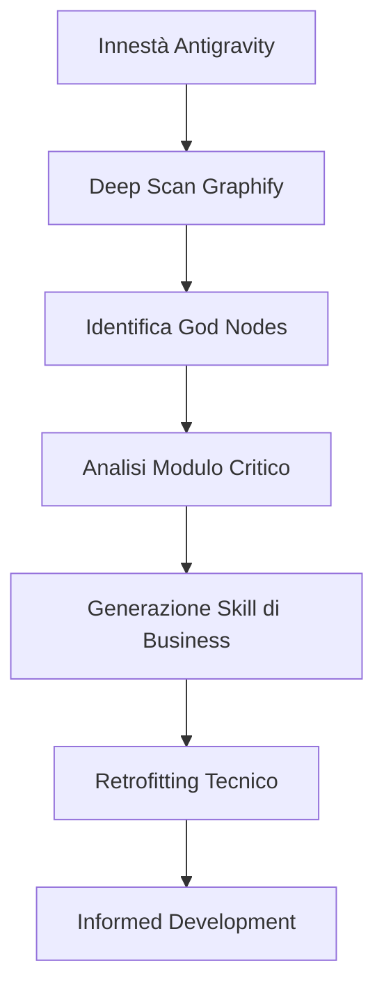

# Onboarding & Business Discovery Workflow

Questo workflow deve essere attivato ogni volta che Antigravity viene innestato in un nuovo progetto per permettere all'Agente di "capire" la logica di business e la struttura tecnica esistente.

## 🚀 Fase 1: Deep Scanning
Se non è ancora stato fatto, esegui la mappatura completa del progetto.

```bash
npm run graph:build
```

## 🔍 Fase 2: Analisi dei God Nodes
Consulta `graphify-out/GRAPH_REPORT.md`. Identifica i file con il punteggio di centralità più alto. In un progetto legacy, questi sono solitamente i nodi dove risiede la logica di business critica (o il debito tecnico più pericoloso).

> [!IMPORTANT]
> Non modificare codice prima di aver mappato almeno i primi 3 nodi centrali identificati dal report.

## 🧪 Fase 3: Estrazione della Logica (Learning Loop)
Chiedi all'utente di indicare un modulo critico. L'Agente dovrà:
1. Analizzare il modulo e le sue dipendenze tramite `npm run graph:query`.
2. Generare un file di "Knowledge Asset" in `.agents/skills/business-logic/{{module-name}}.md`.
3. Documentare le "regole non scritte" trovate nel codice legacy.



## 🛠️ Fase 4: Retrofitting del Debito Tecnico
Una volta capita la logica, l'Agente deve proporre un piano per isolare la business logic dai vincoli tecnici legacy senza interrompere il servizio (Strangler Fig Pattern).

```bash
# Esempio: Estrarre una funzione pura da un modulo legacy
npm run graph:query "Mostrami le dipendenze esterne di [ModuloLegacy]"
```

## 🏗️ Casi Scenari d'Uso Legacy
1. **The Black Box**: Un file da 2000 righe che nessuno tocca da anni. Il grafo permetterà di smontarlo con precisione chirurgica.
2. **The Ghost Module**: Moduli che sembrano inutilizzati ma hanno dipendenze "Surprise" nel grafo.
3. **The Logical Drift**: Quando il codice implementa una logica diversa da quella documentata.

## Checklist di Onboarding
- [ ] Il grafo è stato generato e il report consultato?
- [ ] I "God Nodes" sono stati identificati e discussi con l'utente?
- [ ] È stata creata almeno una Skill locale che descrive un processo di business core?
- [ ] L'Agente ha aggiornato la sua consapevolezza strutturale tramite i Trace Logs?

## Riferimenti
- [Antigravity Agent Protocol](../../AGENT.md)
- [Graphify Intelligence Workflow](./graphify.md)
- [Clean Architecture Standards](../rules/common/clean-architecture.md)

---
*v1.0.0 - Antigravity Legacy Awareness Engine*
