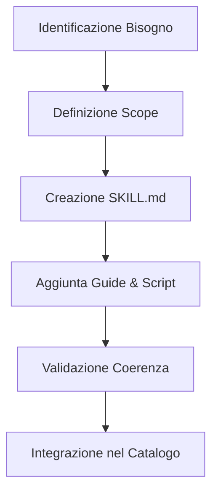

# PlanSkill Workflow

Le **Skill** sono i muscoli dell'agente Antigravity. Questo workflow guida l'agente nella creazione di nuove capacità modularizzate, garantendo che siano riutilizzabili, ben documentate e facili da integrare in diversi contesti.

## Quando creare una Skill?
- Quando una logica complessa viene ripetuta in più task.
- Quando si implementa un nuovo framework o libreria esterna.
- Quando si risolve un bug architetturale che richiede una "guida" per essere evitato in futuro.

## Circuito di Creazione



### 1. Definizione dello Scope
Identifica chiaramente cosa la skill FA e cosa NON FA. Evita "Mega-Skill" onnipresenti.

### 2. Struttura della Skill
Una skill deve seguire questa gerarchia di file:
```text
.agents/skills/[skill-name]/
├── SKILL.md            # Istruzioni principali (YAML + Markdown)
├── scripts/            # Helper scripts (opzionale)
├── examples/           # Reference implementations (opzionale)
└── resources/          # Asset aggiuntivi (opzionale)
```

### 3. Esempio di SKILL.md
```markdown
---
name: high-performance-react
description: Pattern per ottimizzare il rendering di React.
---
# High Performance React
## Metodologia
Utilizza `useMemo` e `useCallback` solo...
```

### 4. Automatizzazione via Script
Se la skill richiede passi ripetitivi, crea uno script in `scripts/`.
```javascript
// .agents/skills/my-skill/scripts/setup.js
console.log("Inizializzazione ambiente per MySkill...");
// Logica di setup...
```

### 5. Registrazione nel Catalogo
Dopo la creazione, aggiorna il catalogo globale.
```bash
# Comando per aggiornare il catalogo delle skill
npm run catalog:update
```

## Requisiti di Qualità per una Skill
- Deve avere almeno un esempio di codice "Prima vs Dopo".
- Deve includere una sezione "Gotchas" o "Error Handling".
- Deve essere scritta in un linguaggio agnostico rispetto all'utente (istruzioni chiare per l'AI).

> [!IMPORTANT]
> Una Skill senza un `SKILL.md` correttamente formattato con YAML frontmatter non verrà caricata correttamente dal sistema di orchestrazione Antigravity.

> [!TIP]
> Mantieni le skill atomiche. Se senti che la skill sta diventando troppo grande, spezzala in più skill correlate (es. `auth-core` e `auth-jwt`).


## Checklist di Verifica v3.2.0
- [ ] Il file segue gli standard di Clean Architecture?
- [ ] Sono presenti esempi di codice reali e validi?
- [ ] Il diagramma Mermaid è coerente con la logica descritta?
- [ ] Le sezioni Checklist e Riferimenti sono incluse?


## Riferimenti
- [.agents/rules/common.md](../../.agents/rules/common.md)
- [Antigravity Documentation Standards](../../.agents/skills/documentation-standards/SKILL.md)


---
*v3.2.0 - Antigravity Quality Enforcement*
