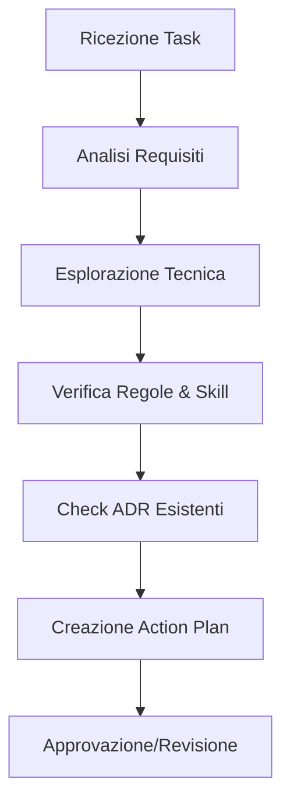

# Planning Workflow

In Antigravity, il **Planning** è il momento in cui l'incertezza viene trasformata in intenzione. Un piano ben fatto riduce il tempo di esecuzione del 40% e previene bug strutturali che sarebbero difficili da risolvere in seguito.

## Obiettivi della Fase
1. **Chiarezza**: Capire esattamente cosa deve essere fatto.
2. **Standardizzazione**: Applicare Clean Architecture e pattern collaudati.
3. **Pianificazione della Verifica**: Sapere come testeremo il successo.

## Protocollo Operativo



### 1. Analisi della Richiesta
- **De-costruzione**: Scomponi ogni richiesta in sottomoduli indipendenti.
- **Parametri**: Definisci input, output ed effetti collaterali attesi.

### 2. Esplorazione Tecnica
Esamina il codice esistente per trovare il punto d'innesto ideale.
```bash
# Comandi suggeriti per l'esplorazione
grep -r "auth-service" ./src
ls -R ./docs/rules
node scripts/check-dependencies.js
```

### 3. Creazione del Piano d'Azione (Implementation Plan)
Il piano deve essere redatto come un documento strutturato. Ecco un esempio:

```markdown
# Implementation Plan: New Feature X
## Analysis
- Modulo: Authentication Manager
- Pattern: Strategy
## Steps
1. Create interface `IAuthStrategy`.
2. Implement `JwtAuthStrategy`.
3. Update `AuthService` to use the new strategy.
## Verification
- Unit Test for `JwtAuthStrategy`.
- Integration test with `AuthService`.
```

### 4. Gestione delle Eccezioni di Design
Se il planning rivela che la Clean Architecture non può essere rispettata, usa gli **Architecture Decision Records (ADR)**.

```javascript
// Esempio di ADR snippet
const ADR_001 = {
    title: "Uso di cache locale in-memory",
    reason: "Latenza di rete troppo alta per Redis",
    consequences: "Perdita di persistenza al riavvio"
};
```

## Checklist di Validazione del Piano
- [ ] Ho identificato tutti i file da modificare?
- [ ] Ho previsto almeno un test per ogni modifica?
- [ ] Ho controllato `docs/rules/security.md`?

> [!IMPORTANT]
> Non saltare mai la fase di esplorazione tecnica. Quello che sembra un semplice cambio di stringa potrebbe nascondere una logica cablata in altri dieci moduli.

> [!TIP]
> Se il piano supera i 12 step, spezzalo. Un piano troppo lungo è un segno che il task è un "Epic" e non un "Task".

## Changelog
- **v1.2**: Aggiunta sezione ADR e checklist di validazione.
- **v1.1**: Prima definizione del protocollo di analisi.

---
*Antigravity System - Protocollo Planning*