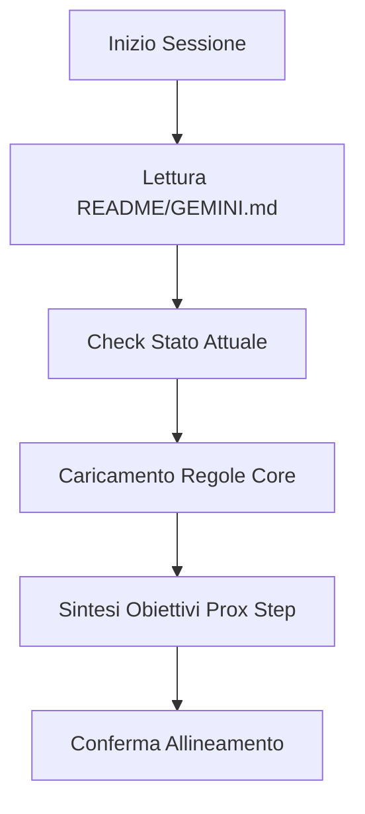

# Primer Workflow

Il **Primer** è una tecnica avanzata di "Context Seeding". Serve a sincronizzare istantaneamente l'agente con lo stato attuale del progetto, le decisioni architettoniche e gli obiettivi a breve termine, minimizzando il "contesto fantasma" o le allucinazioni.

## Quando eseguire un Primer?
- All'inizio di ogni nuova sessione di chat.
- Dopo un errore massivo o una perdita di tracciamento del piano.
- Quando si cambia radicalmente area del progetto.

## Procedura di Bootstrap



### 1. Inizializzazione della Memoria
L'agente deve interrogare il sistema per recuperare l'ultimo stato noto.
```bash
# Esempio di comando per recuperare l'ultimo piano d'azione
cat artifacts/implementation_plan.md
```

### 2. Sincronizzazione delle Regole
Carica le regole specifiche del repository per forzare i vincoli di design.
```bash
# Leggi le regole dominanti
cat docs/rules/common.md
cat docs/rules/clean-architecture.md
```

### 3. Output del Primer
L'output del primer verso l'utente dovrebbe essere conciso e pronto all'azione.
```markdown
# Primer Completato
- Progetto: Antigravity Core
- Stato: Implementazione modulo Auth (Step 3/5)
- Regole Attive: Clean Architecture, TDD strict.
- Prossima Azione: Scrittura test unitario per `AuthStrategy`.
```

### 4. Gestione dello Stack di Skill
Identifica quali skill sono necessarie per il task corrente e "scaldale".
```javascript
// Pseudo-code per il caricamento skill interno
loadSkill('tdd-workflow');
loadSkill('api-design');
```

## Checklist di Successo del Primer
- [ ] Ho letto l'ultima conversazione o log?
- [ ] Conosco il file target principale?
- [ ] Ho chiare le convenzioni di naming?

> [!IMPORTANT]
> Un primer mal eseguito porta a codice inconsistente. Assicurati di non basarti su ricordi obsoleti della cache, ma di verificare sempre lo stato reale dei file su disco.

> [!TIP]
> Se l'utente ti chiede "A che punto siamo?", esegui un mini-primer interno prima di rispondere per garantire accuratezza.

## Changelog
- **v1.1**: Aggiunto supporto per il Metodo Cody e sintesi obiettivi.
- **v1.0**: Prima implementazione della tecnica di primer contestuale.

---
*v1.1 - Antigravity Context Management*
