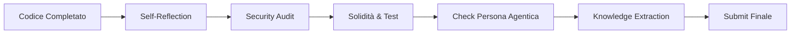

# Review Workflow

La **Review** è il filtro finale. Non è un atto formale, ma un'attività critica di analisi. In questa fase, ci mettiamo nei panni di chi dovrà manutenere questo codice tra due anni.

## Pilastri della Validazione
1. **Integrità Architetturale**: Il sistema è ancora "Clean"?
2. **Postura di Sicurezza**: Abbiamo introdotto rischi?
3. **Efficacia Funzionale**: Il problema dell'utente è davvero risolto?

## Flusso di Verifica Finale



### 1. Auto-Riflessione (Self-Reflection)
Usa questi comandi per verificare la qualità strutturale:
```bash
# Analisi delle dipendenze circolari
npx madge --circular src/
# Controllo linting esteso
npm run lint:strict
```

### 2. Security Audit (Security Checklist)
Non limitarti a leggere il codice. Cerca pattern pericolosi.

```javascript
// ESEMPIO: Cosa cercare durante la review
// EVITA: eval(userData)
// PREFERISCI: JSON.parse(userData) con schema validation

const Joi = require('joi');
const schema = Joi.object({
  id: Joi.number().integer().required()
});
```

### 3. Verifica della Solidità (Testing Standards)
Esegui la suite completa di test per escludere regressioni sibilline.

```bash
# Esecuzione completa pre-commit
npm run test:all
# Verifica coverage
npm run test:coverage
```

### 4. Knowledge Extraction (Continuous Learning)
Se hai imparato qualcosa di nuovo, documentalo. Antigravity cresce con ogni task.

```markdown
# Nuova Skill suggerita: "ElasticSearch Mapping Patterns"
- Perché: Abbiamo risolto un problema di collisione di tipi negli index.
- Path: .agents/skills/elasticsearch-patterns.md
```

## Checklist dei "No-Go"
Se uno di questi è presente, la review fallisce:
- [ ] Commenti di attività (es. "T-O-D-O") rimasti nel codice.
- [ ] Console.log di debugging non rimossi.
- [ ] Funzioni più lunghe di 50 righe senza una ragione valida.
- [ ] Nomi di variabili monosillabici (es. `a`, `b`, `x`).

> [!IMPORTANT]
> La fase di Review deve avvenire con una mentalità critica. Non aver paura di suggerire un refactoring dell'ultimo minuto se identifichi un rischio di sicurezza o una violazione grave dei principi SOLID.

> [!TIP]
> Se il lavoro è complesso, scrivi una breve nota di rilascio allegata alla PR per spiegare le scelte tecniche non ovvie.

---
*v1.2 - Antigravity Review Protocol*