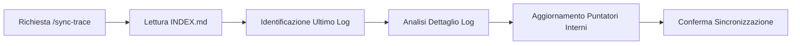

# Trace Synchronization Workflow

> [!IMPORTANT]
> La sincronizzazione è fondamentale per evitare regressioni e mantenere la coerenza architetturale nelle sessioni multi-giorno.

Questo workflow viene attivato tramite `/sync-trace` e serve a ricostruire lo stato mentale dell'agente analizzando la cronologia delle modifiche registrate in `logTrace/`.



## Quando eseguire /sync-trace?
- Quando si riprende un lavoro interrotto.
- Quando il `primer` generale non è sufficiente a capire "cosa è stato fatto esattamente nell'ultima ora".
- Prima di iniziare un task che dipende da modifiche recenti non ancora consolidate nella documentazione principale.

## Procedura di Sincronizzazione

### 1. Scansione dell'Indice
L'agente deve leggere `logTrace/INDEX.md` per identificare gli ultimi task completati o in corso.

### 2. Deep Dive sull'Ultimo Log
L'agente legge l'ultimo file di log (identificato dall'ID più recente) per capire:
- L'obiettivo specifico dell'ultima richiesta.
- I file effettivamente toccati.
- Eventuali blocchi o decisioni architetturali (ADR light).

### 3. Ripristino dei Puntatori
L'agente aggiorna la sua visione interna:
- Qual è il file attivo?
- Qual è il prossimo test da far passare (TDD)?

## Esempio di Comando
```powershell
# Esempio di come l'agente potrebbe scansionare gli ultimi log
Get-ChildItem -Path logTrace/*.md | Sort-Object LastWriteTime -Descending | Select-Object -First 3
```

## Struttura del Log di Sincronizzazione
```json
{
  "sync_event": "20260409-SYNC",
  "recovered_state": "feature_auth_completed",
  "remaining_tasks": ["unit_tests", "docs_update"]
}
```

## Output del Workflow
L'agente deve confermare la sincronizzazione con un breve riassunto:
```markdown
# Sync-Trace Completato
- Ultimo Log: [ID-LOG] ([TITOLO])
- Stato: [SINTESI_STATO]
- Prossimo Step: [AZIONE_CONSIGLIATA]
```

---

## Best Practices per la Tracciabilità

1. **Atomicità**: Ogni log deve rappresentare un'unità logica di lavoro.
2. **Chiarezza**: Usa titoli descrittivi che facilitino la scansione rapida.
3. **Validazione**: Referenzia sempre l'esito dei test per garantire la solidità dello stato ripristinato.

---
*v1.1 - Antigravity Traceability System*
