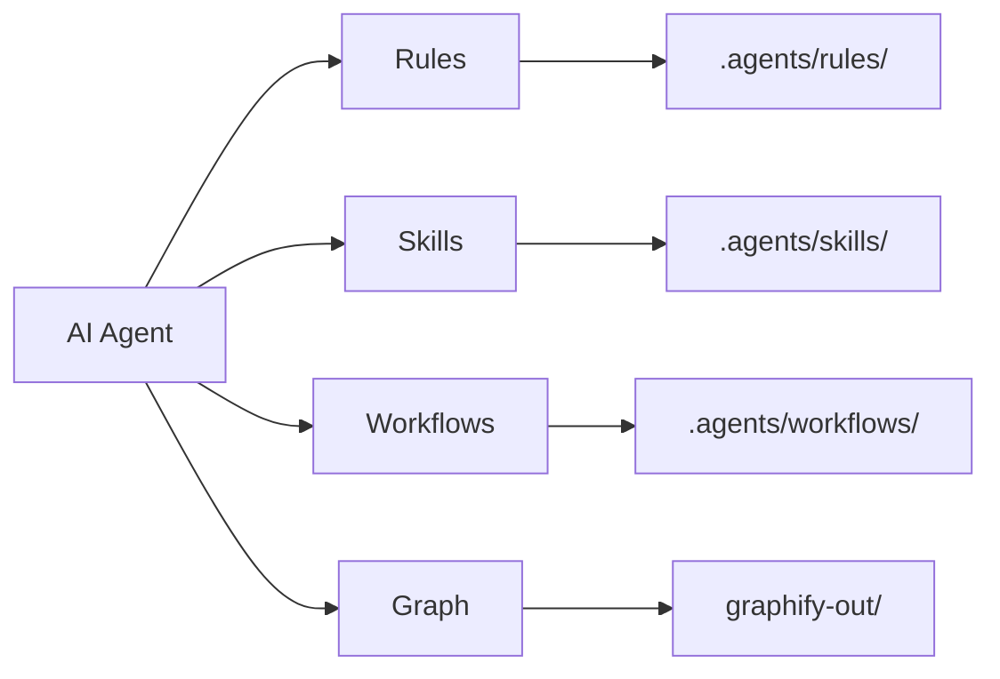
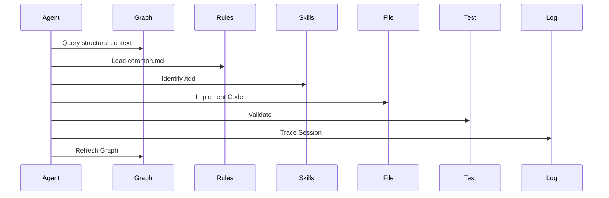
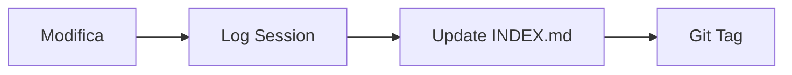

# AGENT.md - Master Instructions for Antigravity AI Agents

Questo file definisce le istruzioni fondamentali e il contesto operativo per tutti gli agenti AI (Gemini, Cursor, Cline, Copilot, etc.) che interagiscono con questo repository.

## 🗺️ Mappa Concettuale



## Panoramica del Progetto
Questa è la **Skill & Rule Library** di Antigravity. Il suo scopo è ospitare e organizzare:
1. **Regole (`.agents/rules/`)**: Standard di codifica, architettura (Clean Architecture) e sicurezza (OWASP).
2. **Skill (`.agents/skills/`)**: Flussi di lavoro specialistici e conoscenze approfondite.
3. **Personas (`.agents/workflows/`)**: Definizioni di persona con focus specifici (es. Architect, Code Reviewer).

## Mandati Obbligatori per l'Agente
In ogni interazione all'interno di questo workspace, devi:

### 1. Rispetto delle Regole
- Caricare e applicare **SEMPRE** le regole contenute in `.agents/rules/common.md` prima di qualsiasi azione di codifica.
- Se il progetto su cui lavori usa un linguaggio specifico (es. Python, TS), verifica se esistono regole corrispondenti in `.agents/rules/` e applicale.
- **Context Hygiene**: Se senti che la sessione sta diventando instabile o incoerente, usa il workflow `/primer`.

### 2. Utilizzo delle Skill
- Quando ti viene chiesto di eseguire compiti complessi (es. TDD, Security Audit), verifica se esiste una skill corrispondente in `.agents/skills/` e seguine le istruzioni "How-To".

### 3. Identità dell'Agente
- Comportati secondo le definizioni presenti in `.agents/workflows/`. Se non diversamente specificato, usa `base_agent.md` as riferimento per la tua persona.

### 4. Gestione del Repository
- Quando crei nuove regole o skill, assicurati che siano ben documentate in Markdown con YAML frontmatter (come da ADR-0002) e seguano la struttura gerarchica esistente.
- Il file `README.md` è la fonte principale per il catalogo delle risorse.

### 5. Consapevolezza Strutturale (Knowledge Graph)
- Prima di rispondere a domande architetturali o eseguire refactoring massivi, l'agente deve consultare il Knowledge Graph integrato.
- Utilizza `graphify-out/GRAPH_REPORT.md` per identificare "God Nodes" e "Surprise Edges".
- Esegui `npm run graph:query` per navigare le relazioni tra componenti che non sono visibili nel solo contesto del file aperto.

### 6. Continuous Learning (Knowledge Harvesting)
- Aderisci a `.agents/rules/continuous-learning.md`. Sii proattivo: quando risolvi un problema inedito o crei un workflow utile, chiedi all'utente di documentarlo immediatamente come regola o skill.

## 🛠️ Esempi di Attivazione Skill

```bash
# Esempio: Innescare il workflow di TDD
@[/tdd] - "Implementa la funzione di validazione email"

# Esempio: Richiedere una revisione di sicurezza
@[/security-auditor] - "Analizza questo endpoint per vulnerabilità SQLi"
```

> [!IMPORTANT]
> **Mandato di Persistenza**: Prima di ogni modifica strutturale, l'agente deve verificare internamente (Chain-of-Thought) se il piano è allineato con `.agents/rules/common.md`. Se la sessione supera i 10 turni, l'agente deve suggerire all'utente un `/primer`.

## Antigravity Workflow Triggers & Golden Rules
1. **"Secure by Design" Implicito**: Ogni proposta tecnica deve includere nativamente una componente di sicurezza.
2. **Aggiornamento Catalogo Automatico**: Quando crei o elimini file, aggiorna il Catalogo nel `README.md`.
3. **Chiusura Task**: Quando l'utente chiude il task, esegui un check finale di conformità alle regole e riassumi brevemente.



### 6. Tracciamento delle Sessioni
Ogni modifica deve essere documentata. Segui rigorosamente il formato richiesto per i Trace Log.

```markdown
# Trace Log: Titolo Attività (vX.Y.Z)
**Session ID**: YYYYMMDD-NNN
**Obiettivo**: Descrizione dell'obiettivo.
- ✅ Cambiamento 1
- ✅ Cambiamento 2
```

## 📊 Pipeline di Tracciamento
L'agente deve assicurarsi che la catena di memoria non venga mai interrotta.



> [!TIP]
> Mantieni i log brevi ma densi di informazioni tecniche. Evita verbosità inutile.

---
*v1.1.0 - Antigravity Agent Protocol*
