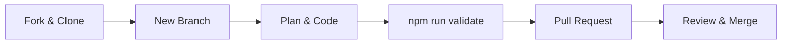

# Contributing to Antigravity

Benvenuto! Siamo felici che tu voglia contribuire a rendere gli agenti AI più intelligenti e sicuri. Per mantenere l'integrità del sistema, seguiamo un rigoroso protocollo basato su **Clean Architecture** e **SecOps**.

---

## 🏗️ Filosofia del Progetto
Ogni aggiunta deve essere:
1.  **Atomica**: Risolvi un problema specifico.
2.  **Documentata**: Se non è scritto, non esiste.
3.  **Validata**: Deve superare tutti i test automatici.

---

## 🛠️ Come Aggiungere una Nuova Skill o Regola

### 1. Inizia con un Piano (`/planning`)
In Antigravity non si scrive codice a caso. Usa l'agente per creare un `implementation_plan.md`.

### 2. Struttura del Contenuto
Ogni file Markdown deve avere questa struttura minima:
```markdown
---
title: "Titolo"
description: "Descrizione breve"
tags: [tag1, tag2]
---
# Titolo
...Contenuto...
## Esempi
## Riferimenti
```

### 3. Esempi di Codice Obbligatori
Devi fornire almeno 3 esempi di codice reali e non banali. Ecco un esempio di come NON farlo e come farlo:

```typescript
// ❌ Anti-pattern: Esempio troppo semplice
function add(a, b) { return a + b; }

// ✅ Corretto: Esempio contestualizzato e robusto
function calculatePrice(amount: number, tax: TaxRate): Money {
  const base = new Money(amount);
  return base.addTax(tax);
}
```

---

## 📊 Pipeline di Validazione

Prima di inviare una Pull Request, devi eseguire i comandi di validazione:

```bash
# 1. Valida la qualità della documentazione (Deve essere 100/100)
npm run validate

# 2. Aggiorna il catalogo nel README
npm run catalog

# 3. Se hai preso decisioni architetturali, crea un ADR
npm run adr "Nome della Decisione"
```

---

## 🔄 Workflow di Sviluppo



## Checklist per la PR
- [ ] Il file Markdown ha lo YAML frontmatter?
- [ ] Hai incluso diagrammi Mermaid dove utile?
- [ ] Hai aggiunto almeno 3 esempi di codice complessi?
- [ ] Il comando `npm run validate` passa senza errori?

---

## Riferimenti
- [Guida all'Uso](./howtouse.md)
- [Master Agent Protocol](./AGENT.md)

---
*v1.0.0 - Antigravity Governance Team*
