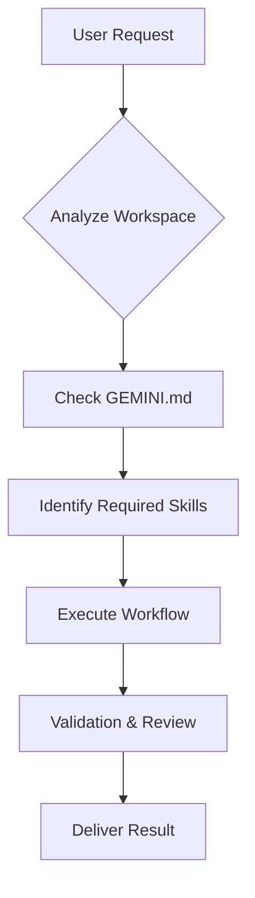

# Antigravity Gemini CLI Configuration

This file provides the definitive context and operational instructions for **Gemini CLI** when working in the Antigravity repository. It ensures that the AI assistant adheres to established standards, utilizes current workflows, and maintains the project's architectural integrity.

## 🚀 Core Mandates

All operations performed via Gemini CLI must strictly follow these mandates:

- **Clean Architecture**: Mandatory implementation of Clean Architecture principles for all design and development tasks. Divide logic into Entities, Use Cases, Adapters, and Frameworks.
- **Security First**: Security is a primary requirement. Consult and apply the guidelines in `docs/rules/security.md` for every code modification.
- **Context Hygiene**: Maintain a lean and relevant context. Refer to `skills/context-management.md` to avoid "hallucinations" or performance degradation during long sessions.

> [!IMPORTANT]
> Failure to adhere to these mandates will trigger a validation error during the pre-commit phase.

## 🛠️ Key Commands

Use these commands to maintain the library and validate your work:

### Catalog Management
```bash
# Updates the library index in README.md based on current skills and agents
npm run catalog
```

### Validation Suite
```bash
# Checks for consistency, broken links, and adherence to project rules
npm run validate
```

### Quality Assessment
```bash
# Run quality assessment on a markdown file
node scripts/evaluate-md-quality.js <file-path>
```

## 📂 Project Structure Alignment

Gemini CLI is configured to recognize the following directory structure, which is mapped to specific agent capabilities:

| Directory | Purpose | Detailed Functionality |
| :--- | :--- | :--- |
| `docs/rules/` | Operational rules | Contains markdown files defining the "how-to" for security, db, and frontend. |
| `skills/` | Agent skills | Reusable scripts and instructions that extend the agent's base capabilities. |
| `.agent/workflows/` | Workflows | BPMN-like sequences of tasks for complex operations (e.g., mass refactoring). |
| `agents/` | Agent Personas | Specific configurations for specialized AI roles (Architect, Researcher). |

## 🔄 Interaction Workflow

The typical interaction flow within Gemini CLI is orchestrated to ensure quality at every step:



## ⚡ Workflow Activation

To invoke a specific workflow, use the slash command syntax. This notifies the agent to load the corresponding instructions from `.agent/workflows/`.

```markdown
# Example: Triggering a mass refactor
/mass-refactor --target ./src --pattern clean-architecture
```

## 🛡️ Security Guardrails

Gemini CLI has built-in guardrails to prevent common vulnerabilities:
1. **Input Sanitization**: All inputs are checked against regex patterns for injection.
2. **Permission Scoping**: The agent can only write to authorized directories within the workspace.
3. **Secret Masking**: Environment variables and keys are never indexed in the context.

## 📝 Best Practices for Gemini CLI

1. **Be Specific**: When invoking a workflow, provide all necessary parameters to minimize ambiguity.
2. **Review Diffs**: Always review the suggested changes before applying them to ensure intent alignment.
3. **Use Skills**: Explicitly refer to `skills/` files to leverage pre-defined best practices and patterns.

> [!TIP]
> Use `/primer` to quickly reload critical context if the conversation becomes too long or fragmented.

Refer to **[AGENT.md](./AGENT.md)** for the full execution framework and advanced agentic patterns.
