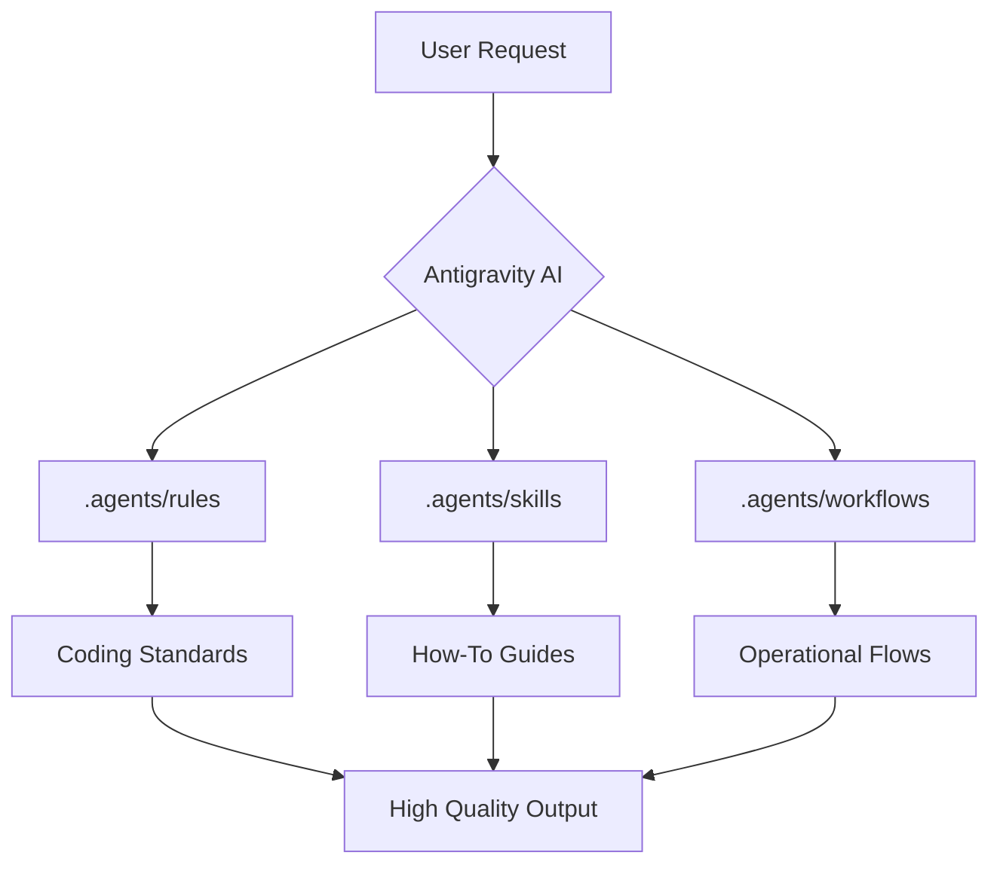

# Antigravity Skills & Rules Library

Benvenuti nella libreria personale di skill, regole e agenti per **Antigravity**. 
Questo repository è progettato per centralizzare e standardizzare il comportamento degli agenti AI, garantendo coerenza, sicurezza e alta qualità nello sviluppo software.

---
🌍 **Linguaggio / Language**: [Italiano (Principale)] | **[English (README_EN.md)](./README_EN.md)**  
📜 **Governance**: **[LICENSE](./LICENSE)** | **[CONTRIBUTING.md](./CONTRIBUTING.md)** | **Version**: `v1.1.0`
---

## 🛠️ Prerequisiti e Installazione

Per utilizzare appieno tutte le funzionalità di Antigravity (inclusa l'analisi strutturale tramite Knowledge Graph), assicurati di avere installato:
- **Node.js** (v16+)
- **Python** (v3.10+)

### Setup Rapido
Per configurare automaticamente l'ambiente virtuale e le dipendenze Python:
```bash
# Sincronizza (se sei in un nuovo progetto) e iniettà gli script
node sync-library.js

# Esegui il setup automatico (venv, graphify, hooks)
node scripts/setup-project.js
```

## 🏗️ Architettura del Sistema

L'ecosistema Antigravity si basa su tre pilastri fondamentali che guidano l'agente durante tutto il ciclo di vita dello sviluppo:



## Struttura del Repository

- **`.agents/rules/`**: Regole e standard di codifica (es. comuni, specifiche per linguaggio come Python, TS).
- **`.agents/skills/`**: Moduli "How-To" per operazioni complesse (es. TDD, Ottimizzazione, Security Audit).
- **`.agents/workflows/`**: Sequenze operative, processi automatizzati e Personas (es. Architect, Code Reviewer).
- **`logTrace/`**: Cronologia delle sessioni e memoria degli agenti.

> [!IMPORTANT]
> Tutte le modifiche al codice devono passare attraverso il processo di validazione automatica (`npm run validate`) prima di essere considerate definitive.

## Filosofia
L'obiettivo è creare un ecosistema dove l'AI non è solo una chat, ma uno strumento specializzato guidato da regole ferree e competenze specifiche (skills).

👉 **[Leggi la Guida all'Uso Completa](./howtouse.md)** e le **[Istruzioni per l'Agente](./AGENT.md)** per imparare a integrare Antigravity nel tuo workflow quotidiano.

## 🚀 Comandi Rapidi

Per mantenere l'integrità della libreria, utilizza i seguenti comandi:

```bash
# Valida la struttura e i link della libreria
npm run validate

# Rigenera il catalogo nel README
npm run catalog

# Crea un nuovo record di decisione architetturale (ADR)
npm run adr "Titolo"

# Rigenera il Knowledge Graph
npm run graph:build

# Interroga le dipendenze strutturali
npm run graph:query "Mostrami le dipendenze di X"

# Esegui il ciclo completo di rilascio (validate + catalog + tag)
npm run release
```

## 🛠️ Personalizzazione degli Agenti

Ogni persona operativa (Persona) è definita da un file Markdown che ne modella il comportamento. Ecco un esempio di come definire un nuovo agente:

```markdown
# Security Auditor Agent
- Focus: Analisi OWASP e vulnerabilità.
- Skill associate: .agents/skills/security-audit/
- Workflow: Verifica automatica pre-rilascio.
```

## 📊 Pipeline di Qualità

Il repository implementa controlli di qualità continui. Lo script di valutazione della documentazione può essere eseguito manualmente:

```bash
# Valuta un file .md specifico
node scripts/evaluate-md-quality.js .agents/rules/common.md
```

> [!TIP]
> Per ottenere il punteggio massimo (100/100), i file Markdown devono includere YAML frontmatter, diagrammi Mermaid, alert tags e almeno 3 esempi di codice.

## Come Contribuire
Aggiungi nuove regole in `.agents/rules/` o nuove competenze in `.agents/skills/` seguendo i template esistenti. Assicurati di aggiornare la versione del repository in `package.json`.


<!-- CATALOG_START -->
## Catalogo 

*Questo catalogo è generato automaticamente dallo script `scripts/generate-catalog.cjs`*

### Regole e Standard (.agents/rules)
- [**Clean Architecture Standards**](./.agents/rules/common/clean-architecture.md) - *Guida definitiva alla separazione delle responsabilità e all'integrità del dominio.*
- [**Error Handling & Resilience**](./.agents/rules/common/error-handling.md) - *Standard per la gestione degli errori, la resilienza del codice e la stabilità del sistema.*
- [**Immutability Standards**](./.agents/rules/common/immutability.md) - *Principi di immutabilità per la prevenzione di side effect e la sicurezza del thread.*
- [**Knowledge & Structural Graph**](./.agents/rules/common/knowledge-graph.md) - *Obbligo di mantenere una mappatura strutturale del codice per garantire l'integrità architetturale.*
- [**Logging & Observability Standards**](./.agents/rules/common/logging.md) - *Standard per il logging strutturato, la telemetria e la tracciabilità operativa delle applicazioni.*
- [**Naming Conventions**](./.agents/rules/common/naming-conventions.md) - *Standard di naming per garantire chiarezza, intenzionalità e coerenza verbale nel codice.*
- [**Security & OWASP Compliance**](./.agents/rules/common/security.md) - *Standard di sicurezza gestiti tramite approccio secure-by-default e conformità OWASP.*
- [**Simplicity & Clean Code**](./.agents/rules/common/simplicity.md) - *Principi di semplicità, leggibilità e manutenibilità estrema (KISS, YAGNI).*
- [**SOLID Principles**](./.agents/rules/common/solid.md) - *Principi SOLID per un design del software robusto, manutenibile e scalabile.*
- [**TDD as Architectural Design**](./.agents/rules/common/tdd.md) - *Protocollo per il Test-Driven Development (TDD) inteso come strumento di design e disaccoppiamento forzato.*
- [**Traceability & Session Memory**](./.agents/rules/common/traceability.md) - *Standard per il tracciamento delle modifiche, la cronologia operativa e la gestione della memoria di sessione degli agenti AI.*
- [**Versioning & Lifecycle**](./.agents/rules/common/versioning.md) - *Standard per il versionamento semantico (SemVer), il tagging git e la gestione del ciclo di vita del software.*
- [**Antigravity Common Rules**](./.agents/rules/common.md) - *Regole universali applicabili a ogni riga di codice generata nell'ecosistema Antigravity.*
- [**Continuous Learning Rule**](./.agents/rules/continuous-learning.md) - *Mandato per l'auto-miglioramento proattivo della libreria tramite Knowledge Harvesting.*
- [**Database Rules**](./.agents/rules/database.md) - *Standard per design schema, ORM e sicurezza dei dati.*
- [**Frontend Rules**](./.agents/rules/frontend.md) - *Standard per UI/UX, accessibilità e testing frontend.*
- [**Python Rules**](./.agents/rules/python.md) - *Standard per sviluppo Python moderno con focus su sicurezza e tipi.*
- [**Security Standards (OWASP)**](./.agents/rules/security.md) - *Standard di sicurezza obbligatori basati su OWASP Top 10.*
- [**TypeScript Rules**](./.agents/rules/typescript.md) - *Standard per TypeScript type-safe e professionale.*

### Decisioni Architetturali (docs/adr)
- [**ADR-0001: Adopting Architecture Decision Records**](./docs/adr/0001-adopting-adr.md) - *Decisione di utilizzare gli ADR per documentare le scelte architetturali del repository Antigravity.*
- [**ADR-0002: Standardizing Metadata with YAML Frontmatter**](./docs/adr/0002-standard-metadata.md) - *Adozione dello standard YAML Frontmatter per tutti gli asset Markdown del repository.*
- [**ADR-0003: Quality-Enforced Documentation-as-Code Structure**](./docs/adr/0003-quality-enforced-documentation-as-code-structure.md) - *Decisione di imporre metriche di qualità automatizzate per tutti gli asset Markdown del repository.*

### Competenze e Flussi (.agents/skills)
- [**AI Prompting Skill**](./.agents/skills/ai-prompting/SKILL.md) - *Pattern e framework per scrivere prompt agentici efficaci.*
- [**RESTful API Design & OpenAPI Standards**](./.agents/skills/api-design/SKILL.md) - *Best practices per la progettazione di API scalabili, sicure e ben documentate utilizzando standard REST e specifiche OpenAPI.*
- [**API Versioning Skill**](./.agents/skills/api-versioning/SKILL.md) - *Pattern per gestire il ciclo di vita e le breaking changes delle API.*
- [**Auth Patterns Skill**](./.agents/skills/auth-patterns/SKILL.md) - *Pattern di implementazione per autenticazione JWT e autorizzazione RBAC.*
- [**Context Management Skill (Context Hygiene)**](./.agents/skills/context-management/SKILL.md) - *Guida alla Context Hygiene per mantenere l'AI precisa nelle lunghe sessioni.*
- [**High-Fidelity Observability & Deep Debugging**](./.agents/skills/debugging-pro/SKILL.md) - *Metodologia avanzata per il distributed tracing, context propagation e analisi di performance profonda (Flame Graphs, Memory Profiling).*
- [**DevOps Pipeline Skill**](./.agents/skills/devops-pipeline/SKILL.md) - *Standard per CI/CD, Docker e automazione del deployment.*
- [**Documentation Standards**](./.agents/skills/documentation-standards/SKILL.md) - *Linee guida per documentazione tecnica chiara, scalabile e AI-friendly.*
- [**Error Monitoring Skill**](./.agents/skills/error-monitoring/SKILL.md) - *Pattern per implementare observability completa: Sentry, OpenTelemetry e SLO.*
- [**Knowledge Graph Skill (Graphify)**](./.agents/skills/knowledge-graph/SKILL.md) - *Skill per gestire e interrogare il Knowledge Graph del progetto utilizzando Graphify.*
- [**Performance Optimization Skill**](./.agents/skills/performance-optimization/SKILL.md) - *Pattern sistematici per identificare e risolvere colli di bottiglia.*
- [**Refactoring Best Practices & Technical Debt Management**](./.agents/skills/refactoring-guide/SKILL.md) - *Tecniche avanzate per migliorare la qualità, la leggibilità e la manutenibilità del codice senza alterarne il comportamento esterno.*
- [**TDD Workflow & Testing Strategy**](./.agents/skills/tdd-workflow/SKILL.md) - *Guida completa al ciclo Red-Green-Refactor, design patterns per il testing e best practices di validazione.*
- [**Testing Strategy Skill**](./.agents/skills/testing-strategy/SKILL.md) - *Strategia di test completa: piramide dei test, pattern e coverage goals.*

### Workflows (.agents/workflows)
- [**Software Architect Workflow**](./.agents/workflows/architect.md) - *Software Architect esperto in System Design, Clean Architecture e ADR.*
- [**AutoResearch Workflow**](./.agents/workflows/auto-research.md) - *Un framework per l'ottimizzazione autonoma e iterativa di componenti logiche tramite loop di feedback misurabili.*
- [**Base Agent Persona**](./.agents/workflows/base_agent.md) - *Persona base per lo sviluppo software senior con focus su Clean Architecture e DevSecOps.*
- [**CodeReviewer Workflow**](./.agents/workflows/code-reviewer.md) - *Senior Code Reviewer focalizzato su qualità del codice, pattern e feedback costruttivo.*
- [**Execution Workflow**](./.agents/workflows/execution.md) - *Protocollo operativo per l'implementazione del codice, basato su cicli iterativi di TDD come Design Architetturale.*
- [**Graphify Intelligence Workflow**](./.agents/workflows/graphify.md) - *Protocollo operativo per l'analisi strutturale e la navigazione del repository tramite Knowledge Graph.*
- [**ImproveMd Workflow**](./.agents/workflows/improve-md.md) - *Migliora la qualità della documentazione MD tramite Auto-Research e Git tagging.*
- [**Main Workflow Orchestrator**](./.agents/workflows/main-workflow.md) - *Il punto di ingresso e l'orchestrazione principale per tutti i task di sviluppo nell'ecosistema Antigravity.*
- [**MassRefactor Workflow**](./.agents/workflows/mass-refactor.md) - *Attiva la modalità Esecuzione Massiva (DevOps) per applicare standard su più file contemporaneamente.*
- [**Onboarding & Business Discovery Workflow**](./.agents/workflows/onboarding.md) - *Protocollo per l'acquisizione rapida del contesto in progetti legacy o nuovi.*
- [**PlanSkill Workflow**](./.agents/workflows/plan-skill.md) - *Protocollo per la progettazione e la creazione di nuove Skill agentiche in Antigravity.*
- [**Planning Workflow**](./.agents/workflows/planning.md) - *Protocollo dettagliato per l'analisi dei requisiti, l'esplorazione tecnica e la strutturazione del piano d'azione.*
- [**Primer Workflow**](./.agents/workflows/primer.md) - *Esegui un Primer (Metodo Cody) per ricaricare rapidamente il contesto critico in una chat pulita.*
- [**Review Workflow**](./.agents/workflows/review.md) - *Protocollo finale per l'audit di qualità, sicurezza e validazione funzionale prima della consegna.*
- [**Security Auditor Agent**](./.agents/workflows/security-auditor.md) - *Security Engineer esperto in AppSec, OWASP e threat modeling.*
- [**Trace Synchronization Workflow**](./.agents/workflows/sync-trace.md) - *Sincronizza lo stato dell'agente leggendo l'indice e i log di traccia in logTrace/.*

<!-- CATALOG_END -->
